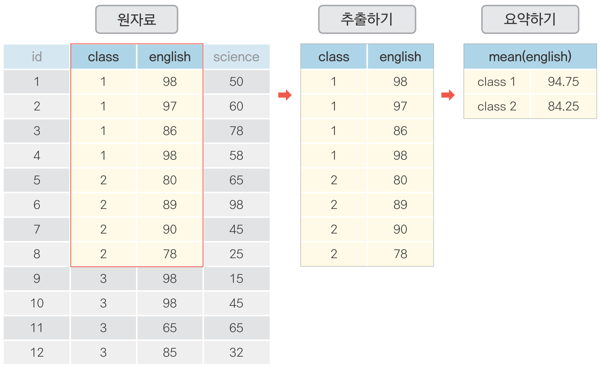
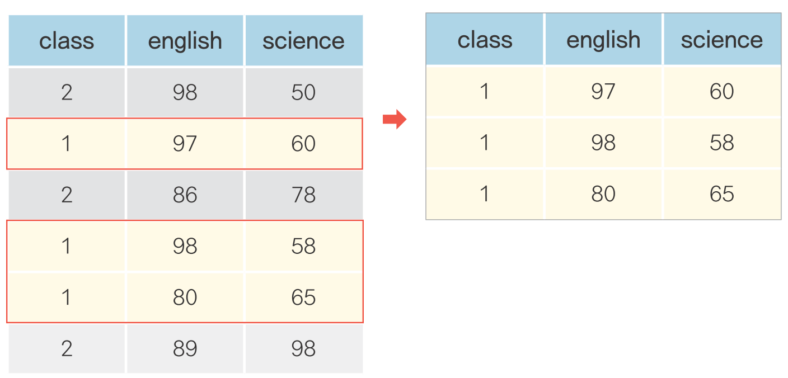
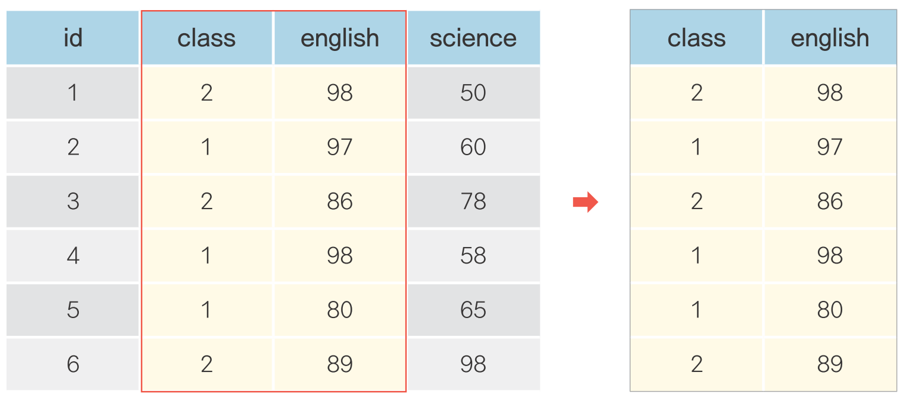

```{r setup, include=FALSE}
# xaringanExtra::use_tile_view()

library(knitr)
library(icon)
```

```{r echo=FALSE}
knitr::opts_chunk$set(cache = T, warning = F, message = F, fig.retina = 3)

# code highlighting
hook_source = knitr::knit_hooks$get('source')
knitr::knit_hooks$set(source = function(x, options) {
  x = stringr::str_replace(x, '^[[:blank:]]?([^*].+?)[[:blank:]]*#<<[[:blank:]]*$', '*\\1')
  hook_source(x, options)
})
```


```{python}
import pandas as pd
```


class: title0

자유자재로 데이터 가공하기

---

<br>

## .center[자유자재로 데이터 가공하기]

<br>
```{r echo=F, out.width = '600px', fig.align='center'}

```

---

#### 데이터 전처리(Preprocessing) - dplyr 패키지

.left[
&nbsp; &nbsp; 함수       |&nbsp; 기능
-----------|-------
&nbsp; &nbsp; filter()   &nbsp; | &nbsp; 행 추출&nbsp; &nbsp;
&nbsp; &nbsp; select()   &nbsp; | &nbsp; 열(변수) 추출&nbsp; &nbsp;
&nbsp; &nbsp; mutate()   &nbsp; | &nbsp; 변수 추가&nbsp; &nbsp;
&nbsp; &nbsp; arrange()  &nbsp; | &nbsp; 정렬&nbsp; &nbsp;
&nbsp; &nbsp; summarise()&nbsp; | &nbsp; 통계치 산출&nbsp; &nbsp;
&nbsp; &nbsp; group_by() &nbsp; | &nbsp; 집단별로 나누기&nbsp; &nbsp;
&nbsp; &nbsp; left_join()&nbsp; | &nbsp; 데이터 합치기(열)&nbsp; &nbsp;
&nbsp; &nbsp; bind_rows()&nbsp; | &nbsp; 데이터 합치기(행)&nbsp; &nbsp;

]

---

name: filter
class: title1

조건에 맞는 데이터만 추출하기

---
<br><br>
### .center[조건에 맞는 데이터만 추출하기]
<br>
```{r echo=F, out.width = '600px', fig.align='center'}

```

---

#### 데이터 불러오기
```{python eval = F}
exam = pd.read_csv('csv_exam.csv')
exam
```

---


```{python, echo = F}
exam = pd.read_csv('csv_exam.csv')
exam
```


---

```{python}
# 1반인 경우만 추출
exam[exam['class'] == 1]
```

---

#### (1) `class` 추출

```{python}
exam['class']
```
---

#### (2) `class`가 1인지 확인

```{python}
exam['class'] == 1
```

---


#### (3) `class`가 1이면 추출

```{python}
exam[exam['class'] == 1]
```


---

#### `class`가 1인지 확인

```{python eval=F}
exam['class'] == 1
```

--

#### `class`가 1이면 추출

```{python eval = F}
exam[exam['class'] == 1]
```

---

```{python}
# 2반인 경우만 추출
exam[exam['class'] == 2]
```

---

```{python}
# 1반이 아닌 경우
exam[exam['class'] != 1]
```

---

```{python}
# 2반이 아닌 경우
exam[exam['class'] != 2]
```

---

#### 초과, 미만, 이상, 이하 조건 걸기

```{python}
# 수학 점수가 50점을 초과한 경우
exam[exam['math'] > 50]
```

---

```{python}
# 수학 점수가 50점 미만인 경우
exam[exam['math'] < 50]
```

---

```{python}
# 영어 점수가 80점 이상인 경우
exam[exam['english'] >= 80]
```

---

```{python}
# 영어 점수가 80점 이하인 경우
exam[exam['english'] <= 80]
```


---

#### 여러 조건을 충족하는 행 추출하기

```{python}
# 1반인 경우
exam[exam['class'] == 1]
```

--

```{python}
# 1반 이면서 수학 점수가 50점 이상인 경우
exam[(exam['class'] == 1) & (exam['math'] >= 50)]
```

---

```{python}
# 2반 이면서 영어 점수가 80점 이상인 경우
exam[(exam['class'] == 2) & (exam['english'] >= 80)]
```

---

#### 여러 조건 중 하나 이상 충족하는 행 추출하기

```{python}
# 수학 점수가 90점 이상이거나 영어 점수가 90점 이상인 경우
exam[(exam['math'] >= 90) | (exam['english'] >= 90)]
```

---

```{python}
# 영어 점수가 90점 미만이거나 과학점수가 50점 미만인 경우
exam[(exam['english'] < 90) | (exam['science'] < 50)]
```

---

#### 목록에 해당되는 행 추출하기

```{python}
# 1, 3, 5반 추출
exam[(exam['class'] == 1) | (exam['class'] == 3) | (exam['class'] == 5)] 
```

---

#### 목록에 해당되는 행 추출하기

```{python}
exam[exam['class'].isin([1, 3, 5])]
```

---
- `df.isin[]`

```{python}
exam['class'].isin([1, 3, 5])
```

---

#### 추출한 행으로 데이터 만들기

```{python}
class1 = exam[exam['class'] == 1]  # class가 1인 행 추출, class1에 할당
class2 = exam[exam['class'] == 2]  # class가 2인 행 추출, class2에 할당
```


```{python}
sum(class1['math'])/4              # 1반 수학 점수 평균 구하기
sum(class2['math'])/4              # 1반 수학 점수 평균 구하기
```

---

#### `len()` 활용하기

```{python}
len(exam)                        # 전체 학생 수 구하기
```
--

```{python}
sum(exam['math'])/len(exam)      # 전체 수학 평균 구하기
```

--

```{python}
sum(class1['math'])/len(class1)  # 1반 수학 점수 평균 구하기
sum(class2['math'])/len(class2)  # 2반 수학 점수 평균 구하기
```

---

#### `df.mean()` 활용하기

```{python}
exam['math'].mean()   # 전체 수학 평균 구하기
```

--

```{python}
class1['math'].mean()  # 1반 수학 평균 구하기
class2['math'].mean()  # 2반 수학 평균 구하기
```


---


#### Python에서 사용하는 기호들

.left[

논리 연산자  | &nbsp; &nbsp; 기능
:-----------:|---
<            | &nbsp; &nbsp; 작다
<=           | &nbsp; &nbsp; 작거나 같다 &nbsp;
>            | &nbsp; &nbsp; 크다
>=           | &nbsp; &nbsp; 크거나 같다
==           | &nbsp; &nbsp; 같다
!=           | &nbsp; &nbsp; 같지 않다
&            | &nbsp; &nbsp; 그리고
│            | &nbsp; &nbsp; 또는


`r fontawesome("lightbulb")` `df.isin()` : 매칭 확인

]

---

---
### 혼자서 해보기

**`mpg` 데이터를 이용해서 분석 문제를 해결해 보세요.**

Q1. 자동차 배기량에 따라 고속도로 연비가 다른지 알아보려고 합니다. `displ`(배기량)이 `4` 이하인 <br> &nbsp; &nbsp; &nbsp; &nbsp;자동차와 `5` 이상인 자동차 중 어떤 자동차의 `hwy`(고속도로 연비)가 평균적으로 더 높은지 알아보세요.

Q2. 자동차 제조 회사에 따라 도시 연비가 다른지 알아보려고 합니다. `'audi'`와 `'toyota'` 중 <br> &nbsp; &nbsp; &nbsp; &nbsp;어느 `manufacturer`(자동차 제조 회사)의 `cty`(도시 연비)가 평균적으로 더 높은지 알아보세요.

Q3. `'chevrolet'`, `'ford'`, `'honda'` 자동차의 고속도로 연비 평균을 알아보려고 합니다. <br> &nbsp; &nbsp; &nbsp; &nbsp; 이 회사들의 자동차를 추출한 뒤 `hwy` 전체 평균을 구해보세요.

---

Q1. 자동차 배기량에 따라 고속도로 연비가 다른지 알아보려고 합니다. `displ`(배기량)이 `4` 이하인 <br> &nbsp; &nbsp; &nbsp; &nbsp;자동차와 `5` 이상인 자동차 중 어떤 자동차의 `hwy`(고속도로 연비)가 평균적으로 더 높은지 알아보세요.

```{python}
mpg = pd.read_csv('data_mpg.csv')  # mpg 데이터 불러오기

mpg_a = mpg[mpg['displ'] <= 4]    # displ 4 이하 추출
mpg_b = mpg[mpg['displ'] >= 5]    # displ 5 이상 추출
```

```{python}
mpg_a['displ'].mean()  # displ 4 이하 hwy 평균
mpg_b['displ'].mean()  # displ 5 이상 hwy 평균
```

---

Q2. 자동차 제조 회사에 따라 도시 연비가 다른지 알아보려고 합니다. `'audi'`와 `'toyota'` 중 <br> &nbsp; &nbsp; &nbsp; &nbsp;어느 `manufacturer`(자동차 제조 회사)의 `cty`(도시 연비)가 평균적으로 더 높은지 알아보세요.
```{python}
mpg_audi   = mpg[mpg['manufacturer'] == 'audi']    # audi 추출
mpg_toyota = mpg[mpg['manufacturer'] == 'toyota']  # toyota 추출

mpg_audi['cty'].mean()    # audi의 cty 평균
mpg_toyota['cty'].mean()  # toyota의 cty 평균
```

---

Q3. `'chevrolet'`, `'ford'`, `'honda'` 자동차의 고속도로 연비 평균을 알아보려고 합니다. <br> &nbsp; &nbsp; &nbsp; &nbsp; 이 회사들의 자동차를 추출한 뒤 `hwy` 전체 평균을 구해보세요.
```{python}
# manufacturer가 chevrolet, ford, honda에 해당하면 추출
mpg_new = mpg[mpg['manufacturer'].isin(['chevrolet', 'ford', 'honda'])]
mpg_new['hwy'].mean()
```

---

<!-- --- -->
<!-- name: select -->
<!-- class: title1 -->

<!-- 필요한 변수만 추출하기 -->

<!-- --- -->

<!-- <br> -->
<!-- ### .center[필요한 변수만 추출하기] -->

<!-- <br> -->
<!-- ```{r echo=F, out.width = '600px', fig.align='center'} -->
<!--  -->
<!-- ``` -->

<!-- --- -->

<!-- ```{python} -->
<!-- exam %>% select(math)  # math 추출 -->
<!-- ``` -->

<!-- --- -->

<!-- ```{python} -->
<!-- exam %>% select(english)  # english 추출 -->
<!-- ``` -->

<!-- --- -->

<!-- #### 여러 변수 추출하기 -->

<!-- ```{python} -->
<!-- exam %>% select(class, math, english)  # class, math, english 변수 추출 -->
<!-- ``` -->

<!-- --- -->

<!-- #### 변수 제외하기 -->

<!-- ```{python} -->
<!-- exam %>% select(-math)  # math 제외 -->
<!-- ``` -->

<!-- --- -->

<!-- #### 변수 제외하기 -->

<!-- ```{python} -->
<!-- exam %>% select(-math, -english)  # math, english 제외 -->
<!-- ``` -->

<!-- --- -->

<!-- #### filter()와 select() 조합하기 -->

<!-- ```{python} -->
<!-- # class가 1인 행만 추출한 다음 english 추출 -->
<!-- exam %>% filter(class == 1) %>% select(english) -->
<!-- ``` -->

<!-- --- -->

<!-- #### dplyr Tip - 줄 바꿔서 가독성 높은 코드 만들기 -->
<!-- ```{python} -->
<!-- exam %>% -->
<!--   filter(class == 1) %>%  # class가 1인 행 추출 -->
<!--   select(english)         # english 추출 -->
<!-- ``` -->

<!-- --- -->

<!-- #### dplyr Tip - 일부만 출력하기 -->

<!-- ```{python} -->
<!-- exam %>% -->
<!--   select(id, math) %>%  # id, math 추출 -->
<!--   head                  # 앞부분 6행까지 추출 -->
<!-- ``` -->

<!-- --- -->

<!-- #### dplyr Tip - 일부만 출력하기 -->

<!-- ```{python} -->
<!-- exam %>% -->
<!--   select(id, math) %>%  # id, math 추출 -->
<!--   head(10)              # 앞부분 10행까지 추출 -->
<!-- ``` -->

<!-- --- -->


<!-- ### 혼자서 해보기 -->

<!-- `mpg` 데이터를 이용해서 분석 문제를 해결해보세요. -->

<!-- Q1. `mpg` 데이터는 11개 변수로 구성되어 있습니다. 이 중 일부만 추출해서 분석에 활용하려고 합니다. <br> &nbsp; &nbsp; &nbsp; &nbsp; `mpg` 데이터에서 `class`(자동차 종류), `cty`(도시 연비) 변수를 추출해 새로운 데이터를 만드세요. <br> &nbsp; &nbsp; &nbsp; &nbsp; 새로 만든 데이터의 일부를 출력해서 두 변수로만 구성되어 있는지 확인하세요. -->

<!-- Q2. 자동차 종류에 따라 도시 연비가 다른지 알아보려고 합니다. 앞에서 추출한 데이터를 이용해서 <br> &nbsp; &nbsp; &nbsp; &nbsp; `class`(자동차 종류)가 `'suv'`인 자동차와 `'compact'`인 자동차 중 어떤 자동차의 `cty`(도시 연비) <br> &nbsp; &nbsp; &nbsp; &nbsp; 평균이 더 높은지 알아보세요. -->

<!-- --- -->

<!-- Q1. `mpg` 데이터는 11개 변수로 구성되어 있습니다. 이 중 일부만 추출해서 분석에 활용하려고 합니다. <br> &nbsp; &nbsp; &nbsp; &nbsp; `mpg` 데이터에서 `class`(자동차 종류), `cty`(도시 연비) 변수를 추출해 새로운 데이터를 만드세요. <br> &nbsp; &nbsp; &nbsp; &nbsp; 새로 만든 데이터의 일부를 출력해서 두 변수로만 구성되어 있는지 확인하세요. -->

<!-- ```{python} -->
<!-- mpg = ggplot2::mpg                 # mpg 데이터 불러오기 -->

<!-- df = mpg %>% select(class, cty)    # class, cty 변수 추출 -->
<!-- head(df)                            # df 일부 출력 -->

<!-- ``` -->

<!-- --- -->

<!-- Q2. 자동차 종류에 따라 도시 연비가 다른지 알아보려고 합니다. 앞에서 추출한 데이터를 이용해서 <br> &nbsp; &nbsp; &nbsp; &nbsp; `class`(자동차 종류)가 `'suv'`인 자동차와 `'compact'`인 자동차 중 어떤 자동차의 `cty`(도시 연비) <br> &nbsp; &nbsp; &nbsp; &nbsp; 평균이 더 높은지 알아보세요. -->

<!-- ```{python} -->
<!-- df_suv = df %>% filter(class == 'suv')          # class가 suv인 행 추출 -->
<!-- df_compact = df %>% filter(class == 'compact')  # class가 compact인 행 추출 -->

<!-- mean(df_suv$cty)                                 # suv의 cty 평균 -->
<!-- mean(df_compact$cty)                             # compact의 cty 평균 -->
<!-- ``` -->

<!-- --- -->
