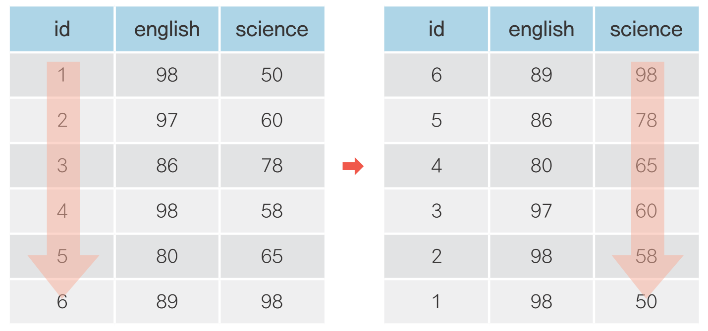

```{r setup, include=FALSE}
# xaringanExtra::use_tile_view()

library(knitr)
library(icon)
```

```{r echo=FALSE}
knitr::opts_chunk$set(cache = T, warning = F, message = F, fig.retina = 3)

# code highlighting
hook_source = knitr::knit_hooks$get('source')
knitr::knit_hooks$set(source = function(x, options) {
  x = stringr::str_replace(x, '^[[:blank:]]?([^*].+?)[[:blank:]]*#<<[[:blank:]]*$', '*\\1')
  hook_source(x, options)
})
```


```{python echo = F}
import pandas as pd
import numpy as np
```


class: title0

자유자재로 데이터 가공하기

---

<br>

## .center[자유자재로 데이터 가공하기]

<br>
```{r echo=F, out.width = '600px', fig.align='center'}
knitr::include_graphics('img/preprocessing.png')
```

---

#### 데이터 전처리(Preprocessing) - dplyr 패키지

.left[
&nbsp; &nbsp; 함수       |&nbsp; 기능
-----------|-------
&nbsp; &nbsp; filter()   &nbsp; | &nbsp; 행 추출&nbsp; &nbsp;
&nbsp; &nbsp; select()   &nbsp; | &nbsp; 열(변수) 추출&nbsp; &nbsp;
&nbsp; &nbsp; mutate()   &nbsp; | &nbsp; 변수 추가&nbsp; &nbsp;
&nbsp; &nbsp; arrange()  &nbsp; | &nbsp; 정렬&nbsp; &nbsp;
&nbsp; &nbsp; summarise()&nbsp; | &nbsp; 통계치 산출&nbsp; &nbsp;
&nbsp; &nbsp; group_by() &nbsp; | &nbsp; 집단별로 나누기&nbsp; &nbsp;
&nbsp; &nbsp; left_join()&nbsp; | &nbsp; 데이터 합치기(열)&nbsp; &nbsp;
&nbsp; &nbsp; bind_rows()&nbsp; | &nbsp; 데이터 합치기(행)&nbsp; &nbsp;

]

---

name: filter
class: title1

조건에 맞는 데이터만 추출하기

---
<br><br>
### .center[조건에 맞는 데이터만 추출하기]
<br>
```{r echo=F, out.width = '600px', fig.align='center'}
knitr::include_graphics('img/filter.png')
```

---

#### 데이터 불러오기
```{python eval = F}
exam = pd.read_csv('csv_exam.csv')
exam
```

---


```{python, echo = F}
exam = pd.read_csv('csv_exam.csv')
exam
```


---

```{python}
# 1반인 경우만 추출
exam[exam['class'] == 1]
```

---

#### (1) `class` 추출

```{python}
exam['class']
```
---

#### (2) `class`가 1인지 확인

```{python}
exam['class'] == 1
```

---


#### (3) `class`가 1이면 추출

```{python}
exam[exam['class'] == 1]
```


---

#### `class`가 1인지 확인

```{python eval=F}
exam['class'] == 1
```

--

#### `class`가 1이면 추출

```{python eval = F}
exam[exam['class'] == 1]
```

---

```{python}
# 2반인 경우만 추출
exam[exam['class'] == 2]
```

---

```{python}
# 1반이 아닌 경우
exam[exam['class'] != 1]
```

---

```{python}
# 2반이 아닌 경우
exam[exam['class'] != 2]
```

---

#### 초과, 미만, 이상, 이하 조건 걸기

```{python}
# 수학 점수가 50점을 초과한 경우
exam[exam['math'] > 50]
```

---

```{python}
# 수학 점수가 50점 미만인 경우
exam[exam['math'] < 50]
```

---

```{python}
# 영어 점수가 80점 이상인 경우
exam[exam['english'] >= 80]
```

---

```{python}
# 영어 점수가 80점 이하인 경우
exam[exam['english'] <= 80]
```


---

#### 여러 조건을 충족하는 행 추출하기

```{python}
# 1반인 경우
exam[exam['class'] == 1]
```

--

```{python}
# 1반 이면서 수학 점수가 50점 이상인 경우
exam[(exam['class'] == 1) & (exam['math'] >= 50)]
```

---

```{python}
# 2반 이면서 영어 점수가 80점 이상인 경우
exam[(exam['class'] == 2) & (exam['english'] >= 80)]
```

---

#### 여러 조건 중 하나 이상 충족하는 행 추출하기

```{python}
# 수학 점수가 90점 이상이거나 영어 점수가 90점 이상인 경우
exam[(exam['math'] >= 90) | (exam['english'] >= 90)]
```

---

```{python}
# 영어 점수가 90점 미만이거나 과학점수가 50점 미만인 경우
exam[(exam['english'] < 90) | (exam['science'] < 50)]
```

---

#### 목록에 해당되는 행 추출하기

```{python}
# 1, 3, 5반 추출
exam[(exam['class'] == 1) | (exam['class'] == 3) | (exam['class'] == 5)] 
```

---

#### 목록에 해당되는 행 추출하기

```{python}
exam[exam['class'].isin([1, 3, 5])]
```

---
- `df.isin[]`

```{python}
exam['class'].isin([1, 3, 5])
```

---

#### 추출한 행으로 데이터 만들기

```{python}
class1 = exam[exam['class'] == 1]  # class가 1인 행 추출, class1에 할당
class2 = exam[exam['class'] == 2]  # class가 2인 행 추출, class2에 할당
```


```{python}
sum(class1['math'])/4              # 1반 수학 점수 평균 구하기
sum(class2['math'])/4              # 1반 수학 점수 평균 구하기
```

---

#### `len()` 활용하기

```{python}
len(exam)                        # 전체 학생 수 구하기
```
--

```{python}
sum(exam['math'])/len(exam)      # 전체 수학 평균 구하기
```

--

```{python}
sum(class1['math'])/len(class1)  # 1반 수학 점수 평균 구하기
sum(class2['math'])/len(class2)  # 2반 수학 점수 평균 구하기
```

---

#### `df.mean()` 활용하기

```{python}
exam['math'].mean()   # 전체 수학 평균 구하기
```

--

```{python}
class1['math'].mean()  # 1반 수학 평균 구하기
class2['math'].mean()  # 2반 수학 평균 구하기
```


---


#### Python에서 사용하는 기호들

.left[

논리 연산자  | &nbsp; &nbsp; 기능
:-----------:|---
<            | &nbsp; &nbsp; 작다
<=           | &nbsp; &nbsp; 작거나 같다 &nbsp;
>            | &nbsp; &nbsp; 크다
>=           | &nbsp; &nbsp; 크거나 같다
==           | &nbsp; &nbsp; 같다
!=           | &nbsp; &nbsp; 같지 않다
&            | &nbsp; &nbsp; 그리고
│            | &nbsp; &nbsp; 또는


`r fontawesome("lightbulb")` `df.isin()` : 매칭 확인

]

---

---
### 혼자서 해보기

**`mpg` 데이터를 이용해서 분석 문제를 해결해 보세요.**

Q1. 자동차 배기량에 따라 고속도로 연비가 다른지 알아보려고 합니다. `displ`(배기량)이 `4` 이하인 <br> &nbsp; &nbsp; &nbsp; &nbsp;자동차와 `5` 이상인 자동차 중 어떤 자동차의 `hwy`(고속도로 연비)가 평균적으로 더 높은지 알아보세요.

Q2. 자동차 제조 회사에 따라 도시 연비가 다른지 알아보려고 합니다. `'audi'`와 `'toyota'` 중 <br> &nbsp; &nbsp; &nbsp; &nbsp;어느 `manufacturer`(자동차 제조 회사)의 `cty`(도시 연비)가 평균적으로 더 높은지 알아보세요.

Q3. `'chevrolet'`, `'ford'`, `'honda'` 자동차의 고속도로 연비 평균을 알아보려고 합니다. <br> &nbsp; &nbsp; &nbsp; &nbsp; 이 회사들의 자동차를 추출한 뒤 `hwy` 전체 평균을 구해보세요.

---

Q1. 자동차 배기량에 따라 고속도로 연비가 다른지 알아보려고 합니다. `displ`(배기량)이 `4` 이하인 <br> &nbsp; &nbsp; &nbsp; &nbsp;자동차와 `5` 이상인 자동차 중 어떤 자동차의 `hwy`(고속도로 연비)가 평균적으로 더 높은지 알아보세요.

```{python}
mpg = pd.read_csv('data_mpg.csv')  # mpg 데이터 불러오기

mpg_a = mpg[mpg['displ'] <= 4]    # displ 4 이하 추출
mpg_b = mpg[mpg['displ'] >= 5]    # displ 5 이상 추출
```

```{python}
mpg_a['displ'].mean()  # displ 4 이하 hwy 평균
mpg_b['displ'].mean()  # displ 5 이상 hwy 평균
```

---

Q2. 자동차 제조 회사에 따라 도시 연비가 다른지 알아보려고 합니다. `'audi'`와 `'toyota'` 중 <br> &nbsp; &nbsp; &nbsp; &nbsp;어느 `manufacturer`(자동차 제조 회사)의 `cty`(도시 연비)가 평균적으로 더 높은지 알아보세요.
```{python}
mpg_audi   = mpg[mpg['manufacturer'] == 'audi']    # audi 추출
mpg_toyota = mpg[mpg['manufacturer'] == 'toyota']  # toyota 추출

mpg_audi['cty'].mean()    # audi의 cty 평균
mpg_toyota['cty'].mean()  # toyota의 cty 평균
```

---

Q3. `'chevrolet'`, `'ford'`, `'honda'` 자동차의 고속도로 연비 평균을 알아보려고 합니다. <br> &nbsp; &nbsp; &nbsp; &nbsp; 이 회사들의 자동차를 추출한 뒤 `hwy` 전체 평균을 구해보세요.
```{python}
# manufacturer가 chevrolet, ford, honda에 해당하면 추출
mpg_new = mpg[mpg['manufacturer'].isin(['chevrolet', 'ford', 'honda'])]
mpg_new['hwy'].mean()
```

---

---
name: select
class: title1

필요한 변수만 추출하기

---

<br>
### .center[필요한 변수만 추출하기]

<br>
```{r echo=F, out.width = '600px', fig.align='center'}
knitr::include_graphics('img/select.png')
```

---

```{python}
exam['math']  # math 추출
```

---

```{python}
exam[['math']]  # math 추출 - 데이터 프레임 형태로
```


---

#### 여러 변수 추출하기

```{python}
exam[['class', 'math', 'english']]  # class, math, english 변수 추출
```

---

#### 변수 제외하기

```{python}
exam.drop(columns = 'math')  # math 제외
```

---

#### 변수 제외하기

```{python}
exam.drop(columns = ['math', 'english'])  # math, english 제외
```

---


#### 행, 열 동시 추출하기

```{python}
# class가 1인 행만 추출한 다음 english 추출
exam[exam['class'] == 1]['english']
```

---


##### Q. 2반의 수학 점수 추출

--
```{python}
exam[exam['class'] == 2]['math']
```

--

##### Q. 2반의 수학 점수 평균


--

```{python}
exam[exam['class'] == 2]['math'].mean()
```


---

### 혼자서 해보기

`mpg` 데이터를 이용해서 분석 문제를 해결해보세요.

Q1. `mpg` 데이터는 11개 변수로 구성되어 있습니다. 이 중 일부만 추출해서 분석에 활용하려고 합니다. <br> &nbsp; &nbsp; &nbsp; &nbsp; `mpg` 데이터에서 `class`(자동차 종류), `cty`(도시 연비) 변수를 추출해 새로운 데이터를 만드세요. <br> &nbsp; &nbsp; &nbsp; &nbsp; 새로 만든 데이터의 일부를 출력해서 두 변수로만 구성되어 있는지 확인하세요.

Q2. 자동차 종류에 따라 도시 연비가 다른지 알아보려고 합니다. 앞에서 추출한 데이터를 이용해서 <br> &nbsp; &nbsp; &nbsp; &nbsp; `class`(자동차 종류)가 `'suv'`인 자동차와 `'compact'`인 자동차 중 어떤 자동차의 `cty`(도시 연비) <br> &nbsp; &nbsp; &nbsp; &nbsp; 평균이 더 높은지 알아보세요.

---

Q1. `mpg` 데이터는 11개 변수로 구성되어 있습니다. 이 중 일부만 추출해서 분석에 활용하려고 합니다. <br> &nbsp; &nbsp; &nbsp; &nbsp; `mpg` 데이터에서 `class`(자동차 종류), `cty`(도시 연비) 변수를 추출해 새로운 데이터를 만드세요. <br> &nbsp; &nbsp; &nbsp; &nbsp; 새로 만든 데이터의 일부를 출력해서 두 변수로만 구성되어 있는지 확인하세요.

```{python}
mpg = pd.read_csv('data_mpg.csv')  # mpg 데이터 불러오기

df = mpg[['class', 'cty']]         # class, cty 변수 추출
df.head()                          # df 일부 출력
```

---

Q2. 자동차 종류에 따라 도시 연비가 다른지 알아보려고 합니다. 앞에서 추출한 데이터를 이용해서 <br> &nbsp; &nbsp; &nbsp; &nbsp; `class`(자동차 종류)가 `'suv'`인 자동차와 `'compact'`인 자동차 중 어떤 자동차의 `cty`(도시 연비) <br> &nbsp; &nbsp; &nbsp; &nbsp; 평균이 더 높은지 알아보세요.

##### 방법1
```{python}
df_suv = df[df['class'] == 'suv']          # class가 suv인 행 추출
df_compact = df[df['class'] == 'compact']  # class가 compact인 행 추출
```


```{python}
df_suv['cty'].mean()                       # suv의 cty 평균
df_compact['cty'].mean()                   # compact의 cty 평균
```

---

Q2. 자동차 종류에 따라 도시 연비가 다른지 알아보려고 합니다. 앞에서 추출한 데이터를 이용해서 <br> &nbsp; &nbsp; &nbsp; &nbsp; `class`(자동차 종류)가 `'suv'`인 자동차와 `'compact'`인 자동차 중 어떤 자동차의 `cty`(도시 연비) <br> &nbsp; &nbsp; &nbsp; &nbsp; 평균이 더 높은지 알아보세요.

##### 방법2
```{python}
df[df['class'] == 'suv']['cty'].mean()
df[df['class'] == 'compact']['cty'].mean()
```


---

name: arrange
class: title1

순서대로 정렬하기

---
<br>
### .center[순서대로 정렬하기]

<br>

```{r echo=F, out.width = '600px', fig.align='center'}

```


---

#### 오름차순으로 정렬하기

```{python}
exam.sort_values('math')  # math 오름차순 정렬
```
---

#### 내림차순으로 정렬하기

```{python}
exam.sort_values('math', ascending = False)    # math 내림차순 정렬
```
---

#### 여러 기준으로 정렬하기

```{python}
exam.sort_values(['class', 'math'])  # class 및 math 오름차순 정렬
```

---

#### 여러 기준으로 정렬하기 - 정렬 순서 따로 정하기

```{python}
exam.sort_values(['class', 'math'], ascending = [True, False])  

```


---


### 혼자서 해보기

`mpg` 데이터를 이용해서 분석 문제를 해결해보세요.

Q. `'audi'`에서 생산한 자동차 중에 어떤 자동차 모델의 `hwy`(고속도로 연비)가 높은지 알아보려고 합니다. <br> &nbsp; &nbsp; &nbsp; &nbsp; `'audi'`에서 생산한 자동차 중 `hwy`가 1~5위에 해당하는 자동차의 데이터 출력하세요.


---

Q. `'audi'`에서 생산한 자동차 중에 어떤 자동차 모델의 `hwy`(고속도로 연비)가 높은지 알아보려고 합니다. <br> &nbsp; &nbsp; &nbsp; &nbsp; `'audi'`에서 생산한 자동차 중 `hwy`가 1~5위에 해당하는 자동차의 데이터 출력하세요.

```{python}
mpg = pd.read_csv('data_mpg.csv')
```

```{python}
mpg[mpg['manufacturer'] == 'audi'].sort_values('hwy', ascending = False).head(5)
```

--

.left[
```{python, eval = F}
mpg[mpg['manufacturer'] == 'audi'] \
  .sort_values('hwy', ascending = False) \
  .head(5)   
```
]
.pull-right[
```{python, eval = F}
# audi 추출
# hwy 내림차순 정렬
# 5행까지 출력
```

]

---


name: groupby_summarise
class: title1

집단별로 요약하기

---
<br>
### .center[집단별로 요약하기]

<br>

```{r echo=F, out.width = '600px', fig.align='center'}
knitr::include_graphics('img/groupby_summarise.png')
```

---

#### 요약 통계량 구하기


```{python}
exam.agg(mean_math = ('math', 'mean'))  # math 평균 산출
```

---

#### 집단별 요약 통계량 구하기
```{python}
exam.groupby('class').agg(mean_math = ('math', 'mean'))  # class별 math 평균 산출
```

--

.pull-left[
```{python eval = F}
exam.groupby('class') \
    .agg(mean_math = ('math', 'mean'))
```
]
.pull-right[
```{python eval = F}
# class별로 분리
# math 평균 산출
```

]

---


#### 여러 요약 통계량 한 번에 구하기
```{python}
exam.groupby('class').agg(mean_math   = ('math', 'mean'),    # class별로 분리
                          sum_math    = ('math', 'sum'),     # 수학 점수 평균
                          median_math = ('math', 'median'),  # 수학 점수 중앙값
                          n           = ('class', 'count'))  # 빈도: 학생 수
```

---

#### 자주 사용하는 요약 통계량 함수

.left[
&nbsp; &nbsp; &nbsp; &nbsp;함수    |&nbsp; &nbsp; &nbsp; 의미
--------|-----
&nbsp; &nbsp; mean()  &nbsp;|&nbsp; &nbsp; 평균&nbsp;&nbsp;&nbsp;
&nbsp; &nbsp; std()   &nbsp;|&nbsp; &nbsp; 표준편차&nbsp;&nbsp;&nbsp;
&nbsp; &nbsp; sum()   &nbsp;|&nbsp; &nbsp; 합계&nbsp;&nbsp;&nbsp;
&nbsp; &nbsp; median()&nbsp;|&nbsp; &nbsp; 중앙값&nbsp;&nbsp;&nbsp;
&nbsp; &nbsp; min()   &nbsp;|&nbsp; &nbsp; 최솟값&nbsp;&nbsp;&nbsp;
&nbsp; &nbsp; max()   &nbsp;|&nbsp; &nbsp; 최댓값&nbsp;&nbsp;&nbsp;
&nbsp; &nbsp; count() &nbsp;|&nbsp; &nbsp; 빈도&nbsp;&nbsp;&nbsp;
]
---

#### 하위 집단별로 다시나누기

.scroll-box-24[

```{python, echo = F}
mpg = pd.read_csv('data_mpg.csv')
```

```{python}
mpg.groupby(['manufacturer', 'drv']).agg(mean_cty = ('cty', 'mean'))
```
]

---

#### reset_index()
```{python}
mpg.groupby(['manufacturer', 'drv']).agg(mean_cty = ('cty', 'mean')).reset_index()
```


---

### 혼자서 해보기

`mpg` 데이터를 이용해서 분석 문제를 해결해 보세요.

Q1. `mpg` 데이터의 `class`는 자동차를 특징에 따라 `'suv'`, `'compact'` 등 일곱 종류로 분류한 <br> &nbsp; &nbsp; &nbsp; &nbsp; 변수입니다. 어떤 차종의 연비가 높은지 비교해보려고 합니다. `class`별 `cty` 평균을 구해보세요.

Q2. 앞 문제의 출력 결과는 `class` 값 알파벳 순으로 정렬되어 있습니다. 어떤 차종의 도시 연비가 높은지 <br> &nbsp; &nbsp; &nbsp; &nbsp; 쉽게 알아볼 수 있도록 `cty` 평균이 높은 순으로 정렬하여 출력하세요.

Q3. 어떤 회사 자동차의 `hwy`(고속도로 연비)가 가장 높은지 알아보려고 합니다. `hwy` 평균이 가장 높은 <br> &nbsp; &nbsp; &nbsp; &nbsp; 회사 세 곳을 출력하세요.

Q4. 어떤 회사에서 `'compact'`(경차) 차종을 가장 많이 생산하는지 알아보려고 합니다. <br> &nbsp; &nbsp; &nbsp; &nbsp; 각 회사별 `'compact'` 차종 수를 내림차순으로 정렬해 출력하세요.

---

Q1. `mpg` 데이터의 `class`는 자동차를 특징에 따라 `'suv'`, `'compact'` 등 일곱 종류로 분류한 <br> &nbsp; &nbsp; &nbsp; &nbsp; 변수입니다. 어떤 차종의 연비가 높은지 비교해보려고 합니다. `class`별 `cty` 평균을 구해보세요.
```{python}
mpg = pd.read_csv('data_mpg.csv')
```

<br-back-20>

.pull-left[
```{python}
mpg.groupby('class') \
    .agg(mean_cty = ('cty', 'mean'))
```
]

.pull-right[
```{python eval=F}
# class별 분리
# cty 평균 구하기
```
]

---

Q2. 앞 문제의 출력 결과는 `class` 값 알파벳 순으로 정렬되어 있습니다. 어떤 차종의 도시 연비가 높은지 <br> &nbsp; &nbsp; &nbsp; &nbsp; 쉽게 알아볼 수 있도록 `cty` 평균이 높은 순으로 정렬하여 출력하세요.

.pull-left-60[
```{python}
mpg.groupby('class') \
  .agg(mean_cty = ('cty', 'mean')) \
  .sort_values('mean_cty', ascending = False)
```

]

.pull-right-40[
```{python}
# class별 분리
# cty 평균 구하기
# 내림차순 정렬하기

```
]


---

Q3. 어떤 회사 자동차의 `hwy`(고속도로 연비)가 가장 높은지 알아보려고 합니다. `hwy` 평균이 가장 높은 <br> &nbsp; &nbsp; &nbsp; &nbsp; 회사 세 곳을 출력하세요.


.pull-left-60[
```{python}
mpg.groupby('manufacturer') \
    .agg(mean_hwy = ('hwy', 'mean')) \
    .sort_values('mean_hwy', ascending = False) \
    .head(3)
```

]
.pull-right-40[
```{python}
# manufacturer별 분리
# hwy 평균 구하기
# 내림차순 정렬하기
# 상위 3행 추출
```
]

---

Q4. 어떤 회사에서 `'compact'`(경차) 차종을 가장 많이 생산하는지 알아보려고 합니다. <br> &nbsp; &nbsp; &nbsp; &nbsp; 각 회사별 `'compact'` 차종 수를 내림차순으로 정렬해 출력하세요.

.pull-left-60[
```{python}
mpg[mpg['class'] == 'compact'] \
    .groupby('manufacturer') \
    .agg(n = ('manufacturer', 'count')) \
    .sort_values('n', ascending = False)
```

]
.pull-right-40[

```{python}
# compact 추출
# manufacturer별 분리
# 빈도 구하기
# 내림차순 정렬
```
]

---
Q4. 어떤 회사에서 `'compact'`(경차) 차종을 가장 많이 생산하는지 알아보려고 합니다. <br> &nbsp; &nbsp; &nbsp; &nbsp; 각 회사별 `'compact'` 차종 수를 내림차순으로 정렬해 출력하세요.

```{python}
mpg[mpg['class'] == 'compact'].value_counts('manufacturer')
```

---

class:title1

분석 도전

---

### 분석 도전

**`midwest` 데이터는 미국 동북중부 437개 지역의 인구통계 정보를 담고 있습니다. `data_midwest.csv`를 <br>이용해서 데이터 분석 문제를 해결해보세요.**

Q1. `popadults`는 해당 지역의 성인 인구, `poptotal`은 전체 인구를 나타냅니다. `midwest` 데이터에 <br> &nbsp; &nbsp; &nbsp; &nbsp; '전체 인구 대비 미성년 인구 백분율' 변수를 추가하세요.

Q2. 미성년 인구 백분율이 가장 높은 상위 5개 `county`(지역)의 미성년 인구 백분율을 출력하세요.

Q3. 분류표의 기준에 따라 미성년 비율 등급 변수를 추가하고, 각 등급에 몇 개의 지역이 있는지 알아보세요.

분류  |기준
:------:|:----:
&nbsp; &nbsp; &nbsp; large &nbsp; &nbsp; &nbsp; | 40% 이상
&nbsp; &nbsp; &nbsp; middle &nbsp; &nbsp; &nbsp;| 30% ~ 40% 미만
&nbsp;&nbsp; &nbsp;  small &nbsp; &nbsp; &nbsp; | 30% 미만

Q4. `popasian`은 해당 지역의 아시아인 인구를 나타냅니다. '전체 인구 대비 아시아인 인구 백분율' 변수를 <br> &nbsp; &nbsp; &nbsp; &nbsp; 추가하고, 하위 10개 지역의 `state`(주), `county`(지역명), 아시아인 인구 백분율을 출력하세요.


---
Q1. `popadults`는 해당 지역의 성인 인구, `poptotal`은 전체 인구를 나타냅니다. `midwest` 데이터에 <br> &nbsp; &nbsp; &nbsp; &nbsp; '전체 인구 대비 미성년 인구 백분율' 변수를 추가하세요.
```{python}
# midwest 불러오기
midwest = pd.read_csv('data_midwest.csv')
```


```{python}
# midwest에 백분율 변수 추가
midwest['ratio'] = (midwest['poptotal'] - midwest['popadults']) \
                  / midwest['poptotal']*100
```

--

```{python eval = F}
midwest['ratio'] = (1 - midwest['popadults'] / midwest['poptotal'])*100
```

---
Q2. 미성년 인구 백분율이 가장 높은 상위 5개 `county`(지역)의 미성년 인구 백분율을 출력하세요.

.pull-left-60[

```{python}
midwest.sort_values('ratio', ascending = False) \
       .head(5)[['county', 'ratio']]
      
```
]
.pull-right-40[
```{python}
# ratio 내림차순 정렬
# 상위 5행 추출, 변수 추출
```
]

---
Q3. 분류표의 기준에 따라 미성년 비율 등급 변수를 추가하고, 각 등급에 몇 개의 지역이 있는지 알아보세요.


분류  |기준
:------:|:----:
&nbsp; &nbsp; &nbsp; large &nbsp; &nbsp; &nbsp; | 40% 이상
&nbsp; &nbsp; &nbsp; middle &nbsp; &nbsp; &nbsp;| 30% ~ 40% 미만
&nbsp;&nbsp; &nbsp;  small &nbsp; &nbsp; &nbsp; | 30% 미만


```{python}
# 등급 변수 추가
midwest['grade'] = np.where(midwest['ratio'] >= 40, 'large',
                   np.where(midwest['ratio'] >= 30, 'middle', 'small'))

# 미성년 비율 등급 빈도표
midwest['grade'].value_counts()
```


---

Q4. `popasian`은 해당 지역의 아시아인 인구를 나타냅니다. '전체 인구 대비 아시아인 인구 백분율' 변수를 <br> &nbsp; &nbsp; &nbsp; &nbsp; 추가하고, 하위 10개 지역의 `state`(주), `county`(지역명), 아시아인 인구 백분율을 출력하세요.
```{python}
# 아시안 비율 변수 추가
midwest['ratio_asian'] = midwest['popasian']/midwest['poptotal']*100
```


.pull-left-60[

```{python}
midwest.sort_values('ratio_asian', ascending=True)\
       .head(10)[['state', 'county', 'ratio_asian']]

```

]
.pull-right-40[

```{python}
# 내림차순 정렬
# 상위 10행 추출, 변수 추출
```
]
