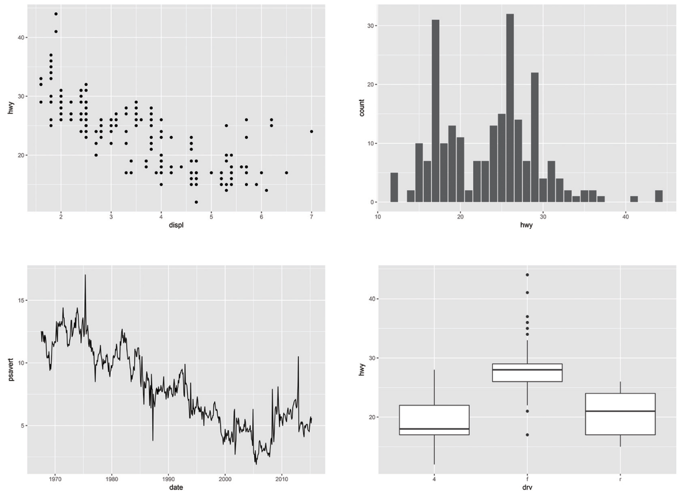
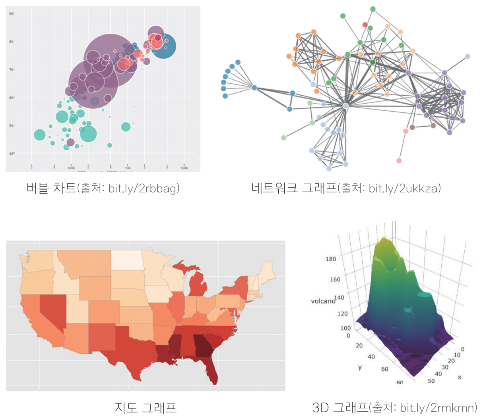

```{r setup, include=FALSE}
# xaringanExtra::use_tile_view()

library(knitr)
library(icon)
```

```{r echo=FALSE}
knitr::opts_chunk$set(cache = T, warning = F, message = F, fig.retina = 3, out.width = '60%')

# code highlighting
hook_source = knitr::knit_hooks$get('source')
knitr::knit_hooks$set(source = function(x, options) {
  x = stringr::str_replace(x, '^[[:blank:]]?([^*].+?)[[:blank:]]*#<<[[:blank:]]*$', '*\\1')
  hook_source(x, options)
})
```


```{python echo = F}
import pandas as pd
import numpy as np
import matplotlib.pyplot as plt
import seaborn as sns
```


class: title0

그래프 만들기

---
<br>
### .center[그래프 만들기]

<br>
```{r echo=F, out.width = '600px', fig.align='center'}

```

---
<br>

.left[
#### 다양한 그래프
- 2차원 그래프, 3차원 그래프
- 지도 그래프
- 네트워크 그래프
- 모션 차트
- 인터랙티브 그래프
]

.right[
```{r echo=F, out.width = '500px', fig.align='center'}

```
]

---

name: point
class: title1

산점도

---

#### 산점도

- 산점도(Scater Plot) : 데이터를 x축과 y축에 점으로 표현한 그래프
- 나이와 소득처럼, 연속 값으로 된 두 변수의 관계를 표현할 때 사용


```{python echo=F}
# 그래프 크기
plt.rcParams['figure.figsize'] = [6, 4]

# 폰트 크기
plt.rcParams.update({'font.size': '12'})
```

```{python echo=F}
import seaborn as sns
mpg = pd.read_csv('data_mpg.csv')
p = sns.scatterplot(data = mpg, x = 'displ', y = 'hwy')
plt.show()
```

---

#### 준비하기
```{python}
import seaborn as sns
mpg = pd.read_csv('data_mpg.csv')
```

```{python echo=F}
import matplotlib.pyplot as plt
```


---


#### 1. 산점도 만들기

```{python eval=F}
sns.scatterplot(data = mpg, x = 'displ', y = 'hwy')
```

<br-back-20>

```{python, echo=F}
p = sns.scatterplot(data = mpg, x = 'displ', y = 'hwy')
plt.show()
```


---

#### 2. 설정 추가하기 - x축 고정
```{python eval=F}
sns.scatterplot(data = mpg, x = 'displ', y = 'hwy').set(xlim = (3, 6))
```

<br-back-20>

```{python, echo = F}
p = sns.scatterplot(data = mpg, x = 'displ', y = 'hwy').set(xlim = (3, 6))
plt.show()
```

---

#### 3. 설정 추가하기 - x축, y축 고정

```{python, eval = F}
sns.scatterplot(data = mpg, x = 'displ', y = 'hwy') \
    .set(xlim = (3, 6), ylim = (10, 30))
```

<br-back-20>

```{python, echo = F}
p = sns.scatterplot(data = mpg, x = 'displ', y = 'hwy').set(xlim = (3, 6), ylim = (10, 30))
plt.show()
```

---

### 혼자서 해보기

**`mpg` 데이터와 `midwest` 데이터를 이용해서 분석 문제를 해결해 보세요.**

Q1. `mpg` 데이터의 `cty`(도시 연비)와 `hwy`(고속도로 연비) 간에 어떤 관계가 있는지 알아보려고 합니다. <br> &nbsp; &nbsp; &nbsp; &nbsp; x축은 `cty`, y축은 `hwy`로 된 산점도를 만들어 보세요.

Q2. 미국 지역별 인구통계 정보를 담은 `ggplot2` 패키지의 `midwest` 데이터를 이용해서 전체 인구와 <br> &nbsp; &nbsp; &nbsp; &nbsp; 아시아인 인구 간에 어떤 관계가 있는지 알아보려고 합니다. <br> &nbsp; &nbsp; &nbsp; &nbsp; •x축은 `poptotal`(전체 인구), y축은 `popasian`(아시아인 인구)으로 된 산점도를 만들어 보세요. <br> &nbsp; &nbsp; &nbsp; &nbsp; •전체 인구는 50만 명 이하, 아시아인 인구는 1만 명 이하인 지역만 산점도에 표시되게 설정하세요.
---


Q1. `mpg` 데이터의 `cty`(도시 연비)와 `hwy`(고속도로 연비) 간에 어떤 관계가 있는지 알아보려고 합니다. <br> &nbsp; &nbsp; &nbsp; &nbsp; x축은 `cty`, y축은 `hwy`로 된 산점도를 만들어 보세요.
```{python eval = F}
sns.scatterplot(data = mpg, x = 'cty', y = 'hwy')
```

<br-back-20>

```{python echo =  F}
sns.scatterplot(data = mpg, x = 'cty', y = 'hwy')
plt.show()
```

---

Q2. 미국 지역별 인구통계 정보를 담은 `ggplot2` 패키지의 `midwest` 데이터를 이용해서 전체 인구와 <br> &nbsp; &nbsp; &nbsp; &nbsp; 아시아인 인구 간에 어떤 관계가 있는지 알아보려고 합니다. <br> &nbsp; &nbsp; &nbsp; &nbsp; •x축은 `poptotal`(전체 인구), y축은 `popasian`(아시아인 인구)으로 된 산점도를 만들어 보세요. <br> &nbsp; &nbsp; &nbsp; &nbsp; •전체 인구는 50만 명 이하, 아시아인 인구는 1만 명 이하인 지역만 산점도에 표시되게 설정하세요.

```{python echo=F}
midwest = pd.read_csv('data_midwest.csv')
```

```{python eval=F}
sns.scatterplot(data = midwest, x = 'poptotal', y = 'popasian') \
    .set(xlim = (0, 500000), ylim = (0, 10000))
```

<br-back-20>

```{python echo=F, out.width = '55%'}
p = sns.scatterplot(data = midwest, x = 'poptotal', y = 'popasian') \
    .set(xlim = (0, 500000), ylim = (0, 10000))
plt.show()

```

---

name: line
class: title1

선 그래프

---

#### 선 그래프(Line Chart)

- 데이터를 선으로 표현한 그래프
- 시계열 그래프(Time Series Chart) : 일정 시간 간격을 두고 나열된 시계열 데이터(Time Series Data)를 선으로 표현한 그래프
- 환율, 주가지수 등 경제 지표가 시간에 따라 어떻게 변하는지 표현할 때 활용

```{python, echo = FALSE, out.width = '55%'}
tmp = pd.read_csv('data_economics.csv')
tmp['year'] = pd.to_datetime(tmp['date']).dt.year
p = sns.lineplot(data = tmp, x = 'year', y = 'unemploy', ci = None)
plt.show()
```

---

#### 준비하기

```{python}
economics = pd.read_csv('data_economics.csv')
economics
```

---
#### 선 그래프 만들기

```{python, eval = F}
sns.lineplot(data = economics, x = 'date', y = 'unemploy')
```

```{python, echo = F}
p = sns.lineplot(data = economics, x = 'date', y = 'unemploy')
plt.show()
```

---

#### 년도만 추출하기

##### 날짜 타입으로 바꾸기

```{python}
economics.info()
```

---

#### 년도만 추출하기

##### 날짜 타입으로 바꾸기
```{python}
economics['date2'] = pd.to_datetime(economics['date'])
economics.info()
```

---
#### 년도만 추출하기

##### 날짜 타입으로 바꾸기

```{python}
economics[['date', 'date2']]
```

---

#### 년, 월, 일 추출

.pull-left[

```{python}
economics['date2'].dt.year
```

]

---

#### 년, 월, 일 추출

.pull-left[

```{python}
economics['date2'].dt.year
```

]

.pull-right[


```{python, error = T}
economics['date'].dt.year
```
]

---

#### 년, 월, 일 추출

.pull-left[

```{python}
economics['date2'].dt.month
```
]
.pull-right[


```{python}
economics['date2'].dt.day
```
]
---

#### year 변수 추가하기
```{python}
economics['year'] = economics['date2'].dt.year
economics
```

---

#### 선 그래프 만들기 - 연도별 실업자 수

```{python eval=F}
sns.lineplot(data = economics, x = 'year', y = 'unemploy')
```

```{python echo=F}
p = sns.lineplot(data = economics, x = 'year', y = 'unemploy')
plt.tight_layout()
plt.show()
```

---

#### 선 그래프 만들기 - 신뢰 구간(confidence interval) 제거

```{python eval=F}
sns.lineplot(data = economics, x = 'year', y = 'unemploy', ci = None)
```

```{python echo=F}
p = sns.lineplot(data = economics, x = 'year', y = 'unemploy', ci = None)
plt.tight_layout()
plt.show()
```

---


### 혼자서 해보기

**`economics` 데이터를 이용해서 분석 문제를 해결해 보세요.**

Q1. `psavert`(개인 저축률)가 연도별로 어떻게 변해왔는지 알아보려고 합니다. 연도별 개인 저축률의 변화를 <br> &nbsp;&nbsp; &nbsp; &nbsp;나타낸 시계열 그래프를 만들어 보세요(신뢰 구간은 제거하세요).

Q2. 2013년의 월별 개인 저축률의 변화를 나타낸 시계열 그래프를 만들어 보세요.

---

Q1. `psavert`(개인 저축률)가 연도별로 어떻게 변해왔는지 알아보려고 합니다. 연도별 개인 저축률의 변화를 <br> &nbsp;&nbsp; &nbsp; &nbsp;나타낸 시계열 그래프를 만들어 보세요(신뢰 구간은 제거하세요).


```{python eval = F}
sns.lineplot(data = economics, x = 'year', y = 'psavert', ci = None)
```

<br-back-20>

```{python echo = F}
p = sns.lineplot(data = economics, x = 'year', y = 'psavert', ci = None)
plt.show()
```

---

Q2. 2013년의 월별 개인 저축률의 변화를 나타낸 시계열 그래프를 만들어 보세요. <br> &nbsp;&nbsp; &nbsp; &nbsp; &nbsp;

<br-back-20>
```{python eval=F}
economics['month'] = economics['date2'].dt.month                # month 변수 추가
df = economics[economics['year'] == 2013]                       # 2013년 추출

sns.lineplot(data = df, x = 'month', y = 'psavert', ci = None)  # 그래프 만들기
```


```{python echo=F, out.width = '55%'}
economics['month'] = economics['date2'].dt.month                # month 변수 추가
df = economics[economics['year'] == 2013]                       # 2013년 추출

sns.lineplot(data = df, x = 'month', y = 'psavert', ci = None)  # 그래프 만들기
```

---


##### 월 모두 표기하기

```{python eval = F}
sns.lineplot(data = df, x = 'month', y = 'psavert', ci = None).set(xticks = df['month'])
```


```{python echo = F, out.width = '55%'}
# 그래프 만들기
p = sns.lineplot(data = df, x = 'month', y = 'psavert', ci = None).set(xticks = df['month'])
plt.show()
```
---


##### 월 모두 표기하기

```{python eval = F}
sns.lineplot(data = df, x = 'month', y = 'psavert', ci = None).set(xticks = df['month'])
```


```{python echo = F, out.width = '55%'}
# 그래프 만들기
p = sns.lineplot(data = df, x = 'month', y = 'psavert', ci = None).set(xticks = df['month'])
plt.show()
```


---


---
name: bar
class: title1

막대 그래프

---

#### 막대 그래프

- 막대 그래프(Bar Chart) : 데이터의 크기를 막대의 길이로 표현한 그래프
- 성별 소득 차이처럼 집단 간 차이를 표현할 때 주로 사용

```{python echo=F}
tmp = mpg.groupby('drv').agg(mean_hwy = ('hwy', 'mean')).reset_index().sort_values('mean_hwy', ascending = False)

# 그래프 출력
p = sns.barplot(data = tmp, x = 'drv', y = 'mean_hwy')
plt.show()

```

---

```{python}
p = sns.barplot(data = tmp, x = 'drv', y = 'mean_hwy')
plt.show()
```

---

#### 1. 집단별 요약표 만들기
```{python}
df_mpg = mpg.groupby('drv').agg(mean_hwy = ('hwy', 'mean'))
df_mpg
```

---


#### 2. index를 변수로 만들기


```{python, error=T}
df_mpg[df_mpg['drv'] == 'f']
```

---
#### 2. index를 변수로 만들기

```{python}
df_mpg.info()
```

---

#### 2. index를 변수로 만들기

```{python}
df_mpg = mpg.groupby('drv').agg(mean_hwy = ('hwy', 'mean')).reset_index()
df_mpg
```

--

```{python}
df_mpg[df_mpg['drv'] == 'f']
```


---

#### 2. 그래프 생성
```{python eval=F}
sns.barplot(data = df_mpg, x = 'drv', y = 'mean_hwy')
```

```{python echo=F}
p = sns.barplot(data = df_mpg, x = 'drv', y = 'mean_hwy')
plt.show()
```

---

#### 2. 그래프 생성 - 내림차순 정렬
```{python}
# 정렬하기
df_mpg = mpg.groupby('drv').agg(mean_hwy = ('hwy', 'mean')).reset_index() \
        .sort_values('mean_hwy', ascending = False)

df_mpg
```

---

#### 2. 그래프 생성 - 내림차순 정렬

```{python, eval=F}
# 그래프 출력
sns.barplot(data = df_mpg, x = 'drv', y = 'mean_hwy')
```

```{python echo = F}
# 그래프 출력
p = sns.barplot(data = df_mpg, x = 'drv', y = 'mean_hwy')
plt.show()
```

---

### 혼자서 해보기

**`mpg` 데이터를 이용해서 분석 문제를 해결해 보세요.**

Q. 어떤 회사가 도시 연비가 높은 `'suv'` 차종을 생산하는지 알아보려고 합니다.`'suv'` 차종을 대상으로 <br> &nbsp; &nbsp; &nbsp; &nbsp; `cty`(도시 연비)가 가장 높은 회사 다섯 곳의 평균 `cty`를 막대 그래프로 만들어 보세요.
<br> &nbsp; &nbsp; &nbsp; &nbsp; •막대는 연비가 높은 순으로 정렬하세요.

---

Q. 어떤 회사가 도시 연비가 높은 `'suv'` 차종을 생산하는지 알아보려고 합니다.`'suv'` 차종을 대상으로 <br> &nbsp; &nbsp; &nbsp; &nbsp; `cty`(도시 연비)가 가장 높은 회사 다섯 곳의 평균 `cty`를 막대 그래프로 만들어 보세요.
<br> &nbsp; &nbsp; &nbsp; &nbsp; •막대는 연비가 높은 순으로 정렬하세요.

.pull-left-60[
```{python eval = F}
# mpg 데이터 불러오기
mpg = pd.read_csv('data_mpg.csv')

# 평균 표 생성
df = mpg[mpg['class'] == 'suv'] \
      .groupby('manufacturer') \
      .agg(mean_cty = ('cty','mean')) \
      .sort_values('mean_cty', ascending = False) \
      .head(5) \
      .reset_index()
      
df
```
]

<br><br><br>
.pull-right-40[
```{python echo = F}
# mpg 데이터 불러오기
mpg = pd.read_csv('data_mpg.csv')

# 평균 표 생성
df = mpg[mpg['class'] == 'suv'] \
      .groupby('manufacturer') \
      .agg(mean_cty = ('cty','mean')) \
      .sort_values('mean_cty', ascending = False) \
      .head(5) \
      .reset_index()

df
```
]

---

Q. 어떤 회사가 도시 연비가 높은 `'suv'` 차종을 생산하는지 알아보려고 합니다.`'suv'` 차종을 대상으로 <br> &nbsp; &nbsp; &nbsp; &nbsp; `cty`(도시 연비)가 가장 높은 회사 다섯 곳의 평균 `cty`를 막대 그래프로 만들어 보세요.
<br> &nbsp; &nbsp; &nbsp; &nbsp; •막대는 연비가 높은 순으로 정렬하세요.

```{python eval = F}
# 그래프 생성
sns.barplot(data = df, x = 'manufacturer', y = 'mean_cty')
```

```{python echo = F}
# 그래프 생성
sns.barplot(data = df, x = 'manufacturer', y = 'mean_cty')
plt.show()
```


---

---
name: boxplot
class: title1

상자그림

---

#### 상자그림

- 상자 그림(Box Plot) : 데이터의 분포(퍼져 있는 형태)를 직사각형 상자 모양으로 표현한 그래프
- 분포를 알 수 있기 때문에 평균만 볼 때보다 데이터의 특성을 좀 더 자세히 이해할 수 있음

```{python eval=F}
ggplot2::mpg %>%
  filter(class %in% c('compact', 'subcompact', 'suv')) %>%
  ggplot(aes(x = class, y = cty)) + geom_boxplot()
```

---

#### 상자그림 만들기
```{python eval = F}
sns.boxplot(data = mpg, x = 'drv', y = 'hwy')
```

```{python echo = F}
sns.boxplot(data = mpg, x = 'drv', y = 'hwy')
plt.show()
```

---

<!-- ### 혼자서 해보기 -->

<!-- **`mpg` 데이터를 이용해서 분석 문제를 해결해 보세요.** -->

<!-- Q. `class`(자동차 종류)가 `'compact'`, `'subcompact'`, `'suv'`인 자동차의 `cty`(도시 연비)가 <br> &nbsp; &nbsp; &nbsp; &nbsp; 어떻게 다른지 비교해보려고 합니다. 세 차종의 `cty`를 나타낸 상자 그림을 만들어보세요. -->

<!-- --- -->

<!-- Q. `class`(자동차 종류)가 `'compact'`, `'subcompact'`, `'suv'`인 자동차의 `cty`(도시 연비)가 <br> &nbsp; &nbsp; &nbsp; &nbsp; 어떻게 다른지 비교해보려고 합니다. 세 차종의 `cty`를 나타낸 상자 그림을 만들어보세요. -->

<!-- ```{python} -->
<!-- # mpg 데이터 불러오기 -->
<!-- mpg = ggplot2::mpg -->

<!-- class_mpg = mpg %>% -->
<!--   filter(class %in% c('compact', 'subcompact', 'suv')) -->
<!-- ``` -->

<!-- --- -->
<!-- Q. `class`(자동차 종류)가 `'compact'`, `'subcompact'`, `'suv'`인 자동차의 `cty`(도시 연비)가 <br> &nbsp; &nbsp; &nbsp; &nbsp; 어떻게 다른지 비교해보려고 합니다. 세 차종의 `cty`를 나타낸 상자 그림을 만들어보세요. -->

<!-- ```{python} -->
<!-- ggplot(data = class_mpg, aes(x = class, y = cty)) + geom_boxplot() -->
<!-- ``` -->
