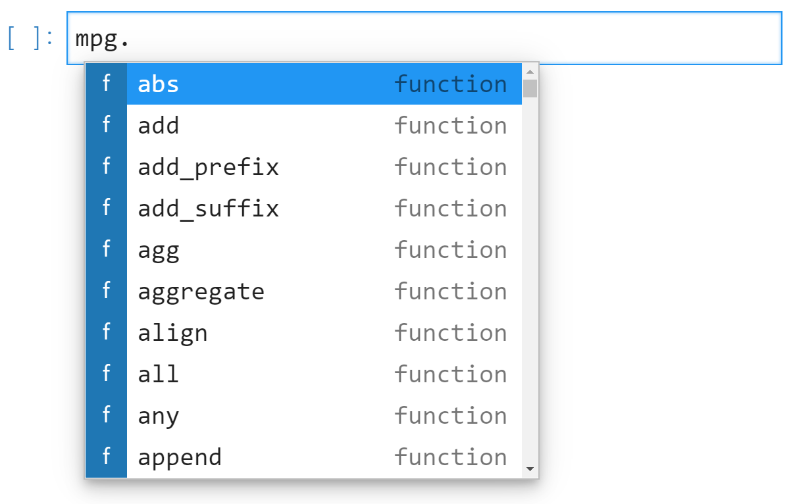
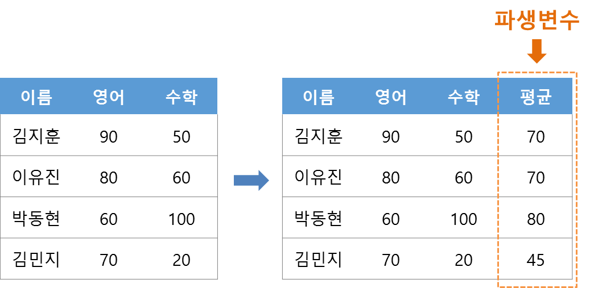
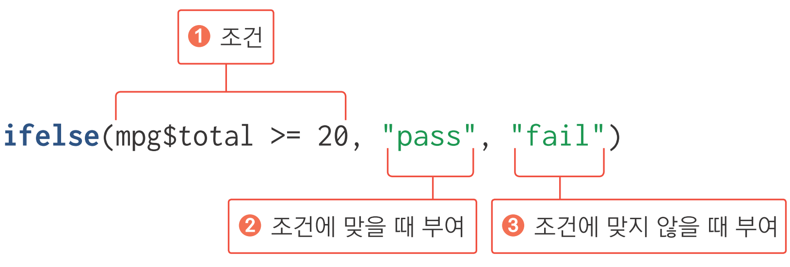

```{r setup, include=FALSE}
xaringanExtra::use_tile_view()

library(knitr)
library(icon)
```


```{r echo=FALSE}
knitr::opts_chunk$set(cache = T, warning = F, message = F, fig.retina = 3)

# code highlighting
hook_source = knitr::knit_hooks$get('source')
knitr::knit_hooks$set(source = function(x, options) {
  x = stringr::str_replace(x, '^[[:blank:]]?([^*].+?)[[:blank:]]*#<<[[:blank:]]*$', '*\\1')
  hook_source(x, options)
})
```


class: title0

쉽게 배우는 Python 데이터 분석

---

class: no-page-num

<br>

.pull-left[
&nbsp;&nbsp;&nbsp;&nbsp;&nbsp;&nbsp;&nbsp;&nbsp;
```{r, echo=FALSE, out.width='70%', out.height='70%'}
include_graphics('https://raw.githubusercontent.com/youngwoos/Doit_textmining/main/cover.png')
```
]

.pull-right[

<br>
<br>
<br>

`r fontawesome('github')` [github.com/youngwoos/Doit_textmining](https://github.com/youngwoos/Doit_textmining)

`r fontawesome('facebook-square')` [facebook.com/groups/datacommunity](https://facebook.com/groups/datacommunity)

- [네이버책](https://book.naver.com/bookdb/book_detail.nhn?bid=17891971)
  - [yes24](http://bit.ly/3oUuJOB)
  - [알라딘](http://bit.ly/3oXOSDn)
  - [교보문고](https://bit.ly/2LtNOcB)
]

---

class: no-page-num

### 김영우


#### <https://facebook.com/groups/datacommunity>
#### <https://github.com/youngwoos>
#### <stats7445@gmail.com>

---

### 목차

#### 1. 안녕 R? - 친해지기
- [변수](#variable)
- [함수](#function)
- [라이브러리](#library)

#### 2. 데이터 프레임의 세계로
- [데이터 프레임 만들기](#dataframe)
- [외부 데이터를 R로 가져오기](#read_file)
- [데이터 프레임을 csv 파일로 저장하기](#write_file)

#### 3. 데이터 분석 기초
- [데이터 파악하기](#eda)
- [변수명 바꾸기](#rename)
- [파생 변수 만들기](#derived_variable)
- [조건 함수](#ifelse)

---

### 목차

#### 4. 자유자재로 데이터 가공하기
- [조건에 맞는 데이터만 추출하기](#filter)
- [필요한 변수만 추출하기](#select)
- [순서대로 정렬하기](#arrange)
- [파생변수 추가하기](#mutate)
- [집단별로 요약하기](#groupby_summarise)

#### 5. 그래프 만들기
- [산점도](#point)
- [선 그래프](#line)
- [막대 그래프](#bar)
- [상자그림](#boxplot)

---
### 목차

#### 6. 데이터 합치기
- [가로로 합치기 - 열 추가](#left_join)
- [세로로 합치기 - 행 추가](#bind_rows)

#### 7. 데이터 정제하기
- [빠진 데이터를 찾아라! - 결측치 정제하기](#missing_value)
- [이상한 데이터를 찾아라! - 이상치 정제하기](#outlier)


---


class: title0

안녕 Python? - 친해지기

---


### 무작정 따라 해보기!

#### 라이브러리 로드  

```{python}
import pandas as pd
import seaborn as sns
```


#### 데이터 불러오기


```{python}
mpg = pd.read_csv('data_mpg.csv')
```

---


#### 데이터 검토

```{python}
mpg.head()
```  

---

```{python}
mpg.shape
```  

---

```{python}
mpg.info()
```

---

```{python}
mpg.describe()
```

---

#### 데이터 분석

<br-back-10>

##### 1.회사별 평균 연비 높은순 정렬
```{python}
mpg.groupby('manufacturer')\
    .agg(mean_hwy = ('hwy', 'mean'))\
    .sort_values('mean_hwy', ascending = False)\
    .reset_index()
```

---


#### 데이터 분석

##### 2.배기량이 연비에 미치는 영향 회귀분석
```{python eval = F}
import statsmodels.api as sm

mpg['const'] = 1
x = mpg[['const', 'displ']]
y = mpg['hwy']

mod = sm.OLS(y, x).fit()
mod.summary()
```

---
```{python echo = F}
import statsmodels.api as sm

mpg['const'] = 1
x = mpg[['const', 'displ']]
y = mpg['hwy']

mod = sm.OLS(y, x).fit()
mod.summary()
```

---

#### 그래프 만들기

#### 3.배기량과 연비의 관계 그래프
```{python eval=F}
sns.lmplot(data = mpg, x = 'displ', y = 'hwy', ci = False)
```

```{python, echo = F, out.width='40%'}
import matplotlib.pyplot as plt

p = sns.lmplot(data = mpg, x = 'displ', y = 'hwy', ci = False)

plt.tight_layout()
plt.show()
```

---

class: title0

데이터 분석을 위한 연장 챙기기

---
name: variable
class: title1

변수

---

#### mpg 데이터의 변수 다뤄보기

```{python}
mpg
```
---

```{python}
mpg['hwy'].mean()
```

--
```{python}
mpg['hwy'].max()
```
---


```{python}
mpg['hwy'].plot(kind = 'hist')
```


---

#### 변수 만들기

```{python}
a = 1
a
```

--

```{python}
b = 2
b

c = 3
c

ab = 3.5
ab
```


---


#### 변수로 연산하기
```{python}
a + b
a + b + c
4 / b
5 * b
```

---

#### 연속값이 들어 있는 변수 만들기 - List
```{python}
d = [1, 2, 3]
d

e = [3, 4, 5]
e
```

---

#### List 더하기
```{python}
d + e
```


---


#### 문자 변수 만들기
```{python}
a2 = 'a'
a2

b2 = 'text'
b2

c2 = 'Hello world!'
c2
```


---


#### 연속 문자 변수 List 만들기
```{python}
d2 = ['a', 'b', 'c']
d2

e2 = ['Hello!', 'World', 'is', 'good!']
e2


```


---

#### 문자 변수끼리 더하기
```{python}
b2 + c2
```

--

```{python}
b2 + ' ' + c2
```

---

#### 문자 변수는 연산 불가

```{python, error = T, eval = F}
b2 + 2
```

--

```{python, error = T, echo = F}
b2 + 2
```

---


name: function
class: title1

함수

---

```{python}
a = [1, 2, 3]
a
```

--


```{python}
sum(a)  # 합계
```

--

```{python}
max(a)  # 최대값
min(a)  # 최소값
len(a)  # 길이
```

---
name: library
class: title1

라이브러리

---

#### 저장하기

- 노트북 저장하기
- 주피터랩 재실행

---

```{python, echo = F}
del mpg
del pd
```


```{python, error=T}
mpg.head()
```

--

```{python, error=T}
mpg = pd.read_csv('data_mpg.csv')
```

---

#### import

```{python}
import pandas as pd
mpg = pd.read_csv('data_mpg.csv')
mpg.head()
```

---

#### 라이브러리 함수

```{python}
pd.read_csv('data_mpg.csv')
```

---

#### 라이브러리 함수


```{python}
a = ['a', 'a', 'b', 'c']
a
```

--

```{python}
pd.value_counts(a)
```


---


#### 내장 함수와 라이브러리 함수


.pull-left[
##### 내장 함수

```{python, eval=F}
sum()
max()
```

- function()
]

--


.pull-right[

##### 라이브러리 함수

```{python, eval=F}
pd.read_csv()
pd.value_counts()
```

- library.function()
]


---

#### 라이브러리 메서드(Method)

```{python}
mpg = pd.read_csv('data_mpg.csv')
type(mpg)
```

---

```{python}
mpg.head()
```

---

```{python}
mpg.info()
```

---

```{python error=T}
a = [1, 2, 3]
type(a)
```

--

```{python error=T}
a.info()
```

---

#### 함수와 메서드


.pull-left[
##### 함수

```{python, eval=F}
pd.read_csv()
pd.value_counts()
```

- library.function()

]


--


.pull-right[


##### 메서드
```{python, eval=F}
mpg.head()
mpg.describe()
```

- data.method()

]

---

#### 함수와 메서드, 어트리뷰트(Attribute)


.pull-left[
##### 함수

```{python, eval=F}
pd.read_csv()
pd.value_counts()
```

- library.function()

]


.pull-right[

##### 메서드
```{python, eval=F}
mpg.head()
mpg.describe()
```

- data.method()

]


<br>
.pull-right[
##### 어트리뷰트

```{python, eval=F}
mpg.shape
mpg.dtypes
```

- data.attribute

]

---

#### 함수 파라미터(parameter) 지정하기

```{python}
mpg.head()
```

---

```{python}
mpg.head(n = 10)
```

--

```{python}
mpg.head(n = 3)
```


---

```{python eval = F}
import seaborn as sns
sns.relplot(data = mpg, x = 'displ', y = 'hwy')
```

```{python echo=F}
import seaborn as sns
g = sns.relplot(data = mpg, x = 'displ', y = 'hwy')
plt.tight_layout()
plt.show()
```

---

```{python eval = F}
sns.relplot(data = mpg, x = 'displ', y = 'hwy', hue = 'cyl')
```

```{python echo=F}
g = sns.relplot(data = mpg, x = 'displ', y = 'hwy', hue = 'cyl')
plt.tight_layout()
plt.show()
```

---

```{python eval = F}
sns.relplot(data = mpg, x = 'displ', y = 'hwy', hue = 'drv')
```

```{python echo=F}
g = sns.relplot(data = mpg, x = 'displ', y = 'hwy', hue = 'drv')
plt.tight_layout()
plt.show()
```

---

```{python eval = F}
sns.relplot(data = mpg, x = 'displ', y = 'hwy', hue = 'drv', marker = 'x')
```

```{python echo=F}
g = sns.relplot(data = mpg, x = 'displ', y = 'hwy', hue = 'drv', marker = 'x')
plt.tight_layout()
plt.show()
```

---

#### 함수 사용법이 궁금할 땐 help

```{python eval=F}
sns.relplot?
```


---


#### 자동 완성 기능

- `mpg.` → [Tab]

```{r, echo=F}

```


---

class: title0

데이터 프레임의 세계로!

---
name: dataframe
class: title1

데이터 프레임 만들기

---

#### 데이터 프레임 만들기

```{python}
df = pd.DataFrame({'history' : [90, 80, 60, 70],
                   'math' : [50, 60, 100, 20],
                   'class' : [1, 1, 2, 2]})
df
```

---


#### 특정 변수의 값만 추출하기

```{python}
df['history']
```

--

```{python}
df['math']
```

---

#### 특정 변수의 값으로 연산하기

##### 합계

```{python}
sum(df['history'])
```

--

##### 평균

```{python}
sum(df['history'])/4
```


---

#### Q. `math` 합계와 평균 구하기

--

##### (1) 추출

```{python}
df['math']
```

<br-back-10>
--

##### (2) 합계

```{python}
sum(df['math'])
```

<br-back-10>
--

##### (3) 평균

```{python}
sum(df['math'])/4
```

---


name: read_file
class: title1

외부 데이터를 R로 가져오기

---

#### 엑셀 파일 불러오기


```{python eval = F}
df_finalexam = pd.read_excel('finalexam.xlsx')
df_finalexam
```

`r icon_style(fontawesome("exclamation-triangle"), fill = "#FF7333")`  노트북(.ipynb)과 같은 경로에 불러올 파일이 있어야 함


---
```{python echo = F}
df_finalexam = pd.read_excel('finalexam.xlsx',)
df_finalexam
```


---

##### Q. math, history, english 평균 각각 구하기

<br10>

--

```{python}
df_finalexam['math'].mean()
```

```{python}
df_finalexam['history'].mean()
```


```{python}
df_finalexam['english'].mean()
```

---

##### 모든 변수의 평균 구하기

```{python}
df_finalexam.mean()
```


---


#### CSV 파일 불러오기

<br-back-20>
.pull-left[

```{python}
pd.read_csv('csv_exam.csv')
```
]

.pull-right[
<br><br><br><br>

- 범용 데이터 형식, 다양한 소프트웨어에서 사용
- 값 사이를 쉼표(,)로 구분
- 용량 작음
]

---

```{python echo = F}
if 'csv_exam' in globals() : del csv_exam
```

```{python, error = T}
csv_exam
```

---

```{python}
csv_exam = pd.read_csv('csv_exam.csv')
csv_exam
```

---

name: write_file
class: title1

데이터 프레임을  
CSV 파일로 저장하기

---

#### 데이터 프레임을 CSV 파일로 저장하기

```{python}
df_finalexam.to_csv('output_newdata.csv')
```

--

##### index 제거
```{python}
df_finalexam.to_csv('output_newdata2.csv', index = False)
```

---

#### 데이터 프레임을 엑셀 파일로 저장하기


```{python}
df_finalexam.to_excel('output_newdata3.xlsx')
```

--

##### index 제거

```{python}
df_finalexam.to_excel('output_newdata4.xlsx', index = False)
```

---


class: title0

데이터 분석 기초

---
name: eda
class: title1

데이터 파악하기

---

### 데이터 파악하기

.left[

&nbsp; &nbsp; 함수     |&nbsp; &nbsp; 기능
---------|----------------------------------
&nbsp; &nbsp; df.head()   &nbsp; |&nbsp; &nbsp; 데이터 앞부분 출력      &nbsp; &nbsp;
&nbsp; &nbsp; df.tail()   &nbsp; |&nbsp; &nbsp; 데이터 뒷부분 출력      &nbsp; &nbsp;
&nbsp; &nbsp; df.shape    &nbsp; |&nbsp; &nbsp; 데이터 차원 출력        &nbsp; &nbsp;           &nbsp; &nbsp;
&nbsp; &nbsp; df.info()    &nbsp; |&nbsp; &nbsp; 데이터 속성 출력        &nbsp; &nbsp;           &nbsp; &nbsp;
&nbsp; &nbsp; df.describe()&nbsp; |&nbsp; &nbsp; 요약 통계량 출력&nbsp; &nbsp;

]


---

#### 데이터 준비하기

.pull-left[
```{python eval=F}
exam = pd.read_csv('csv_exam.csv')
exam
```
]
.pull-right[

```{python echo=F}
exam = pd.read_csv('csv_exam.csv')
exam
```
]

---

#### df.head() - 데이터 앞부분 확인하기
```{python}
exam.head()    # 앞에서부터 5행까지 출력
exam.head(10)  # 앞에서부터 10행까지 출력
```

---

#### df.tail() - 데이터 뒷부분 확인하기

```{python}
exam.tail()    # 뒤에서부터 5행까지 출력
exam.tail(10)  # 뒤에서부터 10행까지 출력
```

---

#### df.shape - 몇 행 몇 열로 구성되는지 알아보기

```{python}
exam.shape  # 행, 열 출력
```


---

#### df.info() - 속성 파악하기

```{python}
exam.info()  # 데이터 속성 확인
```

---

#### df.describe() - 요약 통계량 산출하기

```{python}
exam.describe()  # 요약 통계량 출력
```

---

#### Q. mpg 데이터 파악하기

```{python}
# mpg 데이터 불러오기
mpg = pd.read_csv('data_mpg.csv')
```

---

```{python}
mpg.head()  # 데이터 앞부분 확인
```

--

```{python}
mpg.tail()  # 데이터 뒷부분 확인
```

---
```{python}
mpg.shape  # 행, 열 출력
```

---

```{python}
mpg.info()  # 데이터 속성 확인
```

---

```{python}
mpg.describe() # 요약 통계량 출력
```


---
name: rename
class: title1

데이터 수정하기:  
변수명 바꾸기

---

#### 데이터 프레임 만들기

```{python}
df_raw = pd.DataFrame({'var1' : [1, 2, 1],
                       'var2' : [2, 3, 2]})
df_raw
```

--

#### 데이터 프레임 복사본 만들기

```{python}
df_new = df_raw  # 복사본 생성
df_new           # 출력
```

---

#### 변수명 바꾸기: `df.rename()`

```{python}
df_new = df_new.rename(columns = {'var2' : 'v2'})  # var2를 v2로 수정
df_new
```

--

#### 원본과 비교

```{python}
df_raw
```


---

### 혼자서 해보기


**`mpg` 데이터를 이용해서 분석 문제를 해결해 보세요.**

`mpg` 데이터의 변수명은 긴 단어를 짧게 줄인 축약어로 되어있습니다. `cty` 변수는 도시 연비, `hwy` 변수는 <br> 고속도로 연비를 의미합니다. 변수명을 이해하기 쉬운 단어로 바꾸려고 합니다. `data_mpg.csv`를 이용해서 아래 문제를 해결해 보세요.

Q1. `data_mpg.csv`를 불러와 복사본을 만드세요.

Q2. 복사본 데이터를 이용해서 `cty`는 `city`로, `hwy`는 `highway`로 변수명을 수정하세요.

Q3. 데이터 일부를 출력해 변수명이 바뀌었는지 확인해 보세요. 아래와 같은 결과물이 출력되어야 합니다.

<!-- 코드 없이 결과물만 출력 -->
```{python echo = F}
mpg = pd.read_csv('data_mpg.csv')
mpg_new = mpg
mpg_new = mpg_new.rename(columns = {'cty' : 'city'})     # cty를 city로 수정
mpg_new = mpg_new.rename(columns = {'hwy' : 'highway'})  # cty를 city로 수정
mpg_new.head(5)
```

---

### 정답

Q1. `data_mpg.csv`를 불러와 복사본을 만드세요.
```{python}
mpg = pd.read_csv('data_mpg.csv')  # mpg 데이터 불러오기
mpg_new = mpg                      # 복사본 만들기
```

---

Q2. 복사본 데이터를 이용해서 `cty`는 `city`로, `hwy`는 `highway`로 변수명을 수정하세요.

```{python}
mpg_new = mpg_new.rename(columns = {'cty' : 'city'})     # cty를 city로 수정
mpg_new = mpg_new.rename(columns = {'hwy' : 'highway'})  # cty를 city로 수정

```

--

<br>

Q3. 데이터 일부를 출력해 변수명이 바뀌었는지 확인해 보세요. 아래와 같은 결과물이 출력되어야 합니다.
```{python}
mpg_new.head(5)  # 데이터 일부 출력
```

---

`r fontawesome("lightbulb")` 여러 변수명 한 번에 바꾸기

```{python eval = F}
mpg.rename(columns = {'cty' : 'city', 
                      'hwy' : 'highway'})
```


---
name: derived_variable
class: title1

데이터 수정하기:  
파생변수 만들기

---

<br>
.center[
## 파생변수 만들기
]

<br>
```{r echo=F, out.width = '600px', fig.align='center'}

```

---

#### 데이터 프레임 만들기

```{python}
df = pd.DataFrame({'var1' : [4, 3, 8],
                   'var2' : [2, 6, 1]})
df
```

---

#### 파생변수 만들기
```{python}
df['var_sum'] = df['var1'] + df['var2']  # var_sum 파생변수 생성
df
```

--

#### Q. `var_mean` 만들기

--

```{python}
df['var_mean'] = (df['var1'] + df['var2'])/2  # var_mean 파생변수 생성
df
```

---

### mpg에 적용하기


#### mpg 통합 연비 변수 만들기

--

```{python}
mpg['total'] = (mpg['cty'] + mpg['hwy'])/2  # 통합 연비 변수 생성
```

--

```{python}
mpg.info()
mpg['total'].mean()
```

---

name: ifelse
class: title1

데이터 수정하기:  
조건 함수로 파생 변수 만들기

---

#### 기준값 정하기

```{python eval = F}
mpg['total'].describe()  # 요약 통계량 산출
```


```{python echo = F}
mpg['total'].describe()  # 요약 통계량 산출
```


---

```{python eval = F}
mpg['total'].plot(kind = 'hist')      # 히스토그램 생성
```

```{python echo = F}
mpg['total'].plot(kind = 'hist')      # 히스토그램 생성
plt.show()
```

---
```{python}
mpg['total'].plot(kind = 'hist')      # 히스토그램 생성
plt.show()
```

---

#### 조건 함수로 합격 판정 변수 만들기

```{r echo=F, out.width = '600px', fig.align='left'}

```
```{python}
import numpy as np

# 20 이상이면 pass, 그렇지 않으면 fail 부여
mpg['test'] = np.where(mpg['total'] >= 20, 'pass', 'fail')
```

```{python}
mpg['test'].head(20)
```

---

```{python}
mpg[['total', 'test']].head(20)
```


---

#### 빈도표, 막대 그래프로 합격 판정 자동차 수 살펴보기

```{python}
count_test = mpg['test'].value_counts()  # 연비 합격 빈도표 생성
count_test
```

--

```{python eval=F}
count_test.plot(kind = 'bar')            # 빈도 막대 그래프 생성
```

<br-back-10>

```{python echo=F, out.width = '35%'}
count_test.plot(kind = 'bar')            # 빈도 막대 그래프 생성
plt.show()
```
---

#### 빈도표, 막대 그래프로 합격 판정 자동차 수 살펴보기

```{python}
count_test = mpg['test'].value_counts()  # 연비 합격 빈도표 생성
count_test
```


```{python eval=F}
count_test.plot(kind = 'bar', rot = 0)   # 빈도 막대 그래프 생성, x축 label 회전
```

<br-back-10>

```{python echo=F, out.width = '35%'}
count_test.plot(kind = 'bar', rot = 0)   # 빈도 막대 그래프 생성
plt.show()
```
---


---

### 중첩 조건문 활용하기 - 연비 등급 변수 만들기

.left[

&nbsp; 등급|&nbsp; &nbsp;total 기준
----|---
&nbsp; &nbsp; A &nbsp; &nbsp;   |&nbsp; &nbsp; 30 이상 &nbsp; &nbsp;
&nbsp; &nbsp; B &nbsp; &nbsp;   |&nbsp; &nbsp; 20~29 &nbsp; &nbsp;
&nbsp; &nbsp; C &nbsp; &nbsp;   |&nbsp; &nbsp; 20 미만 &nbsp; &nbsp;

]
<br><br><br><br><br><br><br>

--

```{python}
# total 기준으로 A, B, C 등급 부여
mpg['grade'] = np.where(mpg['total'] >= 30, 'A',
               np.where(mpg['total'] >= 20, 'B', 'C'))
```

`r icon_style(fontawesome("exclamation-triangle"), fill = "#FF7333")` np.where()가 두 번 반복되므로 열리는 괄호와 닫히는 괄호가 각각 두 개, 쉼표도 각각 두 개

---

```{python}
mpg[['total', 'test', 'grade']].head(20)
```

---

#### 빈도표, 막대 그래프로 연비 등급 살펴보기

--

```{python}
count_grade = mpg['grade'].value_counts()  # 등급 빈도표 생성
count_grade
```

```{python eval=F}
count_grade.plot(kind = 'bar', rot = 0)    # 빈도 막대 그래프 생성
```

<br-back-10>

```{python echo=F, out.width='35%'}
count_grade.plot(kind = 'bar', rot = 0)    # 빈도 막대 그래프 생성
plt.show()
```
---

#### 빈도표, 막대 그래프로 연비 등급 살펴보기

```{python}
count_grade = mpg['grade'].value_counts().sort_index()  # 등급 빈도표 생성, index 정렬
count_grade
```

```{python eval=F}
count_grade.plot(kind = 'bar', rot = 0)    # 빈도 막대 그래프 생성
```

<br-back-10>

```{python echo=F, out.width='35%'}
count_grade.plot(kind = 'bar', rot = 0)    # 빈도 막대 그래프 생성
plt.show()
```


---


---
#### 원하는 만큼 범주 만들기: 범주 개수 - 1

.left[
등급|total 기준
:----:|:---:
&nbsp; &nbsp; &nbsp; A &nbsp;&nbsp; &nbsp;    |&nbsp; &nbsp; 30 이상&nbsp; &nbsp;
&nbsp; &nbsp; &nbsp; B &nbsp;&nbsp; &nbsp;    |&nbsp; &nbsp; 25 이상&nbsp; &nbsp;
&nbsp; &nbsp; &nbsp; C &nbsp;&nbsp; &nbsp;    |&nbsp; &nbsp; 20 이상&nbsp; &nbsp;
&nbsp; &nbsp; &nbsp; D &nbsp;&nbsp; &nbsp;    |&nbsp; &nbsp; 20 미만&nbsp; &nbsp;
]

<br><br><br><br><br><br>
```{python, eval = F}
# A, B, C, D 등급 부여
mpg['grade2'] = np.where(mpg['total'] >= 30, 'A',
                np.where(mpg['total'] >= 25, 'B',
                np.where(mpg['total'] >= 20, 'C', 'D')))
```
---

### 정리하기

```{python eval=F}
# 1. 라이브러리 로드 
import pandas as pd
import numpy as np

# 2. 데이터 불러오기
mpg = pd.read_csv('data_mpg.csv')

# 2. 데이터 파악
mpg.head()      # 데이터 앞부분
mpg.tail()      # 데이터 뒷부분
mpg.shape       # 행, 열 수
mpg.info()      # 속성
mpg.describe()  # 요약 통계량
```

---

```{python eval=F}
# 3. 변수명 수정
mpg = mpg.rename(columns = {'company' : 'manufacturer'})

# 4. 파생변수 생성
mpg['total'] = (mpg['cty'] + mpg['hwy'])/2                  # 변수 조합
mpg['test'] = np.where(mpg['total'] >= 20, 'pass', 'fail')  # 조건문 활용

# 5. 빈도 확인
count_test = mpg['test'].value_counts()  # 빈도표 생성
count_test.plot(kind = 'bar', rot = 0)   # 빈도 막대 그래프 생성
```

---

class: title1

분석 도전

---

### 분석 도전

**`midwest` 데이터는 미국 동북중부 437개 지역의 인구통계 정보를 담고 있습니다. `data_midwest.csv`를 <br>이용해서 데이터 분석 문제를 해결해보세요.**

Q1. `data_midwest.csv`를 불러와 데이터의 특성을 파악하세요.

Q2. `poptotal`(전체 인구) 변수를 `total`로, `popasian`(아시아 인구) 변수를 `asian`으로 변수명을 <br> &nbsp; &nbsp; &nbsp; &nbsp; 수정하세요.

Q3. `total`, `asian` 변수를 이용해서 '전체 인구 대비 아시아 인구 백분율' 파생변수를 만들고, <br> &nbsp; &nbsp; &nbsp; &nbsp; 히스토그램을 만들어 도시들이 어떻게 분포하는지 살펴보세요.

Q4. 아시아 인구 백분율 전체 평균을 초과하면 `'large'`, 그 외에는 `'small'`을 부여한 파생변수를 <br> &nbsp; &nbsp; &nbsp; &nbsp;만드세요.

Q5.`'large'`와 `'small'`에 해당하는 지역이 얼마나 되는지, 빈도표와 빈도 막대 그래프를 만들어 <br> &nbsp; &nbsp; &nbsp; &nbsp; 확인해보세요.


---

Q1. `data_midwest.csv`를 불러와 데이터의 특성을 파악하세요.

```{python eval=F}
midwest = pd.read_csv('data_midwest.csv')
midwest.head()
midwest.tail()
midwest.shape
midwest.info()
midwest.describe()
```

```{python echo=F}
midwest = pd.read_csv('data_midwest.csv')
```

---

Q2. `poptotal`(전체 인구) 변수를 `total`로, `popasian`(아시아 인구) 변수를 `asian`으로 변수명을 <br> &nbsp; &nbsp; &nbsp; &nbsp; 수정하세요.

```{python}
midwest = midwest.rename(columns = {'poptotal' : 'total'})
midwest = midwest.rename(columns = {'popasian' : 'asian'})
```

--
<br-10>

.scroll-box-20[
```{python}
midwest.info()
```
]

---
Q3. `total`, `asian` 변수를 이용해서 '전체 인구 대비 아시아 인구 백분율' 파생변수를 만들고, <br> &nbsp; &nbsp; &nbsp; &nbsp; 히스토그램을 만들어 도시들이 어떻게 분포하는지 살펴보세요.

```{python eval = F}
midwest['ratio'] = midwest['asian']/midwest['total']*100
midwest['ratio'].plot(kind = 'hist')
```

```{python echo = F}
midwest['ratio'] = midwest['asian']/midwest['total']*100
midwest['ratio'].plot(kind = 'hist')
plt.show()
```

---
Q4. 아시아 인구 백분율 전체 평균을 초과하면 `'large'`, 그 외에는 `'small'`을 부여한 파생변수를 <br> &nbsp; &nbsp; &nbsp; &nbsp;만드세요.
```{python}
midwest['ratio'].mean()
midwest['group'] = np.where(midwest['ratio'] > 0.4872, 'large', 'small')
```

---

Q4. 아시아 인구 백분율 전체 평균을 초과하면 `'large'`, 그 외에는 `'small'`을 부여한 파생변수를 <br> &nbsp; &nbsp; &nbsp; &nbsp;만드세요.

```{python eval= F}
midwest['group'] = np.where(midwest['ratio'] > midwest['ratio'].mean(),'large', 'small')
```

---

Q4. 아시아 인구 백분율 전체 평균을 초과하면 `'large'`, 그 외에는 `'small'`을 부여한 파생변수를 <br> &nbsp; &nbsp; &nbsp; &nbsp;만드세요.

```{python eval= F}
m_ratio = midwest['ratio'].mean()
midwest['group'] = np.where(midwest['ratio'] > m_ratio, 'large', 'small')
```
---

Q5.`'large'`와 `'small'`에 해당하는 지역이 얼마나 되는지, 빈도표와 빈도 막대 그래프를 만들어 <br> &nbsp; &nbsp; &nbsp; &nbsp; 확인해보세요.


```{python}
count_group = midwest['group'].value_counts()
count_group
```

<br-back-10>

```{python out.width='35%'}
count_group.plot(kind = 'bar', rot = 0)
```


<!-- 변수 지칭, 시리즈 뽑아내기 추가 -->
<!-- 내장 함수에 넣어도 되나? -->
<!-- 리스트로 만들어서 넣어야 하나? -->
