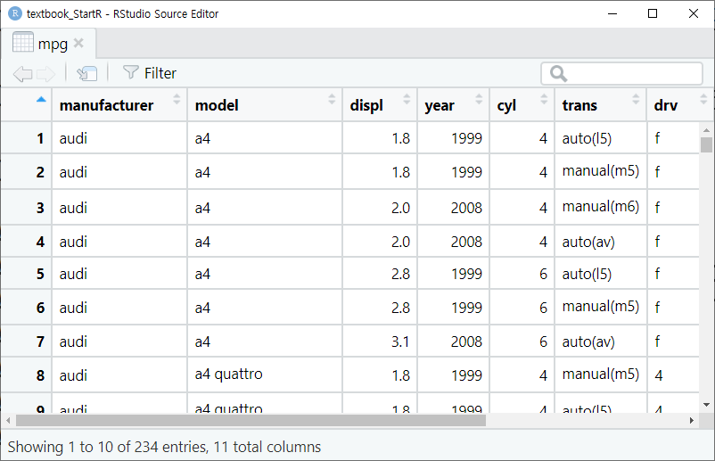
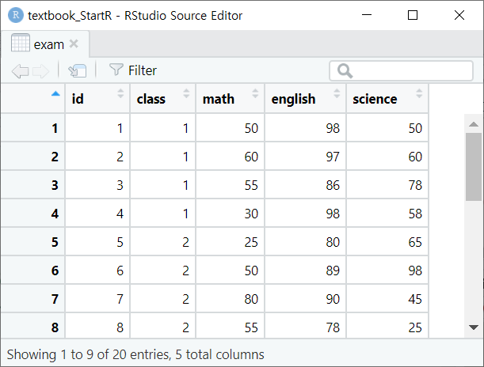
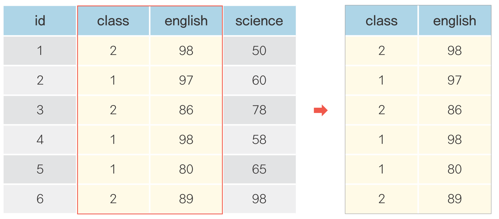
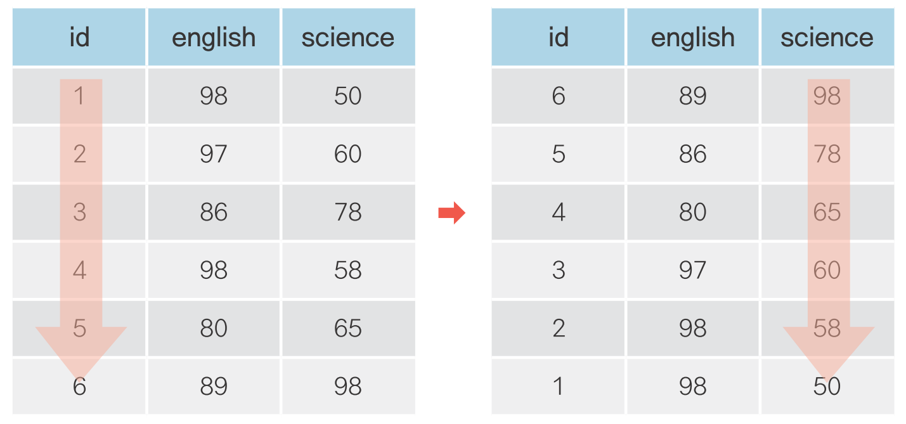
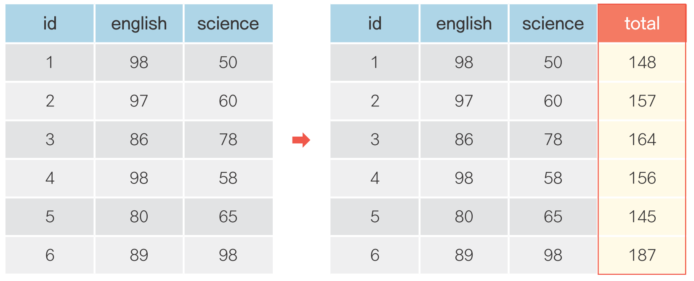
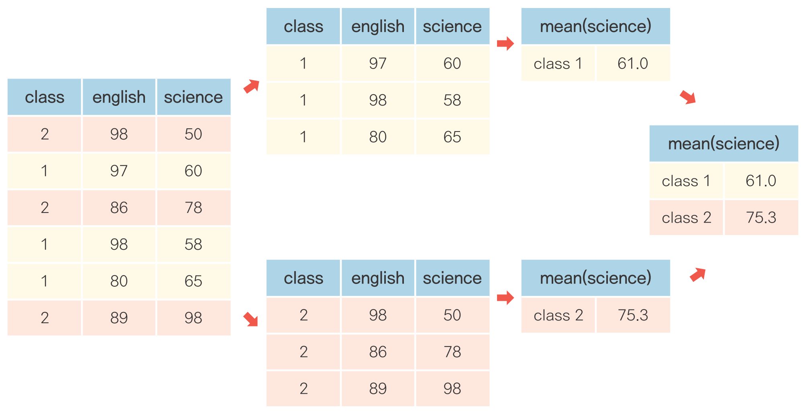
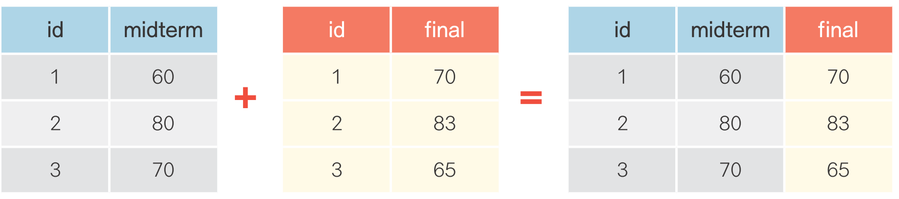

```{r xaringan-tile-view, echo=FALSE}
# overview 기능 - 키보드 o 
# 크롬 시크릿 모드에서 열기
# vimium 단축키와 겹침
xaringanExtra::use_tile_view()
```

```{r setup, include=FALSE}
options(htmltools.dir.version = FALSE, 
        width = 70, 
        # max.print = 80,
        tibble.print_max = 40,
        tibble.width = 70,
        servr.interval = 0.01) # Viewer 수정 반영 속도
knitr::opts_chunk$set(cache = F, fig.height = 5, warning = F, message = F)
```

```{r echo=FALSE}
rm(list = ls())
```


class: center, middle

# 쉽게 배우는 R 데이터 분석

---

### 김영우


#### <https://facebook.com/groups/datacommunity>
#### <https://github.com/youngwoos>
#### <stats7445@gmail.com>

---

### 목차

#### 1. 안녕 R? - 친해지기
- [변수](#variable)
- [함수](#function)
- [패키지](#package)

#### 2. 데이터 프레임의 세계로
- [데이터 프레임 만들기](#dataframe)
- [외부 데이터를 R로 가져오기](#read_file)
- [데이터 프레임을 csv 파일로 저장하기](#write_file)

#### 3. 데이터 분석 기초
- [데이터 파악하기](#eda)
- [변수명 바꾸기](#rename)
- [파생 변수 만들기](#derived_variable)
- [조건 함수](#ifelse)

---

### 목차

#### 4. 자유자재로 데이터 가공하기
- [조건에 맞는 데이터만 추출하기](#filter)
- [필요한 변수만 추출하기](#select)
- [순서대로 정렬하기](#arrange)
- [파생변수 추가하기](#mutate)
- [집단별로 요약하기](#groupby_summarise)

#### 5. 그래프 만들기
- [산점도](#point)
- [선 그래프](#line)
- [막대 그래프](#bar)
- [상자그림](#boxplot)

---
### 목차

#### 6. 데이터 합치기
- [가로로 합치기 - 열 추가](#left_join)
- [세로로 합치기 - 행 추가](#bind_rows)

#### 7. 데이터 정제하기
- [빠진 데이터를 찾아라! - 결측치 정제하기](#missing_value)
- [이상한 데이터를 찾아라! - 이상치 정제하기](#outlier)


---


class: title0

안녕 R? - 친해지기

---


### 무작정 따라 해보기!

#### 패키지 설치
```{r, eval=FALSE}
install.packages("dplyr")
install.packages("ggplot2")
```

#### 패키지 로드  
```{r}
library(dplyr)
library(ggplot2)
```

#### 데이터 검토

```{r, eval=F}
head(mpg)
```  

---

```{r}
head(mpg)
```  


---

```{r}
dim(mpg)
```  

---

```{r eval=F}
str(mpg)
```

```{r echo=F}
str(mpg, strict.width = "cut")
```

---

```{r}
summary(mpg)
```

---

```{r, eval=FALSE}
View(mpg)
```

> [유의] `V`는 대문자

```{r echo=F, out.width = "400px", fig.align="left"}

```


---

#### 데이터 분석

1.회사별 평균 연비 높은순 정렬


```{r eval=F}
mpg %>%
  group_by(manufacturer) %>%
  summarise(mean_hwy = mean(hwy)) %>%
  arrange(desc(mean_hwy))
```

.scroll-box-18[
```{r echo=F}
mpg %>%
  group_by(manufacturer) %>%
  summarise(mean_hwy = mean(hwy)) %>%
  arrange(desc(mean_hwy))
```
]
---


#### 데이터 분석
2.배기량이 연비에 미치는 영향 회귀분석
```{r eval=F}
lm_mpg <- lm(data = mpg, hwy ~ displ)  # 회귀분석 모형 생성
summary(lm_mpg)                        # 결과 출력
```

---

```{r eval=F}
summary(lm_mpg)
```

```{r highlight.output = c(12, 17), echo=F}
lm_mpg <- lm(data = mpg, hwy ~ displ)  # 회귀분석 모형 생성
summary(lm_mpg)                        # 결과 출력
```


---


#### 그래프 만들기
3.배기량과 연비의 관계 그래프
```{r}
qplot(data = mpg, x = displ, y = hwy)
```
---

class: title0

데이터 분석을 위한 연장 챙기기

---
name: variable
class: title1

변수

---

#### mpg 데이터의 변수 다뤄보기

```{r}
# 사용할 패키지 로드
library(ggplot2)

head(mpg)
```

---

```{r fig.height=4, fig.width=6}
mean(mpg$hwy)
max(mpg$hwy)
hist(mpg$hwy)
```

---

#### 변수 만들기

```{r}
a <- 1
a
```

--

```{r}
b <- 2
b

c <- 3
c

ab <- 3.5
ab
```


---


#### 변수로 연산하기
```{r}
a + b
a + b + c
4 / b
5 * b
```


---

####연속값 변수 만들기
```{r}
d <- c(1, 2, 3, 4, 5)
d

e <- c(1:5)
e
```

---

####연속값 변수로 연산하기 
```{r}
d
d + 2
```

--

```{r}
d
e
d + e
```


---


#### 문자 변수 만들기
```{r}
a2 <- "a"
a2

b2 <- "text"
b2

c2 <- "Hello world!"
c2
```


---


####연속 문자 변수 만들기
```{r}
d2 <- c("a", "b", "c")
d2

e2 <- c("Hello!", "World", "is", "good!")
e2


```


---

#### 문자 변수는 연산 불가
```{r, error=T}
b2 + 2
a2 + b2
```


---

name: function
class: title1

함수

---

```{r}
a <- c(1, 2, 3)
a

mean(a)  # 평균
max(a)   # 최대값
min(a)   # 최소값
```


---

```{r}
b <- c("a", "a", "b", "c")
b
```

```{r}
qplot(b)  # 빈도 그래프 만들기
```


---

#### 문자 처리 함수

```{r}
e2
```

--

```{r}
paste(e2, collapse = " ")              # 빈칸 구분자로 문자 붙이기
```

--

```{r}
e2_paste <- paste(e2, collapse = " ")  # 함수 출력 결과로 변수 만들기
e2_paste
```

--

```{r}
e3_paste <- paste(e2, collapse = ",")
e3_paste
```

---
name: package
class: title1

패키지

---

#### 패키지 이용하기  

- R Script 저장하기
- Workspace 저장하기
- RStudio 재실행

---

#### 패키지 로드 안하면 함수 사용 불가

```{r}
b
```

```{r, eval=F}
qplot(b)
```

```{r, error=T, echo=F}
detach(package:ggplot2)
qplot(b)
```


```{r, eval=F}
head(mpg)
```


```{r, error=T, echo=F}
detach(package:ggplot2)
head(mpg)
```


---

```{r}
library(ggplot2)
```

.pull-left[
```{r}
qplot(b)
```
]

.pull-right[

.scroll-box-18[
```{r }
head(mpg)
```
]
]


---

#### 함수 파라미터(parameter) 지정하기
```{r, message=F}
# 'x =' x축
qplot(data = mpg, x = hwy)
```

---


#### 함수 파라미터(parameter) 지정하기

```{r, message=F}
# 'x =' x축
qplot(data = mpg, x = cty)
```

---


#### 함수 파라미터(parameter) 지정하기

```{r, message=F}
# 'geom = ' 그래프 형식
qplot(data = mpg, y = hwy, x = drv, geom = "point")
```

---


#### 함수 파라미터(parameter) 지정하기

```{r, message=F}
# 'geom = ' 그래프 형식
qplot(data = mpg, y = hwy, x = drv, geom = "boxplot")
```

---


#### 함수 파라미터(parameter) 지정하기
```{r, message=F}
# 'colour = ' 색깔 구분
qplot(data = mpg, y = hwy, x = drv, geom = "boxplot", colour = drv)
```


---

#### 함수 사용법이 궁금할 땐 help

```
?qplot
```

---

class: title0

데이터 프레임의 세계로!

---
name: dataframe
class: title1

데이터 프레임 만들기

---

### 데이터 프레임 만들기

```{r}
history <- c(90, 80, 60, 70)  # 역사 점수 생성
history

math <- c(50, 60, 100, 20)    # 수학 점수 생성
math
```

---

```{r}
# 변수 합해서 데이터프레임 만들기
df_midterm <- data.frame(history, math)
df_midterm
```

---

```{r}
# 반 추가하기
class <- c(1, 1, 2, 2)
class
```

--

```{r}
df_midterm <- data.frame(history, math, class)
df_midterm
```

--

```{r}
mean(df_midterm$history)
mean(df_midterm$math)
```

---
#### 1. 변수 따로 만들어서 합치기
```{r}
history <- c(90, 80, 60, 70)
math <- c(50, 60, 100, 20)
class <- c(1, 1, 2, 2)

df_midterm <- data.frame(history, math, class)
```

--

#### 2. 함수 중첩해 한 번에 만들기
```{r}
df_midterm <- data.frame(history = c(90, 80, 60, 70),
                         math = c(50, 60, 100, 20),
                         class = c(1, 1, 2, 2))
df_midterm
```


---

name: read_file
class: title1

외부 데이터를 R로 가져오기

---

#### 엑셀 데이터 불러오기
```{r eval=FALSE}
# readxl 패키지 설치
install.packages("readxl")

# readxl 패키지 로드
library(readxl)
```

```{r echo=FALSE}

# readxl 패키지 로드
library(readxl)
```

---

```{r eval=F}
# 엑셀 파일 불러오기
df_finalexam <- read_excel("finalexam.xlsx", sheet = 1, col_names = T)
df_finalexam
```

.scroll-box-20[
```{r echo=F}
# 엑셀 파일 불러오기
df_finalexam <- read_excel("finalexam.xlsx", sheet = 1, col_names = T)
df_finalexam
```
]

> [주의] 프로젝트 폴더(Working directory)에 불러올 파일이 있어야 함

---


```{r}
mean(df_finalexam$math)
mean(df_finalexam$history)
mean(df_finalexam$english)
```


---

#### `col_names` 파라미터

.scroll-box-24[
```{r}
# 첫번째 행 변수명으로 로드
read_excel("finalexam.xlsx", sheet = 1, col_names = T)
```
]
---

#### `col_names` 파라미터

.scroll-box-24[
```{r}
# 첫번째 행 변수명으로 로드 X
read_excel("finalexam.xlsx", sheet = 1, col_names = F)
```
]

---

### csv 파일 불러오기
- 범용 데이터 형식, 다양한 소프트웨어에서 사용
- 값 사이를 쉼표(,)로 구분
- 용량 작음

.scroll-box-20[
```{r}
read.csv("csv_exam.csv", header = T)
```
]

---

```{r, error=T}
csv_exam
```

--
.scroll-box-22[
```{r}
exam <- read.csv("csv_exam.csv", header = T)
exam
```
]

---

name: write_file
class: title1

데이터 프레임을<br>
csv 파일로 저장하기

---

#### 데이터 프레임을 csv 파일로 저장하기
```{r eval=F}
write.csv(df_finalexam, file = "output_newdata.csv")
```

---

class: title0

데이터 분석 기초

---
name: eda
class: title1

데이터 파악하기

---

### 데이터 파악하기

.left[

&nbsp; &nbsp; 함수     |&nbsp; &nbsp; 기능
---------|----------------------------------
&nbsp; &nbsp; head()   &nbsp; |&nbsp; &nbsp; 데이터 앞부분 출력      &nbsp; &nbsp;
&nbsp; &nbsp; tail()   &nbsp; |&nbsp; &nbsp; 데이터 뒷부분 출력      &nbsp; &nbsp;
&nbsp; &nbsp; View()   &nbsp; |&nbsp; &nbsp; 뷰어 창에서 데이터 확인 &nbsp; &nbsp;
&nbsp; &nbsp; dim()    &nbsp; |&nbsp; &nbsp; 데이터 차원 출력        &nbsp; &nbsp;           &nbsp; &nbsp;
&nbsp; &nbsp; str()    &nbsp; |&nbsp; &nbsp; 데이터 속성 출력        &nbsp; &nbsp;           &nbsp; &nbsp;
&nbsp; &nbsp; summary()&nbsp; |&nbsp; &nbsp; 요약 통계량 출력&nbsp; &nbsp;

]


---

#### 데이터 준비하기

```{r}
exam <- read.csv("csv_exam.csv", header = T)
exam
```

---

#### head() - 데이터 앞부분 확인하기
```{r}
head(exam)      # 앞에서부터 6행까지 출력
head(exam, 10)  # 앞에서부터 10행까지 출력
```

---

#### tail() - 데이터 뒷부분 확인하기

```{r}
tail(exam)      # 뒤에서부터 6행까지 출력
tail(exam, 10)  # 뒤에서부터 10행까지 출력
```

---

#### View() - 뷰어 창에서 데이터 확인하기

```{r, eval=F}
View(exam)
```

> [유의] `V`는 대문자

```{r echo=F, out.width = "400px", fig.align="left"}

```


---

#### dim() - 몇 행 몇 열로 구성되는지 알아보기

```{r}
dim(exam)  # 행, 열 출력
```


---

#### str() - 속성 파악하기

```{r}
str(exam)  # 데이터 속성 확인
```

---

#### summary() - 요약 통계량 산출하기

```{r}
summary(exam)  # 요약 통계량 출력
```

---

### 연습! mpg 데이터 파악하기

```{r}
# ggplot2의 mpg 데이터 불러오기
mpg <- ggplot2::mpg
```

---

```{r}
head(mpg)    # 데이터 앞부분 확인
```

--

```{r}
tail(mpg)    # 데이터 뒷부분 확인
```

---

```{r, eval=F}
View(mpg)    # 데이터 뷰어 창 확인
```

```{r echo=F, out.width = "400px", fig.align="left"}

```

---

```{r}
dim(mpg)     # 행, 열 출력
```

---

```{r}
str(mpg)     # 데이터 속성 확인
```

---

```{r}
summary(mpg)  # 요약 통계량 출력
```


---
name: rename
class: title1

데이터 수정하기<br>
**- 변수명 바꾸기**

---

#### dplyr 패키지 설치 & 로드
```{r, eval=FALSE}
install.packages("dplyr")  # dplyr 설치
library(dplyr)             # dplyr 로드
```

<!-- 실행용 코드, 안보여줌 -->
```{r, echo=FALSE}
library(dplyr)             # dplyr 패키지 로드
```

---

#### 데이터 프레임 만들기

```{r}
df_raw <- data.frame(var1 = c(1, 2, 1),
                     var2 = c(2, 3, 2))
df_raw
```

--

#### 데이터 프레임 복사본 만들기

```{r}
df_new <- df_raw  # 복사본 생성
df_new            # 출력
```

---

#### 변수명 바꾸기

```{r}
df_new <- rename(df_new, v2 = var2)  # var2를 v2로 수정
df_new
```

> [유의] rename()에 '새 변수명 = 기존 변수명' 순서로 입력

--

#### 원본과 비교

```{r}
df_raw
```


---

### 혼자서 해보기

`mpg` 데이터를 이용해서 분석 문제를 해결해 보세요.

`mpg` 데이터의 변수명은 긴 단어를 짧게 줄인 축약어로 되어있습니다. `cty` 변수는 도시 연비, `hwy` 변수는 <br> 고속도로 연비를 의미합니다. 변수명을 이해하기 쉬운 단어로 바꾸려고 합니다. `mpg` 데이터를 이용해서 아래 문제를 해결해 보세요.

Q1. `ggplot2` 패키지의 `mpg` 데이터를 사용할 수 있도록 불러온 뒤 복사본을 만드세요.

Q2. 복사본 데이터를 이용해서 `cty`는 `city`로, `hwy`는 `highway`로 변수명을 수정하세요.

Q3. 데이터 일부를 출력해 변수명이 바뀌었는지 확인해 보세요. 아래와 같은 결과물이 출력되어야 합니다.

<!-- 코드 없이 결과물만 출력 -->
```{r, echo=F}
mpg_new <- ggplot2::mpg
mpg_new <- rename(mpg_new, city = cty)     # cty를 city로 수정
mpg_new <- rename(mpg_new, highway = hwy)  # hwy를 highway로 수정
head(mpg_new)
```

---

#### 정답
Q1. `ggplot2` 패키지의 `mpg` 데이터를 사용할 수 있도록 불러온 뒤 복사본을 만드세요.
```{r}
mpg <- ggplot2::mpg  # mpg 데이터 불러오기
mpg_new <- mpg       # 복사본 만들기
```

---

Q2. 복사본 데이터를 이용해서 `cty`는 `city`로, `hwy`는 `highway`로 변수명을 수정하세요.

```{r}
mpg_new <- rename(mpg_new, city = cty)     # cty를 city로 수정
mpg_new <- rename(mpg_new, highway = hwy)  # hwy를 highway로 수정
```

--

<br>
Q3. 데이터 일부를 출력해 변수명이 바뀌었는지 확인해 보세요. 아래와 같은 결과물이 출력되어야 합니다.
```{r}
head(mpg_new)                              # 데이터 일부 출력
```

---
name: derived_variable
class: title1

데이터 수정하기<br>
**- 파생변수 만들기**

---

<br>
.center[
## 파생변수 만들기
]

<br>
```{r echo=F, out.width = "600px", fig.align="center"}
knitr::include_graphics("img/new_var.png")
```

---

#### 데이터 프레임 만들기

```{r}
df <- data.frame(var1 = c(4, 3, 8),
                 var2 = c(2, 6, 1))
df
```

---

#### 파생변수 만들기
```{r}
df$var_sum <- df$var1 + df$var2       # var_sum 파생변수 생성
df
```

--

```{r}
df$var_mean <- (df$var1 + df$var2)/2  # var_mean 파생변수 생성
df
```

---

#### mpg 통합 연비 변수 만들기

--

```{r}
mpg$total <- (mpg$cty + mpg$hwy)/2  # 통합 연비 변수 생성
```

--

```{r}
str(mpg)
mean(mpg$total)
```

---

name: ifelse
class: title1

데이터 수정하기<br>
**- 조건 함수로 파생 변수 만들기**

---

#### 기준값 정하기

```{r}
summary(mpg$total)  # 요약 통계량 산출
hist(mpg$total)     # 히스토그램 생성
```

---

#### 조건 함수로 합격 판정 변수 만들기

```{r echo=F, out.width = "600px", fig.align="left"}
knitr::include_graphics("img/ifelse.png")
```

```{r}
# 20 이상이면 pass, 그렇지 않으면 fail 부여
mpg$test <- ifelse(mpg$total >= 20, "pass", "fail")
```

```{r eval=F}
mpg %>%
  select(total, test) %>%
  head(20)
```

---

```{r echo=F}
mpg %>%
  select(total, test) %>%
  head(20)
```

---

#### 빈도표, 막대 그래프로 합격 판정 자동차 수 살펴보기

```{r fig.height=4}
table(mpg$test)   # 연비 합격 빈도표 생성

library(ggplot2)  # ggplot2 로드
qplot(mpg$test)   # 연비 합격 빈도 막대 그래프 생성
```

---

### 중첩 조건문 활용하기 - 연비 등급 변수 만들기

.left[

&nbsp; 등급|&nbsp; &nbsp;total 기준
----|---
&nbsp; &nbsp; A &nbsp; &nbsp;   |&nbsp; &nbsp; 30 이상 &nbsp; &nbsp;
&nbsp; &nbsp; B &nbsp; &nbsp;   |&nbsp; &nbsp; 20~29 &nbsp; &nbsp;
&nbsp; &nbsp; C &nbsp; &nbsp;   |&nbsp; &nbsp; 20 미만 &nbsp; &nbsp;

]
<br><br><br><br><br><br><br>

--

```{r}
# total 기준으로 A, B, C 등급 부여
mpg$grade <- ifelse(mpg$total >= 30, "A",
                    ifelse(mpg$total >= 20, "B", "C"))
```

> [유의] ifelse()가 두 번 반복되므로 열리는 괄호와 닫히는 괄호가 각각 두 개, 쉼표도 각각 두 개

---

```{r eval=F}
mpg %>%
  select(total, test, grade) %>%
  head(20)
```


.scroll-box-22[
```{r echo=F}
mpg %>%
  select(total, test, grade) %>%
  head(20)
```
]

---

#### 빈도표, 막대 그래프로 연비 등급 살펴보기
```{r}
table(mpg$grade)  # 등급 빈도표 생성
qplot(mpg$grade)  # 등급 빈도 막대 그래프 생성
```


---
#### 원하는 만큼 범주 만들기: 범주 개수 - 1

.left[
등급|total 기준
:----:|:---:
&nbsp; &nbsp; &nbsp; A &nbsp;&nbsp; &nbsp;    |&nbsp; &nbsp; 30 이상&nbsp; &nbsp;
&nbsp; &nbsp; &nbsp; B &nbsp;&nbsp; &nbsp;    |&nbsp; &nbsp; 25 이상&nbsp; &nbsp;
&nbsp; &nbsp; &nbsp; C &nbsp;&nbsp; &nbsp;    |&nbsp; &nbsp; 20 이상&nbsp; &nbsp;
&nbsp; &nbsp; &nbsp; D &nbsp;&nbsp; &nbsp;    |&nbsp; &nbsp; 20 미만&nbsp; &nbsp;
]

<br><br><br><br><br><br>
```{r, eval=F}
# A, B, C, D 등급 부여
mpg$grade2 <- ifelse(mpg$total >= 30, "A",
                     ifelse(mpg$total >= 25, "B",
                            ifelse(mpg$total >= 20, "C", "D")))
```

---

### 정리하기

```{r, eval=F}
# 1. 데이터, 패키지 준비
mpg <- ggplot2::mpg                 # 데이터 가져오기
library(dplyr)                      # dplyr 로드
library(ggplot2)                    # ggplot2 로드

# 2. 데이터 파악
head(mpg)    # 데이터 앞부분
tail(mpg)    # 데이터 뒷부분
View(mpg)    # 데이터 뷰어 창
dim(mpg)     # 차원
str(mpg)     # 속성
summary(mpg) # 요약 통계량
```

---

```{r, eval=F}
# 3. 변수명 수정
mpg <- rename(mpg, company = manufacturer)  # 변수명 수정

# 4. 파생변수 생성
mpg$total <- (mpg$cty + mpg$hwy)/2                   # 변수 조합
mpg$test <- ifelse(mpg$total >= 20, "pass", "fail")  # 조건문 활용

# 5. 빈도 확인
table(mpg$test)  # 빈도표 출력
qplot(mpg$test)  # 막대 그래프 생성
```

---

class: title1

분석 도전

---

### 분석 도전

`ggplot2` 패키지에는 미국 동북중부 437개 지역의 인구통계 정보를 담은 `midwest`라는 데이터가 포함되어 있습니다. `midwest` 데이터를 사용해서 데이터 분석 문제를 해결해보세요.

Q1. `ggplot2`의 `midwest` 데이터를 불러와 데이터의 특성을 파악하세요.

Q2. `poptotal`(전체 인구) 변수를 `total`로, `popasian`(아시아 인구) 변수를 `asian`으로 변수명을 <br> &nbsp; &nbsp; &nbsp; &nbsp; 수정하세요.

Q3. `total`, `asian` 변수를 이용해서 '전체 인구 대비 아시아 인구 백분율' 파생변수를 만들고, <br> &nbsp; &nbsp; &nbsp; &nbsp; 히스토그램을 만들어 도시들이 어떻게 분포하는지 살펴보세요.

Q4. 아시아 인구 백분율 전체 평균을 초과하면 `"large"`, 그 외에는 `"small"`을 부여한 파생변수를 <br> &nbsp; &nbsp; &nbsp; &nbsp;만드세요.

Q5.`"large"`와 `"small"`에 해당하는 지역이 얼마나 되는지, 빈도표와 빈도 막대 그래프를 만들어 <br> &nbsp; &nbsp; &nbsp; &nbsp; 확인해보세요.


---

Q1. `ggplot2`의 `midwest` 데이터를 불러와 데이터의 특성을 파악하세요.
```{r, eval=F}
midwest <- ggplot2::midwest
head(midwest)
tail(midwest)
View(midwest)
dim(midwest)
str(midwest)
summary(midwest)
```

---

Q2. `poptotal`(전체 인구) 변수를 `total`로, `popasian`(아시아 인구) 변수를 `asian`으로 변수명을 <br> &nbsp; &nbsp; &nbsp; &nbsp; 수정하세요.

```{r}
library(dplyr)
midwest <- rename(midwest, total = poptotal)
midwest <- rename(midwest, asian = popasian)
```

---
Q3. `total`, `asian` 변수를 이용해서 '전체 인구 대비 아시아 인구 백분율' 파생변수를 만들고, <br> &nbsp; &nbsp; &nbsp; &nbsp; 히스토그램을 만들어 도시들이 어떻게 분포하는지 살펴보세요.

```{r}
midwest$ratio <- midwest$asian/midwest$total*100
hist(midwest$ratio)
```

---
Q4. 아시아 인구 백분율 전체 평균을 초과하면 `"large"`, 그 외에는 `"small"`을 부여한 파생변수를 <br> &nbsp; &nbsp; &nbsp; &nbsp;만드세요.
```{r}
mean(midwest$ratio)
midwest$group <- ifelse(midwest$ratio > 0.4872462, "large", "small")
```


---

Q5.`"large"`와 `"small"`에 해당하는 지역이 얼마나 되는지, 빈도표와 빈도 막대 그래프를 만들어 <br> &nbsp; &nbsp; &nbsp; &nbsp; 확인해보세요.

.pull-left[
```{r}
table(midwest$group)
```
]

.pull-right[

```{r}
library(ggplot2)
qplot(midwest$group)
```

]


```{r echo=FALSE}
rm(list = ls())
```


---

class: title0

자유자재로 데이터 가공하기


```{r echo=FALSE}
rm(list = ls())
```

---

<br>

## .center[자유자재로 데이터 가공하기]

<br>
```{r echo=F, out.width = "600px", fig.align="center"}
knitr::include_graphics("img/preprocessing.png")
```

---

#### 데이터 전처리(Preprocessing) - dplyr 패키지

.left[
&nbsp; &nbsp; 함수       |&nbsp; 기능
-----------|-------
&nbsp; &nbsp; filter()   &nbsp; | &nbsp; 행 추출&nbsp; &nbsp;
&nbsp; &nbsp; select()   &nbsp; | &nbsp; 열(변수) 추출&nbsp; &nbsp;
&nbsp; &nbsp; mutate()   &nbsp; | &nbsp; 변수 추가&nbsp; &nbsp;
&nbsp; &nbsp; arrange()  &nbsp; | &nbsp; 정렬&nbsp; &nbsp;
&nbsp; &nbsp; summarise()&nbsp; | &nbsp; 통계치 산출&nbsp; &nbsp;
&nbsp; &nbsp; group_by() &nbsp; | &nbsp; 집단별로 나누기&nbsp; &nbsp;
&nbsp; &nbsp; left_join()&nbsp; | &nbsp; 데이터 합치기(열)&nbsp; &nbsp;
&nbsp; &nbsp; bind_rows()&nbsp; | &nbsp; 데이터 합치기(행)&nbsp; &nbsp;

]

---

name: filter
class: title1

조건에 맞는 데이터만 추출하기

---
<br><br>
### .center[조건에 맞는 데이터만 추출하기]
<br>
```{r echo=F, out.width = "600px", fig.align="center"}
knitr::include_graphics("img/filter.png")
```

---

#### dplyr 패키지 로드
```{r, eval=F}
library(dplyr)
exam <- read.csv("csv_exam.csv")
exam
```


```{r, echo=F}
library(dplyr)
exam <- read.csv("csv_exam.csv")
```

---

```{r}
exam
```

---


```{r}
# exam에서 class가 1인 경우만 추출하여 출력
exam %>% filter(class == 1)
```

> [참고] 단축키 [Ctrl+Shfit+M]으로 `%>%` 기호 입력

--

```{r}
# 2반인 경우만 추출
exam %>% filter(class == 2)
```

---

```{r}
# 1반이 아닌 경우
exam %>% filter(class != 1)
```

---

```{r}
# 3반이 아닌 경우
exam %>% filter(class != 3)
```

---

#### 초과, 미만, 이상, 이하 조건 걸기

```{r}
# 수학 점수가 50점을 초과한 경우
exam %>% filter(math > 50)
```

---

```{r}
# 수학 점수가 50점 미만인 경우
exam %>% filter(math < 50)
```

---

```{r}
# 영어 점수가 80점 이상인 경우
exam %>% filter(english >= 80)
```

---

```{r}
# 영어 점수가 80점 이하인 경우
exam %>% filter(english <= 80)
```


---

#### 여러 조건을 충족하는 행 추출하기

```{r}
# 1반 이면서 수학 점수가 50점 이상인 경우
exam %>% filter(class == 1 & math >= 50)
```

---

```{r}
# 2반 이면서 영어 점수가 80점 이상인 경우
exam %>% filter(class == 2 & english >= 80)
```

---

#### 여러 조건 중 하나 이상 충족하는 행 추출하기

```{r}
# 수학 점수가 90점 이상이거나 영어 점수가 90점 이상인 경우
exam %>% filter(math >= 90 | english >= 90)
```

---

```{r}
# 영어 점수가 90점 미만이거나 과학점수가 50점 미만인 경우
exam %>% filter(english < 90 | science < 50)
```

---

#### 목록에 해당되는 행 추출하기

```{r}
exam %>% filter(class == 1 | class == 3 | class == 5)  # 1, 3, 5반 추출
```

---

#### 목록에 해당되는 행 추출하기 - `%in%` 이용하기

```{r}
exam %>% filter(class %in% c(1, 3, 5))  # 1, 3, 5반 추출
```

---

#### 추출한 행으로 데이터 만들기

```{r}
class1 <- exam %>% filter(class == 1)  # class가 1인 행 추출, class1에 할당
class2 <- exam %>% filter(class == 2)  # class가 2인 행 추출, class2에 할당

mean(class1$math)                      # 1반 수학 점수 평균 구하기
mean(class2$math)                      # 2반 수학 점수 평균 구하기
```

---

#### R에서 사용하는 기호들

.left[

논리 연산자  | &nbsp; &nbsp; 기능
:-----------:|---
<            | &nbsp; &nbsp; 작다
<=           | &nbsp; &nbsp; 작거나 같다 &nbsp;
>            | &nbsp; &nbsp; 크다
>=           | &nbsp; &nbsp; 크거나 같다
==           | &nbsp; &nbsp; 같다
!=           | &nbsp; &nbsp; 같지 않다
│            | &nbsp; &nbsp; 또는
&            | &nbsp; &nbsp; 그리고
%in%         | &nbsp; &nbsp; 매칭 확인

]
---

#### R에서 사용하는 기호들

.left[
산술 연산자|&nbsp; &nbsp;기능
:---------:|---
+          | &nbsp; &nbsp;더하기
-          | &nbsp; &nbsp;빼기
*          | &nbsp; &nbsp;곱하기
/          | &nbsp; &nbsp;나누기
^ , **     | &nbsp; &nbsp;제곱
%/%        | &nbsp; &nbsp;나눗셈의 몫
%%         | &nbsp; &nbsp;나눗셈의 나머지
]

---
### 혼자서 해보기

`mpg` 데이터를 이용해서 분석 문제를 해결해 보세요.

Q1. 자동차 배기량에 따라 고속도로 연비가 다른지 알아보려고 합니다. `displ`(배기량)이 `4` 이하인 <br> &nbsp; &nbsp; &nbsp; &nbsp;자동차와 `5` 이상인 자동차 중 어떤 자동차의 `hwy`(고속도로 연비)가 평균적으로 더 높은지 알아보세요.

Q2. 자동차 제조 회사에 따라 도시 연비가 다른지 알아보려고 합니다. `"audi"`와 `"toyota"` 중 <br> &nbsp; &nbsp; &nbsp; &nbsp;어느 `manufacturer`(자동차 제조 회사)의 `cty`(도시 연비)가 평균적으로 더 높은지 알아보세요.

Q3. `"chevrolet"`, `"ford"`, `"honda"` 자동차의 고속도로 연비 평균을 알아보려고 합니다. <br> &nbsp; &nbsp; &nbsp; &nbsp; 이 회사들의 자동차를 추출한 뒤 `hwy` 전체 평균을 구해보세요.

---

Q1. 자동차 배기량에 따라 고속도로 연비가 다른지 알아보려고 합니다. `displ`(배기량)이 `4` 이하인 <br> &nbsp; &nbsp; &nbsp; &nbsp;자동차와 `5` 이상인 자동차 중 어떤 자동차의 `hwy`(고속도로 연비)가 평균적으로 더 높은지 알아보세요.

```{r}
mpg <- ggplot2::mpg                  # mpg 데이터 불러오기

mpg_a <- mpg %>% filter(displ <= 4)  # displ 4 이하 추출
mpg_b <- mpg %>% filter(displ >= 5)  # displ 5 이상 추출

mean(mpg_a$hwy)  # displ 4 이하 hwy 평균
mean(mpg_b$hwy)  # displ 5 이상 hwy 평균
```

---

Q2. 자동차 제조 회사에 따라 도시 연비가 다른지 알아보려고 합니다. `"audi"`와 `"toyota"` 중 <br> &nbsp; &nbsp; &nbsp; &nbsp;어느 `manufacturer`(자동차 제조 회사)의 `cty`(도시 연비)가 평균적으로 더 높은지 알아보세요.
```{r}
mpg_audi <- mpg %>% filter(manufacturer == "audi")      # audi 추출
mpg_toyota <- mpg %>% filter(manufacturer == "toyota")  # toyota 추출

mean(mpg_audi$cty)    # audi의 cty 평균
mean(mpg_toyota$cty)  # toyota의 cty 평균
```

---

Q3. `"chevrolet"`, `"ford"`, `"honda"` 자동차의 고속도로 연비 평균을 알아보려고 합니다. <br> &nbsp; &nbsp; &nbsp; &nbsp; 이 회사들의 자동차를 추출한 뒤 `hwy` 전체 평균을 구해보세요.
```{r}
# manufacturer가 chevrolet, ford, honda에 해당하면 추출
mpg_new <- mpg %>%
  filter(manufacturer %in% c("chevrolet", "ford", "honda"))

mean(mpg_new$hwy)
```


---
name: select
class: title1

필요한 변수만 추출하기

---

<br>
### .center[필요한 변수만 추출하기]

<br>
```{r echo=F, out.width = "600px", fig.align="center"}

```

---

```{r}
exam %>% select(math)  # math 추출
```

---

```{r}
exam %>% select(english)  # english 추출
```

---

#### 여러 변수 추출하기

```{r}
exam %>% select(class, math, english)  # class, math, english 변수 추출
```

---

#### 변수 제외하기

```{r}
exam %>% select(-math)  # math 제외
```

---

#### 변수 제외하기

```{r}
exam %>% select(-math, -english)  # math, english 제외
```

---

#### filter()와 select() 조합하기

```{r}
# class가 1인 행만 추출한 다음 english 추출
exam %>% filter(class == 1) %>% select(english)
```

---

#### dplyr Tip - 줄 바꿔서 가독성 높은 코드 만들기
```{r, eval=F}
exam %>%
  filter(class == 1) %>%  # class가 1인 행 추출
  select(english)         # english 추출
```

---

#### dplyr Tip - 일부만 출력하기

```{r}
exam %>%
  select(id, math) %>%  # id, math 추출
  head                  # 앞부분 6행까지 추출
```

---

#### dplyr Tip - 일부만 출력하기

```{r}
exam %>%
  select(id, math) %>%  # id, math 추출
  head(10)              # 앞부분 10행까지 추출
```

---


### 혼자서 해보기

`mpg` 데이터를 이용해서 분석 문제를 해결해보세요.

Q1. `mpg` 데이터는 11개 변수로 구성되어 있습니다. 이 중 일부만 추출해서 분석에 활용하려고 합니다. <br> &nbsp; &nbsp; &nbsp; &nbsp; `mpg` 데이터에서 `class`(자동차 종류), `cty`(도시 연비) 변수를 추출해 새로운 데이터를 만드세요. <br> &nbsp; &nbsp; &nbsp; &nbsp; 새로 만든 데이터의 일부를 출력해서 두 변수로만 구성되어 있는지 확인하세요.

Q2. 자동차 종류에 따라 도시 연비가 다른지 알아보려고 합니다. 앞에서 추출한 데이터를 이용해서 <br> &nbsp; &nbsp; &nbsp; &nbsp; `class`(자동차 종류)가 `"suv"`인 자동차와 `"compact"`인 자동차 중 어떤 자동차의 `cty`(도시 연비) <br> &nbsp; &nbsp; &nbsp; &nbsp; 평균이 더 높은지 알아보세요.

---

Q1. `mpg` 데이터는 11개 변수로 구성되어 있습니다. 이 중 일부만 추출해서 분석에 활용하려고 합니다. <br> &nbsp; &nbsp; &nbsp; &nbsp; `mpg` 데이터에서 `class`(자동차 종류), `cty`(도시 연비) 변수를 추출해 새로운 데이터를 만드세요. <br> &nbsp; &nbsp; &nbsp; &nbsp; 새로 만든 데이터의 일부를 출력해서 두 변수로만 구성되어 있는지 확인하세요.

```{r}
mpg <- ggplot2::mpg                 # mpg 데이터 불러오기

df <- mpg %>% select(class, cty)    # class, cty 변수 추출
head(df)                            # df 일부 출력

```

---

Q2. 자동차 종류에 따라 도시 연비가 다른지 알아보려고 합니다. 앞에서 추출한 데이터를 이용해서 <br> &nbsp; &nbsp; &nbsp; &nbsp; `class`(자동차 종류)가 `"suv"`인 자동차와 `"compact"`인 자동차 중 어떤 자동차의 `cty`(도시 연비) <br> &nbsp; &nbsp; &nbsp; &nbsp; 평균이 더 높은지 알아보세요.

```{r}
df_suv <- df %>% filter(class == "suv")          # class가 suv인 행 추출
df_compact <- df %>% filter(class == "compact")  # class가 compact인 행 추출

mean(df_suv$cty)                                 # suv의 cty 평균
mean(df_compact$cty)                             # compact의 cty 평균
```

---

name: arrange
class: title1

순서대로 정렬하기

---
<br>
### .center[순서대로 정렬하기]

<br>

```{r echo=F, out.width = "600px", fig.align="center"}

```


---

#### 오름차순으로 정렬하기

```{r}
exam %>% arrange(math)  # math 오름차순 정렬
```

---

#### 내림차순으로 정렬하기

```{r}
exam %>% arrange(desc(math))  # math 내림차순 정렬
```

---

#### 정렬 기준 변수 여러개 지정

```{r}
exam %>% arrange(class, math)  # class 및 math 오름차순 정렬
```

---


### 혼자서 해보기

`mpg` 데이터를 이용해서 분석 문제를 해결해보세요.

Q. `"audi"`에서 생산한 자동차 중에 어떤 자동차 모델의 `hwy`(고속도로 연비)가 높은지 알아보려고 합니다. <br> &nbsp; &nbsp; &nbsp; &nbsp; `"audi"`에서 생산한 자동차 중 `hwy`가 1~5위에 해당하는 자동차의 데이터 출력하세요.


---

Q. `"audi"`에서 생산한 자동차 중에 어떤 자동차 모델의 `hwy`(고속도로 연비)가 높은지 알아보려고 합니다. <br> &nbsp; &nbsp; &nbsp; &nbsp; `"audi"`에서 생산한 자동차 중 `hwy`가 1~5위에 해당하는 자동차의 데이터 출력하세요.

```{r}
mpg <- ggplot2::mpg                   # mpg 데이터 불러오기

mpg %>%
  filter(manufacturer == "audi") %>%  # audi 추출
  arrange(desc(hwy)) %>%              # hwy 내림차순 정렬
  head(5)                             # 5행까지 출력
```

---
name: mutate
class: title1

파생변수 추가하기

---

<br>

### .center[파생변수 추가하기]

<br>

```{r echo=F, out.width = "600px", fig.align="center"}

```


---

#### 파생변수 추가

```{r}
exam %>%
  mutate(total = math + english + science)     # 합계 변수 추가
```

---

#### 여러 파생변수 동시에 추가
```{r}
exam %>%
  mutate(total = math + english + science,     # 합계 변수 추가
         mean = (math + english + science)/3)  # 평균 변수 추가
```

---

#### 조건문 활용하기
```{r}
exam %>%
  mutate(test = ifelse(science >= 60, "pass", "fail"))
```

---

#### 추가한 변수 활용하기
```{r}
exam %>%
  mutate(total = math + english + science) %>%  # 합계 변수 추가
  arrange(total)                                # 합계 변수 기준 정렬
```

---


### 혼자서 해보기

`mpg` 데이터를 이용해서 분석 문제를 해결해보세요.

`mpg` 데이터는 연비를 나타내는 변수가 `hwy`(고속도로 연비), `cty`(도시 연비) 두 종류로 분리되어 있습니다. 두 변수를 각각 활용하는 대신 하나의 통합 연비 변수를 만들어 분석하려고 합니다.

Q1. `mpg` 데이터 복사본을 만들고, `cty`와 `hwy`를 더한 '합산 연비 변수'를 추가하세요.

Q2. 앞에서 만든 '합산 연비 변수'를 2로 나눠 '평균 연비 변수'를 추가세요.

Q3. '평균 연비 변수'가 가장 높은 자동차 3종의 데이터를 출력하세요.

Q4. 1~3번 문제를 해결할 수 있는 하나로 연결된 `dplyr` 구문을 만들어 출력하세요.  <br> &nbsp; &nbsp; &nbsp; &nbsp; 데이터는 복사본 대신 `mpg` 원본을 이용하세요.

---

Q1. `mpg` 데이터 복사본을 만들고, `cty`와 `hwy`를 더한 '합산 연비 변수'를 추가하세요.
```{r}
mpg <- ggplot2::mpg                               # mpg 데이터 불러오기
mpg_new <- mpg                                    # 복사본 만들기

mpg_new <- mpg_new %>% mutate(total = cty + hwy)  # 합산 변수 만들기
```

---

Q2. 앞에서 만든 '합산 연비 변수'를 2로 나눠 '평균 연비 변수'를 추가세요.
```{r}
mpg_new <- mpg_new %>% mutate(mean = total/2)     # 평균 변수 만들기
```

---

Q3. '평균 연비 변수'가 가장 높은 자동차 3종의 데이터를 출력하세요.
```{r}
mpg_new %>%
  arrange(desc(mean)) %>%  # 내림차순 정렬
  head(3)                  # 상위 3행 출력
```

---

Q4. 1~3번 문제를 해결할 수 있는 하나로 연결된 `dplyr` 구문을 만들어 출력하세요.  <br> &nbsp; &nbsp; &nbsp; &nbsp; 데이터는 복사본 대신 `mpg` 원본을 이용하세요.

```{r}
mpg %>%
  mutate(total = cty + hwy,   # 합산 변수 만들기
         mean = total/2) %>%  # 평균 변수 만들기
  arrange(desc(mean)) %>%     # 내림차순 정렬
  head(3)                     # 상위 3행 출력
```


---

name: groupby_summarise
class: title1

집단별로 요약하기

---
<br>
### .center[집단별로 요약하기]

<br>

```{r echo=F, out.width = "600px", fig.align="center"}

```

---

#### 요약 통계량 구하기

```{r}
exam %>% summarise(mean_math = mean(math))  # math 평균 산출
```

---

#### 집단별 요약 통계량 구하기
```{r}
exam %>%
  group_by(class) %>%                # class별로 분리
  summarise(mean_math = mean(math))  # math 평균 산출
```

---

#### 여러 요약 통계량 한 번에 구하기
```{r}
exam %>%
  group_by(class) %>%                   # class별로 분리
  summarise(mean_math = mean(math),     # 수학 점수 평균
            sum_math = sum(math),       # 수학 점수 합계
            median_math = median(math), # 수학 점수 중앙값
            n = n())                    # 빈도 - 학생 수
```

---

#### 자주 사용하는 요약 통계량 함수

.left[
&nbsp; &nbsp; &nbsp; &nbsp;함수    |&nbsp; &nbsp; &nbsp; 의미
--------|-----
&nbsp; &nbsp; mean()  &nbsp;|&nbsp; &nbsp; 평균&nbsp;&nbsp;&nbsp;
&nbsp; &nbsp; sd()    &nbsp;|&nbsp; &nbsp; 표준편차&nbsp;&nbsp;&nbsp;
&nbsp; &nbsp; sum()   &nbsp;|&nbsp; &nbsp; 합계&nbsp;&nbsp;&nbsp;
&nbsp; &nbsp; median()&nbsp;|&nbsp; &nbsp; 중앙값&nbsp;&nbsp;&nbsp;
&nbsp; &nbsp; min()   &nbsp;|&nbsp; &nbsp; 최솟값&nbsp;&nbsp;&nbsp;
&nbsp; &nbsp; max()   &nbsp;|&nbsp; &nbsp; 최댓값&nbsp;&nbsp;&nbsp;
&nbsp; &nbsp; n()     &nbsp;|&nbsp; &nbsp; 빈도&nbsp;&nbsp;&nbsp;
]
---

#### 각 집단별로 다시 집단 나누기
```{r}
mpg %>%
  group_by(manufacturer, drv) %>%      # 회사별, 구동 방식별 분리
  summarise(mean_cty = mean(cty)) %>%  # cty 평균
  head(10)                             # 일부 출력
```


---

### 혼자서 해보기

`mpg` 데이터를 이용해서 분석 문제를 해결해 보세요.

Q1. `mpg` 데이터의 `class`는 자동차를 특징에 따라 `"suv"`, `"compact"` 등 일곱 종류로 분류한 <br> &nbsp; &nbsp; &nbsp; &nbsp; 변수입니다. 어떤 차종의 연비가 높은지 비교해보려고 합니다. `class`별 `cty` 평균을 구해보세요.

Q2. 앞 문제의 출력 결과는 `class` 값 알파벳 순으로 정렬되어 있습니다. 어떤 차종의 도시 연비가 높은지 <br> &nbsp; &nbsp; &nbsp; &nbsp; 쉽게 알아볼 수 있도록 `cty` 평균이 높은 순으로 정렬하여 출력하세요.

Q3. 어떤 회사 자동차의 `hwy`(고속도로 연비)가 가장 높은지 알아보려고 합니다. `hwy` 평균이 가장 높은 <br> &nbsp; &nbsp; &nbsp; &nbsp; 회사 세 곳을 출력하세요.

Q4. 어떤 회사에서 `"compact"`(경차) 차종을 가장 많이 생산하는지 알아보려고 합니다. <br> &nbsp; &nbsp; &nbsp; &nbsp; 각 회사별 `"compact"` 차종 수를 내림차순으로 정렬해 출력하세요.

---

Q1. `mpg` 데이터의 `class`는 자동차를 특징에 따라 `"suv"`, `"compact"` 등 일곱 종류로 분류한 <br> &nbsp; &nbsp; &nbsp; &nbsp; 변수입니다. 어떤 차종의 연비가 높은지 비교해보려고 합니다. `class`별 `cty` 평균을 구해보세요.
```{r}
mpg <- ggplot2::mpg                 # mpg 데이터 불러오기

mpg %>%
  group_by(class) %>%               # class별 분리
  summarise(mean_cty = mean(cty))   # cty 평균 구하기
```

---

Q2. 앞 문제의 출력 결과는 `class` 값 알파벳 순으로 정렬되어 있습니다. 어떤 차종의 도시 연비가 높은지 <br> &nbsp; &nbsp; &nbsp; &nbsp; 쉽게 알아볼 수 있도록 `cty` 평균이 높은 순으로 정렬하여 출력하세요.
```{r}
mpg %>%
  group_by(class) %>%                  # class별 분리
  summarise(mean_cty = mean(cty)) %>%  # cty 평균 구하기
  arrange(desc(mean_cty))              # 내림차순 정렬하기

```

---

Q3. 어떤 회사 자동차의 `hwy`(고속도로 연비)가 가장 높은지 알아보려고 합니다. `hwy` 평균이 가장 높은 <br> &nbsp; &nbsp; &nbsp; &nbsp; 회사 세 곳을 출력하세요.

```{r}
mpg %>%
  group_by(manufacturer) %>%           # manufacturer별 분리
  summarise(mean_hwy = mean(hwy)) %>%  # hwy 평균 구하기
  arrange(desc(mean_hwy)) %>%          # 내림차순 정렬하기
  head(3)                              # 상위 3행 출력
```

---

Q4. 어떤 회사에서 `"compact"`(경차) 차종을 가장 많이 생산하는지 알아보려고 합니다. <br> &nbsp; &nbsp; &nbsp; &nbsp; 각 회사별 `"compact"` 차종 수를 내림차순으로 정렬해 출력하세요.
```{r}
mpg %>%
  filter(class == "compact") %>%  # compact 추출
  group_by(manufacturer) %>%      # manufacturer별 분리
  summarise(count = n()) %>%      # 빈도 구하기
  arrange(desc(count))            # 내림차순 정렬
```


---

class:title1

분석 도전

---

### 분석 도전

`ggplot2` 패키지의 `midwest` 데이터는 미국 동북중부 437개 지역의 인구통계 정보를 담고 있습니다. `midwest` 데이터를 이용해 데이터 분석 문제를 해결해보세요.

Q1. `popadults`는 해당 지역의 성인 인구, `poptotal`은 전체 인구를 나타냅니다. `midwest` 데이터에 <br> &nbsp; &nbsp; &nbsp; &nbsp; '전체 인구 대비 미성년 인구 백분율' 변수를 추가하세요.

Q2. 미성년 인구 백분율이 가장 높은 상위 5개 `county`(지역)의 미성년 인구 백분율을 출력하세요.

Q3. 분류표의 기준에 따라 미성년 비율 등급 변수를 추가하고, 각 등급에 몇 개의 지역이 있는지 알아보세요.

분류  |기준
:------:|:----:
&nbsp; &nbsp; &nbsp; large &nbsp; &nbsp; &nbsp; | 40% 이상
&nbsp; &nbsp; &nbsp; middle &nbsp; &nbsp; &nbsp;| 30% ~ 40% 미만
&nbsp;&nbsp; &nbsp;  small &nbsp; &nbsp; &nbsp; | 30% 미만

Q4. `popasian`은 해당 지역의 아시아인 인구를 나타냅니다. '전체 인구 대비 아시아인 인구 백분율' 변수를 <br> &nbsp; &nbsp; &nbsp; &nbsp; 추가하고, 하위 10개 지역의 `state`(주), `county`(지역명), 아시아인 인구 백분율을 출력하세요.


---
Q1. `popadults`는 해당 지역의 성인 인구, `poptotal`은 전체 인구를 나타냅니다. `midwest` 데이터에 <br> &nbsp; &nbsp; &nbsp; &nbsp; '전체 인구 대비 미성년 인구 백분율' 변수를 추가하세요.
```{r}
# midwest 불러오기
midwest <- ggplot2::midwest

# midwest에 백분율 변수 추가
midwest <- midwest %>%
  mutate(ratio_child = (poptotal-popadults)/poptotal*100)
```

---
Q2. 미성년 인구 백분율이 가장 높은 상위 5개 `county`(지역)의 미성년 인구 백분율을 출력하세요.
```{r}
midwest %>%
  arrange(desc(ratio_child)) %>%   # ratio_child 내림차순 정렬
  select(county, ratio_child) %>%  # county, ratio_child 추출
  head(5)                          # 상위 5행 출력
```

---
Q3. 분류표의 기준에 따라 미성년 비율 등급 변수를 추가하고, 각 등급에 몇 개의 지역이 있는지 알아보세요.

분류  |기준
:------:|:----:
&nbsp; &nbsp; &nbsp; large &nbsp; &nbsp; &nbsp; | 40% 이상
&nbsp; &nbsp; &nbsp; middle &nbsp; &nbsp; &nbsp;| 30% ~ 40% 미만
&nbsp;&nbsp; &nbsp;  small &nbsp; &nbsp; &nbsp; | 30% 미만

```{r}
# midwest에 grade 변수 추가
midwest <- midwest %>%
  mutate(grade = ifelse(ratio_child >= 40, "large",
                 ifelse(ratio_child >= 30, "middle", "small")))

# 미성년 비율 등급 빈도표
table(midwest$grade)
```
---

Q4. `popasian`은 해당 지역의 아시아인 인구를 나타냅니다. '전체 인구 대비 아시아인 인구 백분율' 변수를 <br> &nbsp; &nbsp; &nbsp; &nbsp; 추가하고, 하위 10개 지역의 `state`(주), `county`(지역명), 아시아인 인구 백분율을 출력하세요.
```{r}
midwest %>%
  mutate(ratio_asian = (popasian/poptotal)*100) %>%  # 백분율 변수 추가
  arrange(ratio_asian) %>%                           # 내림차순 정렬
  select(state, county, ratio_asian) %>%             # 변수 추출
  head(10)                                           # 상위 10행 출력
```


---

class: title0

그래프 만들기

---
<br>
### .center[그래프 만들기]

<br>
```{r echo=F, out.width = "600px", fig.align="center"}
knitr::include_graphics("img/graph01.png")
```

---
<br>

.left[
#### 다양한 그래프
- 2차원 그래프, 3차원 그래프
- 지도 그래프
- 네트워크 그래프
- 모션 차트
- 인터랙티브 그래프
]

.right[
```{r echo=F, out.width = "500px", fig.align="center"}
knitr::include_graphics("img/graph02.png")
```
]

---

<br>

#### ggplot2 레이어 구조 이해하기

```{r echo=F, out.width = "600px", fig.align="left"}
knitr::include_graphics("img/layer.png")
```

---
name: point
class: title1

산점도

---

#### 산점도

- 산점도(Scater Plot) : 데이터를 x축과 y축에 점으로 표현한 그래프
- 나이와 소득처럼, 연속 값으로 된 두 변수의 관계를 표현할 때 사용

```{r echo=F}
library(ggplot2)
ggplot(data = mpg, aes(x = displ, y = hwy)) + geom_point()
```

---

#### 1. 배경 설정하기
```{r}
ggplot(data = mpg, aes(x = displ, y = hwy))
```

---

#### 2. 그래프 모양 추가하기
```{r}
ggplot(data = mpg, aes(x = displ, y = hwy)) + geom_point()
```

---

#### 3. 설정 추가하기 - x축 고정
```{r, warning=F}
ggplot(data = mpg, aes(x = displ, y = hwy)) + geom_point() + xlim(3, 6)
```

---

#### 3. 설정 추가하기 - x축, y축 고정
```{r, warning=F}
ggplot(data = mpg, aes(x = displ, y = hwy)) +
  geom_point() +
  xlim(3, 6) +
  ylim(10, 30)
```

---
<br>

#### ggplot() 구조


```{r echo=F, out.width = "800px", fig.align="left"}
knitr::include_graphics("img/ggplot.png")
```


---

### 혼자서 해보기

`mpg` 데이터와 `midwest` 데이터를 이용해서 분석 문제를 해결해 보세요.

Q1. `mpg` 데이터의 `cty`(도시 연비)와 `hwy`(고속도로 연비) 간에 어떤 관계가 있는지 알아보려고 합니다. <br> &nbsp; &nbsp; &nbsp; &nbsp; x축은 `cty`, y축은 `hwy`로 된 산점도를 만들어 보세요.

Q2. 미국 지역별 인구통계 정보를 담은 `ggplot2` 패키지의 `midwest` 데이터를 이용해서 전체 인구와 <br> &nbsp; &nbsp; &nbsp; &nbsp; 아시아인 인구 간에 어떤 관계가 있는지 알아보려고 합니다. <br> &nbsp; &nbsp; &nbsp; &nbsp; •x축은 `poptotal`(전체 인구), y축은 `popasian`(아시아인 인구)으로 된 산점도를 만들어 보세요. <br> &nbsp; &nbsp; &nbsp; &nbsp; •전체 인구는 50만 명 이하, 아시아인 인구는 1만 명 이하인 지역만 산점도에 표시되게 설정하세요.
---


Q1. `mpg` 데이터의 `cty`(도시 연비)와 `hwy`(고속도로 연비) 간에 어떤 관계가 있는지 알아보려고 합니다. <br> &nbsp; &nbsp; &nbsp; &nbsp; x축은 `cty`, y축은 `hwy`로 된 산점도를 만들어 보세요.
```{r, warning=F}
ggplot(data = mpg, aes(x = cty, y = hwy)) + geom_point()
```

---

Q2. 미국 지역별 인구통계 정보를 담은 `ggplot2` 패키지의 `midwest` 데이터를 이용해서 전체 인구와 <br> &nbsp; &nbsp; &nbsp; &nbsp; 아시아인 인구 간에 어떤 관계가 있는지 알아보려고 합니다. <br> &nbsp; &nbsp; &nbsp; &nbsp; •x축은 `poptotal`(전체 인구), y축은 `popasian`(아시아인 인구)으로 된 산점도를 만들어 보세요. <br> &nbsp; &nbsp; &nbsp; &nbsp; •전체 인구는 50만 명 이하, 아시아인 인구는 1만 명 이하인 지역만 산점도에 표시되게 설정하세요.
```{r, warning=F}
ggplot(data = midwest, aes(x = poptotal, y = popasian)) +
  geom_point() +
  xlim(0, 500000) +
  ylim(0, 10000)
```

---
name: line
class: title1

선 그래프

---

#### 선 그래프(Line Chart)

- 데이터를 선으로 표현한 그래프
- 시계열 그래프(Time Series Chart) : 일정 시간 간격을 두고 나열된 시계열 데이터(Time Series Data)를 선으로 표현한 그래프
- 환율, 주가지수 등 경제 지표가 시간에 따라 어떻게 변하는지 표현할 때 활용

```{r echo=F}
ggplot(data = economics, aes(x = date, y = psavert)) + geom_line()
```

---

#### 선 그래프 만들기
```{r}
ggplot(data = economics, aes(x = date, y = unemploy)) + geom_line()
```


---

### 혼자서 해보기

`ggplot2` 패키지에 들어 있는 `economics` 데이터를 이용해서 분석 문제를 해결해 보세요.

Q. `psavert`(개인 저축률)가 시간에 따라서 어떻게 변해왔는지 알아보려고 합니다. <br> &nbsp; &nbsp; &nbsp; &nbsp; 시간에 따른 개인 저축률의 변화를 나타낸 시계열 그래프를 만들어 보세요.

--

```{r, warning=F}
ggplot(data = economics, aes(x = date, y = psavert)) + geom_line()
```

---
name: bar
class: title1

막대 그래프

---

#### 막대 그래프

- 막대 그래프(Bar Chart) : 데이터의 크기를 막대의 길이로 표현한 그래프
- 성별 소득 차이처럼 집단 간 차이를 표현할 때 주로 사용

```{r echo=F}
ggplot2::mpg %>%
  filter(class %in% c("suv", "compact")) %>%
  group_by(class) %>%
  summarise(mean_hwy = mean(hwy)) %>%

  ggplot(aes(x = class, y = mean_hwy)) + geom_col()
```

---

#### 1. 집단별 요약표 만들기
```{r, message=F, warning=F}
df_mpg <- mpg %>%
  group_by(drv) %>%
  summarise(mean_hwy = mean(hwy))

df_mpg
```

---

#### 2. 그래프 생성
```{r}
ggplot(data = df_mpg, aes(x = drv, y = mean_hwy)) + geom_col()
```

---

#### 2. 그래프 생성 - 내림차순 정렬
```{r}
ggplot(data = df_mpg, aes(x = reorder(drv, -mean_hwy), y = mean_hwy)) +
  geom_col()
```

---


### 혼자서 해보기

`mpg` 데이터를 이용해서 분석 문제를 해결해 보세요.

Q. 어떤 회사가 도시 연비가 높은 `"suv"` 차종을 생산하는지 알아보려고 합니다.`"suv"` 차종을 대상으로 <br> &nbsp; &nbsp; &nbsp; &nbsp; `cty`(도시 연비)가 가장 높은 회사 다섯 곳의 평균 `cty`를 막대 그래프로 만들어 보세요.
<br> &nbsp; &nbsp; &nbsp; &nbsp; •막대는 연비가 높은 순으로 정렬하세요.

---

Q. 어떤 회사가 도시 연비가 높은 `"suv"` 차종을 생산하는지 알아보려고 합니다.`"suv"` 차종을 대상으로 <br> &nbsp; &nbsp; &nbsp; &nbsp; `cty`(도시 연비)가 가장 높은 회사 다섯 곳의 평균 `cty`를 막대 그래프로 만들어 보세요.
<br> &nbsp; &nbsp; &nbsp; &nbsp; •막대는 연비가 높은 순으로 정렬하세요.

.left[
```{r, eval=F}
# mpg 데이터 불러오기
mpg <- ggplot2::mpg

# 평균 표 생성
df <- mpg %>%
  filter(class == "suv") %>%
  group_by(manufacturer) %>%
  summarise(mean_cty = mean(cty)) %>%
  arrange(desc(mean_cty)) %>%
  head(5)

df
```
]

.pull-right[
```{r, echo=F}
# mpg 데이터 불러오기
mpg <- ggplot2::mpg

# 평균 표 생성
df <- mpg %>%
  filter(class == "suv") %>%
  group_by(manufacturer) %>%
  summarise(mean_cty = mean(cty)) %>%
  arrange(desc(mean_cty)) %>%
  head(5)

df
```
]

---

Q. 어떤 회사가 도시 연비가 높은 `"suv"` 차종을 생산하는지 알아보려고 합니다.`"suv"` 차종을 대상으로 <br> &nbsp; &nbsp; &nbsp; &nbsp; `cty`(도시 연비)가 가장 높은 회사 다섯 곳의 평균 `cty`를 막대 그래프로 만들어 보세요.
<br> &nbsp; &nbsp; &nbsp; &nbsp; •막대는 연비가 높은 순으로 정렬하세요.

```{r, warning=F}
# 그래프 생성
ggplot(data = df, aes(x = reorder(manufacturer, -mean_cty),
                      y = mean_cty)) +
  geom_col()
```


---
name: boxplot
class: title1

상자그림

---

#### 상자그림

- 상자 그림(Box Plot) : 데이터의 분포(퍼져 있는 형태)를 직사각형 상자 모양으로 표현한 그래프
- 분포를 알 수 있기 때문에 평균만 볼 때보다 데이터의 특성을 좀 더 자세히 이해할 수 있음

```{r echo=F}
ggplot2::mpg %>%
  filter(class %in% c("compact", "subcompact", "suv")) %>%
  ggplot(aes(x = class, y = cty)) + geom_boxplot()
```

---

#### 상자그림 만들기
```{r}
ggplot(data = mpg, aes(x = drv, y = hwy)) + geom_boxplot()
```

---

### 혼자서 해보기

`mpg` 데이터를 이용해서 분석 문제를 해결해 보세요.

Q. `class`(자동차 종류)가 `"compact"`, `"subcompact"`, `"suv"`인 자동차의 `cty`(도시 연비)가 <br> &nbsp; &nbsp; &nbsp; &nbsp; 어떻게 다른지 비교해보려고 합니다. 세 차종의 `cty`를 나타낸 상자 그림을 만들어보세요.

---

Q. `class`(자동차 종류)가 `"compact"`, `"subcompact"`, `"suv"`인 자동차의 `cty`(도시 연비)가 <br> &nbsp; &nbsp; &nbsp; &nbsp; 어떻게 다른지 비교해보려고 합니다. 세 차종의 `cty`를 나타낸 상자 그림을 만들어보세요.

```{r, warning=F}
# mpg 데이터 불러오기
mpg <- ggplot2::mpg

class_mpg <- mpg %>%
  filter(class %in% c("compact", "subcompact", "suv"))
```

---
Q. `class`(자동차 종류)가 `"compact"`, `"subcompact"`, `"suv"`인 자동차의 `cty`(도시 연비)가 <br> &nbsp; &nbsp; &nbsp; &nbsp; 어떻게 다른지 비교해보려고 합니다. 세 차종의 `cty`를 나타낸 상자 그림을 만들어보세요.

```{r, warning=F}
ggplot(data = class_mpg, aes(x = class, y = cty)) + geom_boxplot()
```


---

class: title0

데이터 합치기

```{r echo=FALSE}
rm(list = ls())
```

---

#### 가로로 합치기 - 열 추가
```{r echo=F, out.width = "600px", fig.align="left"}

```

<br>

#### 세로로 합치기 - 행 추가
```{r echo=F, out.width = "600px", fig.align="left"}
knitr::include_graphics("img/bind_rows.png")
```

---

name: left_join
class: title1

가로로 합치기


---

### 가로로 합치기

#### 데이터 생성
```{r}
# 중간고사 데이터 생성
test1 <- data.frame(id = c(1, 2, 3, 4, 5),
                    midterm = c(60, 80, 70, 90, 85))

# 기말고사 데이터 생성
test2 <- data.frame(id = c(1, 2, 3, 4, 5),
                    final = c(70, 83, 65, 95, 80))

```

---

```{r}
test1  # test1 출력
test2  # test2 출력
```

---

#### id 기준으로 합치기
```{r}
library(dplyr)
total <- left_join(test1, test2, by = "id")  # id 기준으로 합치기
total
```

> [주의] `by` 변수명 앞 뒤에 따옴표 입력

---

### 연습!

```{r}
exam <- read.csv("csv_exam.csv", header = T)
exam
```

---
#### 반별 담임교사 명단 생성
```{r}
name <- data.frame(class = c(1, 2, 3, 4, 5),
                   teacher = c("kim", "lee", "park", "choi", "jung"))
name
```

---

#### class 기준 합치기
```{r}
exam_new <- left_join(exam, name, by = "class")
exam_new
```

---


name: bind_rows
class: title1

세로로 합치기

---

### 세로로 합치기

#### 데이터 생성
```{r}
# 학생 1~5번 시험 데이터 생성
group_a <- data.frame(id = c(1, 2, 3, 4, 5),
                      test = c(60, 80, 70, 90, 85))

# 학생 6~10번 시험 데이터 생성
group_b <- data.frame(id = c(6, 7, 8, 9, 10),
                      test = c(70, 83, 65, 95, 80))
```

---

```{r}
group_a  # group_a 출력
group_b  # group_b 출력
```

---

```{r}
group_all <- bind_rows(group_a, group_b)  # 데이터 합쳐서 group_all에 할당
group_all
```

---

### 혼자서 해보기

`mpg` 데이터를 이용해서 분석 문제를 해결해 보세요.

`mpg` 데이터의 `fl` 변수는 자동차에 사용하는 연료(fuel)를 의미합니다. 아래는 자동차 연료별 가격을 나타낸 표입니다.


.left[

fl  |연료 종류  |가격(갤런당 USD)
:--:|:---------:|:---:
&nbsp; &nbsp; &nbsp; c &nbsp; &nbsp; &nbsp; |CNG        |2.35
&nbsp; &nbsp; &nbsp; d &nbsp; &nbsp; &nbsp; |diesel     |2.38
&nbsp; &nbsp; &nbsp; e &nbsp; &nbsp; &nbsp; |ethanol E85|2.11
&nbsp; &nbsp; &nbsp; p &nbsp; &nbsp; &nbsp; |premium    |2.76
&nbsp; &nbsp; &nbsp; r &nbsp; &nbsp; &nbsp; |regular    |2.22

]

---

### 혼자서 해보기

이 정보를 이용해 연료와 가격으로 구성된 데이터 프레임을 만들어 보세요.

```{r}
fuel <- data.frame(fl = c("c", "d", "e", "p", "r"),
                   price_fl = c(2.35, 2.38, 2.11, 2.76, 2.22))

fuel
```

Q1. `mpg` 데이터에는 연료 종류를 나타낸 `fl` 변수는 있지만 연료 가격을 나타낸 변수는 없습니다. <br> &nbsp; &nbsp; &nbsp; &nbsp; 위에서 만든 `fuel` 데이터를 이용해서 `mpg` 데이터에 `price_fl`(연료 가격) 변수를 추가하세요.

Q2. 연료 가격 변수가 잘 추가됐는지 확인하기 위해서 `model`, `fl`, `price_fl` 변수를 추출해 <br> &nbsp; &nbsp; &nbsp; &nbsp; 앞부분 5행을 출력해 보세요.

---

Q1. `mpg` 데이터에는 연료 종류를 나타낸 `fl` 변수는 있지만 연료 가격을 나타낸 변수는 없습니다. <br> &nbsp; &nbsp; &nbsp; &nbsp; 위에서 만든 `fuel` 데이터를 이용해서 `mpg` 데이터에 `price_fl`(연료 가격) 변수를 추가하세요.
```{r}
mpg <- ggplot2::mpg                     # mpg 데이터 불러오기
mpg <- left_join(mpg, fuel, by = "fl")  # mpg에 연료 가격 변수 추가
```

--

<br>

Q2. 연료 가격 변수가 잘 추가됐는지 확인하기 위해서 `model`, `fl`, `price_fl` 변수를 추출해 <br> &nbsp; &nbsp; &nbsp; &nbsp; 앞부분 5행을 출력해 보세요.

```{r}
mpg %>%
  select(model, fl, price_fl) %>%       # model, fl, price_fl 추출
  head(5)                               # 앞부분 일부 출력
```

---
class: title1

데이터 정제하기

---

.center[
### 데이터 정제하기
### - 빠진 데이터, 이상한 데이터 제거하기
]

<br>
```{r echo=F, out.width = "600px", fig.align="center"}
knitr::include_graphics("img/cleansing.png")
```

---

name: missing_value
class: title1

빠진 데이터를 찾아라! <br>- 결측치 정제하기
---

#### 결측치(Missing Value)
- 누락된 값, 비어있는 값
- 함수 적용 불가, 분석 결과 왜곡
- 제거 후 분석

---


#### 결측치 만들기

결측치 표기 대문자 `NA`

```{r}
df <- data.frame(sex = c("M", "F", NA, "M", "F"),
                 score = c(5, 4, 3, 4, NA))
df
```

> [유의] `NA` 앞 뒤에 따옴표 없음

---


#### 결측치 확인하기
```{r}
is.na(df)         # 결측치 확인
table(is.na(df))  # 결측치 빈도 출력
```

---

#### 변수별로 결측치 확인하기
```{r}
table(is.na(df$sex))    # sex 결측치 빈도 출력
table(is.na(df$score))  # score 결측치 빈도 출력
```

--
<br>

#### 결측치 포함된 상태로 분석

.pull-left[
```{r}
mean(df$score)  # 평균 산출
```
]

.pull-right[
```{r}
sum(df$score)   # 합계 산출
```
]
---

### 결측치 제거하기

#### 결측치 있는 행 제거하기
```{r, message=F}
df %>% filter(is.na(score))   # score가 NA인 데이터만 출력
df %>% filter(!is.na(score))  # score가 NA 아닌 데이터만 출력
```
---

#### 결측치 제외한 데이터로 분석하기
```{r}
df_nomiss <- df %>% filter(!is.na(score))  # 결측치 제외된 데이터 생성
df_nomiss

mean(df_nomiss$score)                      # score 평균
sum(df_nomiss$score)                       # score 합계
```

---

#### 여러 변수 결측치 동시에 제거하기
```{r}
# score, sex 결측치 제외
df_nomiss <- df %>% filter(!is.na(score) & !is.na(sex))
df_nomiss
```

---


#### 결측치가 하나라도 있으면 제거하기
```{r}
df_nomiss2 <- na.omit(df)  # 모든 변수에 결측치 없는 데이터 추출
df_nomiss2                 # 출력
```

- 분석에 필요한 데이터까지 손실 될 가능성 유의
 - ex) 성별-소득 관계 분석하는데 지역 결측치까지 제거


---

### 함수의 결측치 제외 기능 이용하기 - `na.rm = T`
```{r}
mean(df$score, na.rm = T)  # 결측치 제외하고 평균 산출
sum(df$score, na.rm = T)   # 결측치 제외하고 합계 산출
```

---

#### `summarise()`에서 `na.rm = T` 사용하기

```{r eval=F}
exam <- read.csv("csv_exam.csv")  # 데이터 불러오기
exam[c(3, 8, 15), "math"] <- NA   # 3, 8, 15행의 math에 NA 할당
exam
```

---

#### `summarise()`에서 `na.rm = T` 사용하기

```{r eval=F}
exam
```

```{r echo=F, highlight.output = c(4, 9, 16)}
exam <- read.csv("csv_exam.csv")  # 데이터 불러오기
exam[c(3, 8, 15), "math"] <- NA   # 3, 8, 15행의 math에 NA 할당
exam
```

---

#### `summarise()`에 `na.rm = T` 사용하기

```{r}
exam %>% summarise(mean_math = mean(math))

# 결측치 제외하고 평균 산출
exam %>% summarise(mean_math = mean(math, na.rm = T))
```

---

#### 다른 함수들에 적용
```{r}
exam %>% summarise(mean_math = mean(math, na.rm = T),      # 평균
                   sum_math = sum(math, na.rm = T),        # 합계
                   median_math = median(math, na.rm = T))  # 중앙값
```

---

### 결측치 대체하기
- 결측치 많을 경우 모두 제외하면 데이터 손실 큼
- 대안: 다른 값 채워넣기

<br>

#### 결측치 대체법(Imputation)
- 대표값(평균, 최빈값 등)으로 일괄 대체
- 통계분석 기법 적용, 추정값으로 대체

---

### 평균값으로 결측치 대체하기

#### 평균 구하기
```{r}
mean(exam$math, na.rm = T)  # 결측치 제외하고 math 평균 산출
```

---

#### 평균으로 대체하기
```{r, highlight.output = c(4, 9, 16)}
# math가 NA면 55로 대체
exam$math <- ifelse(is.na(exam$math), 55, exam$math)
exam
```
---

```{r}
table(is.na(exam$math))  # 결측치 빈도표 생성
mean(exam$math)          # math 평균 산출
```

---
### 혼자서 해보기

`mpg` 데이터를 이용해서 분석 문제를 해결해 보세요.

`mpg` 데이터에는 결측치가 없습니다. 우선 `mpg` 데이터를 불러와서 일부러 몇 개의 값을 결측치로 만들겠습니다. 아래 코드를 실행하면 다섯 행의 `hwy` 변수에 `NA`가 할당됩니다.

```{r}
mpg <- ggplot2::mpg                          # mpg 데이터 불러오기
mpg[c(65, 124, 131, 153, 212), "hwy"] <- NA  # NA 할당하기
```

---

결측치가 들어 있는 `mpg` 데이터를 활용해 문제를 해결해 보세요.

Q1. `drv`(구동방식)별로 `hwy`(고속도로 연비) 평균이 어떻게 다른지 알아보려고 합니다. 분석을 하기 전에 <br> &nbsp; &nbsp; &nbsp; &nbsp; 우선 두 변수에 결측치가 있는지 확인하려고 합니다. `drv` 변수와 `hwy` 변수에 결측치가 몇 개 있는지 <br> &nbsp; &nbsp; &nbsp; &nbsp; 알아보세요.

Q2. `filter()`를 이용해 `hwy` 변수의 결측치를 제외하고, 어떤 구동방식의 `hwy` 평균이 높은지 <br> &nbsp; &nbsp; &nbsp; &nbsp; 알아보세요. 하나의 `dplyr` 구문으로 만들어야 합니다.

---

Q1. `drv`(구동방식)별로 `hwy`(고속도로 연비) 평균이 어떻게 다른지 알아보려고 합니다. 분석을 하기 전에 <br> &nbsp; &nbsp; &nbsp; &nbsp; 우선 두 변수에 결측치가 있는지 확인하려고 합니다. `drv` 변수와 `hwy` 변수에 결측치가 몇 개 있는지 <br> &nbsp; &nbsp; &nbsp; &nbsp; 알아보세요.
```{r}
table(is.na(mpg$drv))  # drv 결측치 빈도표 출력
table(is.na(mpg$hwy))  # hwy 결측치 빈도표 출력
```

---
Q2. `filter()`를 이용해 `hwy` 변수의 결측치를 제외하고, 어떤 구동방식의 `hwy` 평균이 높은지 <br> &nbsp; &nbsp; &nbsp; &nbsp; 알아보세요. 하나의 `dplyr` 구문으로 만들어야 합니다.

```{r}
mpg %>%
  filter(!is.na(hwy)) %>%          # 결측치 제외
  group_by(drv) %>%                # drv별 분리
  summarise(mean_hwy = mean(hwy))  # hwy 평균 구하기
```


---

name: outlier
class: title1

이상한 데이터를 찾아라! <br>- 이상치 정제하기
---

#### 이상치(Outlier) - 정상범주에서 크게 벗어난 값
- 이상치 포함시 분석 결과 왜곡
- 결측 처리 후 제외하고 분석

.left[
이상치 종류      |예                |해결 방법
-----------------|------------------|---------
존재할 수 없는 값&nbsp; |성별 변수에 3     &nbsp; |결측 처리&nbsp;
극단적인 값      &nbsp; |몸무게 변수에 200 &nbsp; |정상범위 기준 정해서 결측 처리&nbsp;
]
---

### 이상치 제거하기 - 1. 존재할 수 없는 값
- 논리적으로 존재할 수 없으므로 바로 결측 처리 후 분석시 제외

#### 이상치 포함된 데이터 생성 - sex 3, score 6
```{r}
outlier <- data.frame(sex = c(1, 2, 1, 3, 2, 1),
                      score = c(5, 4, 3, 4, 2, 6))
outlier
```

---

#### 이상치 확인하기
```{r}
table(outlier$sex)
table(outlier$score)
```

---

#### 결측 처리하기 - sex
```{r}
# sex가 3이면 NA 할당
outlier$sex <- ifelse(outlier$sex == 3, NA, outlier$sex)
outlier
```

---

#### 결측 처리하기 - score
```{r}
# score가 5보다 크면 NA 할당
outlier$score <- ifelse(outlier$score > 5, NA, outlier$score)
outlier
```

---

#### 결측치 제외하고 분석
```{r}
outlier %>%
  filter(!is.na(sex) & !is.na(score)) %>%
  group_by(sex) %>%
  summarise(mean_score = mean(score))
```

---

### 이상치 제거하기 - 2. 극단적인 값

정상범위 기준 정해서 벗어나면 결측 처리

.left[
&nbsp; 판단 기준   |&nbsp; 예
------------|---
&nbsp; 논리적 판단 &nbsp; |&nbsp; 성인 몸무게 40kg~150kg 벗어나면 극단치&nbsp;
&nbsp; 통계적 판단 &nbsp; |&nbsp; 상하위 0.3% 극단치 또는 상자그림 1.5 IQR 벗어나면 극단치&nbsp;
]
---


### 상자그림으로 극단치 기준 정해서 제거하기

#### 상자그림 생성
```{r eval=F}
mpg <- ggplot2::mpg
boxplot(mpg$hwy)
```

.pull-left[
```{r echo=FALSE}
mpg <- ggplot2::mpg
boxplot(mpg$hwy)
```
]


---

### 상자그림으로 극단치 기준 정해서 제거하기

#### 상자그림 생성 - 통계치 출력
```{r eval=F}
mpg <- ggplot2::mpg
boxplot(mpg$hwy)$stats
```

.pull-left[
```{r echo=FALSE}
mpg <- ggplot2::mpg
boxplot(mpg$hwy)
```
]

<br>

.pull-right[
```{r, echo=FALSE}
boxplot(mpg$hwy, plot = F)$stats
```
]

---

#### 결측 처리하기
```{r}
# 12~37 벗어나면 NA 할당
mpg$hwy <- ifelse(mpg$hwy < 12 | mpg$hwy > 37, NA, mpg$hwy)
table(is.na(mpg$hwy))
```

---

#### 결측치 제외하고 분석하기
```{r}
mpg %>%
  group_by(drv) %>%
  summarise(mean_hwy = mean(hwy, na.rm = T))
```

---

### 혼자서 해보기

`mpg` 데이터를 이용해서 분석 문제를 해결해 보세요.

- 우선 `mpg` 데이터를 불러와서 일부러 이상치를 만들겠습니다.

  - `drv`(구동방식) 변수의 값은 `4`(사륜구동), `f`(전륜구동), `r`(후륜구동) 세 종류로 되어있습니다. <br> &nbsp;몇 개의 행에 존재할 수 없는 값 `k`를 할당하겠습니다.

  - `cty`(도시 연비) 변수도 몇 개의 행에 극단적으로 크거나 작은 값을 할당하겠습니다.


```{r}
mpg <- ggplot2::mpg                                 # mpg 데이터 불러오기
mpg[c(10, 14, 58, 93), "drv"] <- "k"                # drv 이상치 할당
mpg[c(29, 43, 129, 203), "cty"] <- c(3, 4, 39, 42)  # cty 이상치 할당
```

---

### 혼자서 해보기

이상치가 들어 있는 `mpg` 데이터를 활용해 문제를 해결해보세요.

구동방식별로 도시 연비가 다른지 알아보려고 합니다. 분석을 하려면 우선 두 변수에 이상치가 있는지 <br> 확인해야 합니다.

Q1. `drv`에 이상치가 있는지 확인하세요. 이상치를 결측 처리한 다음 이상치가 사라졌는지 확인하세요. <br> &nbsp; &nbsp; &nbsp; &nbsp; 결측 처리 할 때는 `%in%` 기호를 활용하세요.

Q2. 상자 그림을 이용해서 `cty`에 이상치가 있는지 확인하세요. 상자 그림의 통계치를 이용해 정상 범위를 <br> &nbsp; &nbsp; &nbsp; &nbsp; 벗어난 값을 결측 처리한 다음, 다시 상자 그림을 만들어서 이상치가 사라졌는지 확인하세요.

Q3. 두 변수의 이상치를 결측처리 했으니 이제 분석할 차례입니다. 이상치를 제외한 다음 `drv`별로 `cty` <br> &nbsp; &nbsp; &nbsp; &nbsp; 평균이 어떻게 다른지 알아보세요. 하나의 `dplyr` 구문으로 만들어야 합니다.

---

Q1. `drv`에 이상치가 있는지 확인하세요. 이상치를 결측 처리한 다음 이상치가 사라졌는지 확인하세요. <br> &nbsp; &nbsp; &nbsp; &nbsp; 결측 처리 할 때는 `%in%` 기호를 활용하세요.
```{r}
# 이상치 확인
table(mpg$drv)

# drv가 4, f, r이면 기존 값 유지, 그 외 NA 할당
mpg$drv <- ifelse(mpg$drv %in% c("4", "f", "r"), mpg$drv, NA)

# 이상치 확인
table(mpg$drv)
```

---

Q2. 상자 그림을 이용해서 `cty`에 이상치가 있는지 확인하세요. 상자 그림의 통계치를 이용해 정상 범위를 <br> &nbsp; &nbsp; &nbsp; &nbsp; 벗어난 값을 결측 처리한 다음, 다시 상자 그림을 만들어서 이상치가 사라졌는지 확인하세요.

```{r eval=F}
# 상자 그림 생성 및 통계치 산출
boxplot(mpg$cty)$stats
```
.pull-left[
```{r echo=F}
boxplot(mpg$cty)
```
]

.pull-right[
<br>
```{r echo=F}
boxplot(mpg$cty, plot = F)$stats
```
]


---

Q2. 상자 그림을 이용해서 `cty`에 이상치가 있는지 확인하세요. 상자 그림의 통계치를 이용해 정상 범위를 <br> &nbsp; &nbsp; &nbsp; &nbsp; 벗어난 값을 결측 처리한 다음, 다시 상자 그림을 만들어서 이상치가 사라졌는지 확인하세요.


```{r}
# 9~26 벗어나면 NA 할당
mpg$cty <- ifelse(mpg$cty < 9 | mpg$cty > 26, NA, mpg$cty)

# 상자 그림 생성
boxplot(mpg$cty)
```


---

Q3. 두 변수의 이상치를 결측처리 했으니 이제 분석할 차례입니다. 이상치를 제외한 다음 `drv`별로 `cty` <br> &nbsp; &nbsp; &nbsp; &nbsp; 평균이 어떻게 다른지 알아보세요. 하나의 `dplyr` 구문으로 만들어야 합니다.
```{r}
mpg %>%
  filter(!is.na(drv) & !is.na(cty)) %>%  # 결측치 제외
  group_by(drv) %>%                      # drv별 분리
  summarise(mean_hwy = mean(cty))        # cty 평균 구하기
```

