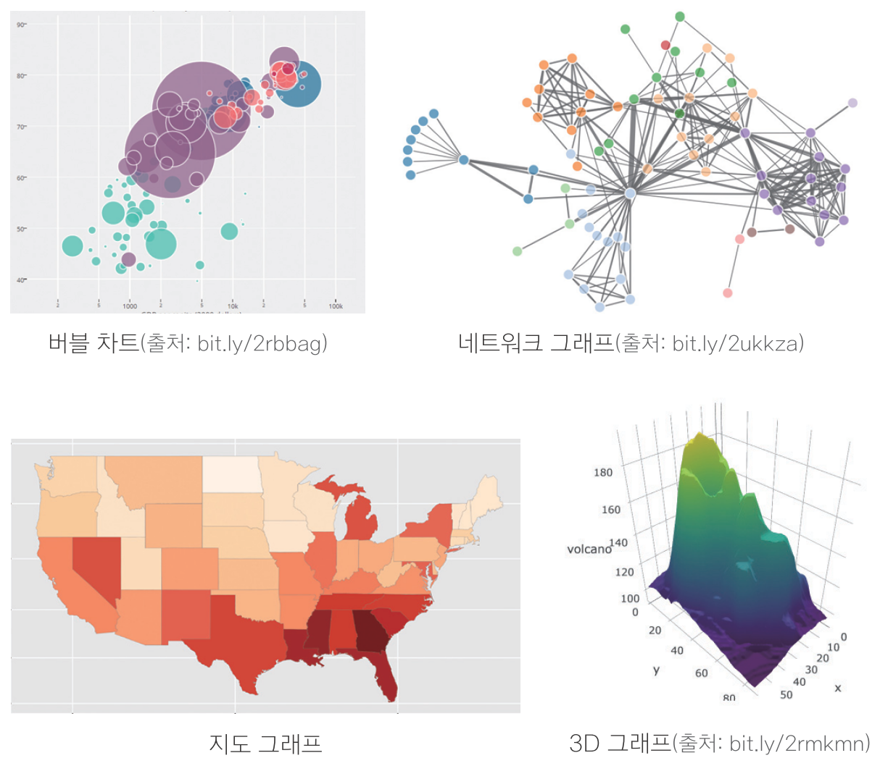

---

class: title0

그래프 만들기

---
<br>
### .center[그래프 만들기]

<br>
```{r echo=F, out.width = '600px', fig.align='center'}
knitr::include_graphics('img/graph01.png')
```

---
<br>

.left[
#### 다양한 그래프
- 2차원 그래프, 3차원 그래프
- 지도 그래프
- 네트워크 그래프
- 모션 차트
- 인터랙티브 그래프
]

.right[
```{r echo=F, out.width = '500px', fig.align='center'}

```
]

---

<br>

#### ggplot2 레이어 구조 이해하기

```{r echo=F, out.width = '600px', fig.align='left'}
knitr::include_graphics('img/layer.png')
```

---
name: point
class: title1

산점도

---

#### 산점도

- 산점도(Scater Plot) : 데이터를 x축과 y축에 점으로 표현한 그래프
- 나이와 소득처럼, 연속 값으로 된 두 변수의 관계를 표현할 때 사용

```{python}
library(ggplot2)
ggplot(data = mpg, aes(x = displ, y = hwy)) + geom_point()
```

---

#### 1. 배경 설정하기
```{python}
ggplot(data = mpg, aes(x = displ, y = hwy))
```

---

#### 2. 그래프 모양 추가하기
```{python}
ggplot(data = mpg, aes(x = displ, y = hwy)) + geom_point()
```

---

#### 3. 설정 추가하기 - x축 고정
```{r, warning=F}
ggplot(data = mpg, aes(x = displ, y = hwy)) + geom_point() + xlim(3, 6)
```

---

#### 3. 설정 추가하기 - x축, y축 고정
```{r, warning=F}
ggplot(data = mpg, aes(x = displ, y = hwy)) +
  geom_point() +
  xlim(3, 6) +
  ylim(10, 30)
```

---
<br>

#### ggplot() 구조


```{r echo=F, out.width = '800px', fig.align='left'}

```


---

### 혼자서 해보기

`mpg` 데이터와 `midwest` 데이터를 이용해서 분석 문제를 해결해 보세요.

Q1. `mpg` 데이터의 `cty`(도시 연비)와 `hwy`(고속도로 연비) 간에 어떤 관계가 있는지 알아보려고 합니다. <br> &nbsp; &nbsp; &nbsp; &nbsp; x축은 `cty`, y축은 `hwy`로 된 산점도를 만들어 보세요.

Q2. 미국 지역별 인구통계 정보를 담은 `ggplot2` 패키지의 `midwest` 데이터를 이용해서 전체 인구와 <br> &nbsp; &nbsp; &nbsp; &nbsp; 아시아인 인구 간에 어떤 관계가 있는지 알아보려고 합니다. <br> &nbsp; &nbsp; &nbsp; &nbsp; •x축은 `poptotal`(전체 인구), y축은 `popasian`(아시아인 인구)으로 된 산점도를 만들어 보세요. <br> &nbsp; &nbsp; &nbsp; &nbsp; •전체 인구는 50만 명 이하, 아시아인 인구는 1만 명 이하인 지역만 산점도에 표시되게 설정하세요.
---


Q1. `mpg` 데이터의 `cty`(도시 연비)와 `hwy`(고속도로 연비) 간에 어떤 관계가 있는지 알아보려고 합니다. <br> &nbsp; &nbsp; &nbsp; &nbsp; x축은 `cty`, y축은 `hwy`로 된 산점도를 만들어 보세요.
```{r, warning=F}
ggplot(data = mpg, aes(x = cty, y = hwy)) + geom_point()
```

---

Q2. 미국 지역별 인구통계 정보를 담은 `ggplot2` 패키지의 `midwest` 데이터를 이용해서 전체 인구와 <br> &nbsp; &nbsp; &nbsp; &nbsp; 아시아인 인구 간에 어떤 관계가 있는지 알아보려고 합니다. <br> &nbsp; &nbsp; &nbsp; &nbsp; •x축은 `poptotal`(전체 인구), y축은 `popasian`(아시아인 인구)으로 된 산점도를 만들어 보세요. <br> &nbsp; &nbsp; &nbsp; &nbsp; •전체 인구는 50만 명 이하, 아시아인 인구는 1만 명 이하인 지역만 산점도에 표시되게 설정하세요.
```{r, warning=F}
ggplot(data = midwest, aes(x = poptotal, y = popasian)) +
  geom_point() +
  xlim(0, 500000) +
  ylim(0, 10000)
```

---
name: line
class: title1

선 그래프

---

#### 선 그래프(Line Chart)

- 데이터를 선으로 표현한 그래프
- 시계열 그래프(Time Series Chart) : 일정 시간 간격을 두고 나열된 시계열 데이터(Time Series Data)를 선으로 표현한 그래프
- 환율, 주가지수 등 경제 지표가 시간에 따라 어떻게 변하는지 표현할 때 활용

```{python}
ggplot(data = economics, aes(x = date, y = psavert)) + geom_line()
```

---

#### 선 그래프 만들기
```{python}
ggplot(data = economics, aes(x = date, y = unemploy)) + geom_line()
```


---

### 혼자서 해보기

`ggplot2` 패키지에 들어 있는 `economics` 데이터를 이용해서 분석 문제를 해결해 보세요.

Q. `psavert`(개인 저축률)가 시간에 따라서 어떻게 변해왔는지 알아보려고 합니다. <br> &nbsp; &nbsp; &nbsp; &nbsp; 시간에 따른 개인 저축률의 변화를 나타낸 시계열 그래프를 만들어 보세요.

--

```{r, warning=F}
ggplot(data = economics, aes(x = date, y = psavert)) + geom_line()
```

---
name: bar
class: title1

막대 그래프

---

#### 막대 그래프

- 막대 그래프(Bar Chart) : 데이터의 크기를 막대의 길이로 표현한 그래프
- 성별 소득 차이처럼 집단 간 차이를 표현할 때 주로 사용

```{python}
ggplot2::mpg %>%
  filter(class %in% c('suv', 'compact')) %>%
  group_by(class) %>%
  summarise(mean_hwy = mean(hwy)) %>%

  ggplot(aes(x = class, y = mean_hwy)) + geom_col()
```

---

#### 1. 집단별 요약표 만들기
```{r, message=F, warning=F}
df_mpg = mpg %>%
  group_by(drv) %>%
  summarise(mean_hwy = mean(hwy))

df_mpg
```

---

#### 2. 그래프 생성
```{python}
ggplot(data = df_mpg, aes(x = drv, y = mean_hwy)) + geom_col()
```

---

#### 2. 그래프 생성 - 내림차순 정렬
```{python}
ggplot(data = df_mpg, aes(x = reorder(drv, -mean_hwy), y = mean_hwy)) +
  geom_col()
```

---


### 혼자서 해보기

`mpg` 데이터를 이용해서 분석 문제를 해결해 보세요.

Q. 어떤 회사가 도시 연비가 높은 `'suv'` 차종을 생산하는지 알아보려고 합니다.`'suv'` 차종을 대상으로 <br> &nbsp; &nbsp; &nbsp; &nbsp; `cty`(도시 연비)가 가장 높은 회사 다섯 곳의 평균 `cty`를 막대 그래프로 만들어 보세요.
<br> &nbsp; &nbsp; &nbsp; &nbsp; •막대는 연비가 높은 순으로 정렬하세요.

---

Q. 어떤 회사가 도시 연비가 높은 `'suv'` 차종을 생산하는지 알아보려고 합니다.`'suv'` 차종을 대상으로 <br> &nbsp; &nbsp; &nbsp; &nbsp; `cty`(도시 연비)가 가장 높은 회사 다섯 곳의 평균 `cty`를 막대 그래프로 만들어 보세요.
<br> &nbsp; &nbsp; &nbsp; &nbsp; •막대는 연비가 높은 순으로 정렬하세요.

.left[
```{python}
# mpg 데이터 불러오기
mpg = ggplot2::mpg

# 평균 표 생성
df = mpg %>%
  filter(class == 'suv') %>%
  group_by(manufacturer) %>%
  summarise(mean_cty = mean(cty)) %>%
  arrange(desc(mean_cty)) %>%
  head(5)

df
```
]

.pull-right[
```{python}
# mpg 데이터 불러오기
mpg = ggplot2::mpg

# 평균 표 생성
df = mpg %>%
  filter(class == 'suv') %>%
  group_by(manufacturer) %>%
  summarise(mean_cty = mean(cty)) %>%
  arrange(desc(mean_cty)) %>%
  head(5)

df
```
]

---

Q. 어떤 회사가 도시 연비가 높은 `'suv'` 차종을 생산하는지 알아보려고 합니다.`'suv'` 차종을 대상으로 <br> &nbsp; &nbsp; &nbsp; &nbsp; `cty`(도시 연비)가 가장 높은 회사 다섯 곳의 평균 `cty`를 막대 그래프로 만들어 보세요.
<br> &nbsp; &nbsp; &nbsp; &nbsp; •막대는 연비가 높은 순으로 정렬하세요.

```{r, warning=F}
# 그래프 생성
ggplot(data = df, aes(x = reorder(manufacturer, -mean_cty),
                      y = mean_cty)) +
  geom_col()
```


---
name: boxplot
class: title1

상자그림

---

#### 상자그림

- 상자 그림(Box Plot) : 데이터의 분포(퍼져 있는 형태)를 직사각형 상자 모양으로 표현한 그래프
- 분포를 알 수 있기 때문에 평균만 볼 때보다 데이터의 특성을 좀 더 자세히 이해할 수 있음

```{python}
ggplot2::mpg %>%
  filter(class %in% c('compact', 'subcompact', 'suv')) %>%
  ggplot(aes(x = class, y = cty)) + geom_boxplot()
```

---

#### 상자그림 만들기
```{python}
ggplot(data = mpg, aes(x = drv, y = hwy)) + geom_boxplot()
```

---

### 혼자서 해보기

`mpg` 데이터를 이용해서 분석 문제를 해결해 보세요.

Q. `class`(자동차 종류)가 `'compact'`, `'subcompact'`, `'suv'`인 자동차의 `cty`(도시 연비)가 <br> &nbsp; &nbsp; &nbsp; &nbsp; 어떻게 다른지 비교해보려고 합니다. 세 차종의 `cty`를 나타낸 상자 그림을 만들어보세요.

---

Q. `class`(자동차 종류)가 `'compact'`, `'subcompact'`, `'suv'`인 자동차의 `cty`(도시 연비)가 <br> &nbsp; &nbsp; &nbsp; &nbsp; 어떻게 다른지 비교해보려고 합니다. 세 차종의 `cty`를 나타낸 상자 그림을 만들어보세요.

```{r, warning=F}
# mpg 데이터 불러오기
mpg = ggplot2::mpg

class_mpg = mpg %>%
  filter(class %in% c('compact', 'subcompact', 'suv'))
```

---
Q. `class`(자동차 종류)가 `'compact'`, `'subcompact'`, `'suv'`인 자동차의 `cty`(도시 연비)가 <br> &nbsp; &nbsp; &nbsp; &nbsp; 어떻게 다른지 비교해보려고 합니다. 세 차종의 `cty`를 나타낸 상자 그림을 만들어보세요.

```{r, warning=F}
ggplot(data = class_mpg, aes(x = class, y = cty)) + geom_boxplot()
```


---

class: title0

데이터 합치기

```{python}
rm(list = ls())
```

---

#### 가로로 합치기 - 열 추가
```{r echo=F, out.width = '600px', fig.align='left'}
knitr::include_graphics('img/left_join.png')
```

<br>

#### 세로로 합치기 - 행 추가
```{r echo=F, out.width = '600px', fig.align='left'}

```

---

name: left_join
class: title1

가로로 합치기


---

### 가로로 합치기

#### 데이터 생성
```{python}
# 중간고사 데이터 생성
test1 = data.frame(id = c(1, 2, 3, 4, 5),
                    midterm = c(60, 80, 70, 90, 85))

# 기말고사 데이터 생성
test2 = data.frame(id = c(1, 2, 3, 4, 5),
                    final = c(70, 83, 65, 95, 80))

```

---

```{python}
test1  # test1 출력
test2  # test2 출력
```

---

#### id 기준으로 합치기
```{python}
library(dplyr)
total = left_join(test1, test2, by = 'id')  # id 기준으로 합치기
total
```

> [주의] `by` 변수명 앞 뒤에 따옴표 입력

---

### 연습!

```{python}
exam = read.csv('csv_exam.csv', header = T)
exam
```

---
#### 반별 담임교사 명단 생성
```{python}
name = data.frame(class = c(1, 2, 3, 4, 5),
                   teacher = c('kim', 'lee', 'park', 'choi', 'jung'))
name
```

---

#### class 기준 합치기
```{python}
exam_new = left_join(exam, name, by = 'class')
exam_new
```

---


name: bind_rows
class: title1

세로로 합치기

---

### 세로로 합치기

#### 데이터 생성
```{python}
# 학생 1~5번 시험 데이터 생성
group_a = data.frame(id = c(1, 2, 3, 4, 5),
                      test = c(60, 80, 70, 90, 85))

# 학생 6~10번 시험 데이터 생성
group_b = data.frame(id = c(6, 7, 8, 9, 10),
                      test = c(70, 83, 65, 95, 80))
```

---

```{python}
group_a  # group_a 출력
group_b  # group_b 출력
```

---

```{python}
group_all = bind_rows(group_a, group_b)  # 데이터 합쳐서 group_all에 할당
group_all
```

---

### 혼자서 해보기

`mpg` 데이터를 이용해서 분석 문제를 해결해 보세요.

`mpg` 데이터의 `fl` 변수는 자동차에 사용하는 연료(fuel)를 의미합니다. 아래는 자동차 연료별 가격을 나타낸 표입니다.


.left[

fl  |연료 종류  |가격(갤런당 USD)
:--:|:---------:|:---:
&nbsp; &nbsp; &nbsp; c &nbsp; &nbsp; &nbsp; |CNG        |2.35
&nbsp; &nbsp; &nbsp; d &nbsp; &nbsp; &nbsp; |diesel     |2.38
&nbsp; &nbsp; &nbsp; e &nbsp; &nbsp; &nbsp; |ethanol E85|2.11
&nbsp; &nbsp; &nbsp; p &nbsp; &nbsp; &nbsp; |premium    |2.76
&nbsp; &nbsp; &nbsp; r &nbsp; &nbsp; &nbsp; |regular    |2.22

]

---

### 혼자서 해보기

이 정보를 이용해 연료와 가격으로 구성된 데이터 프레임을 만들어 보세요.

```{python}
fuel = data.frame(fl = c('c', 'd', 'e', 'p', 'r'),
                   price_fl = c(2.35, 2.38, 2.11, 2.76, 2.22))

fuel
```

Q1. `mpg` 데이터에는 연료 종류를 나타낸 `fl` 변수는 있지만 연료 가격을 나타낸 변수는 없습니다. <br> &nbsp; &nbsp; &nbsp; &nbsp; 위에서 만든 `fuel` 데이터를 이용해서 `mpg` 데이터에 `price_fl`(연료 가격) 변수를 추가하세요.

Q2. 연료 가격 변수가 잘 추가됐는지 확인하기 위해서 `model`, `fl`, `price_fl` 변수를 추출해 <br> &nbsp; &nbsp; &nbsp; &nbsp; 앞부분 5행을 출력해 보세요.

---

Q1. `mpg` 데이터에는 연료 종류를 나타낸 `fl` 변수는 있지만 연료 가격을 나타낸 변수는 없습니다. <br> &nbsp; &nbsp; &nbsp; &nbsp; 위에서 만든 `fuel` 데이터를 이용해서 `mpg` 데이터에 `price_fl`(연료 가격) 변수를 추가하세요.
```{python}
mpg = ggplot2::mpg                     # mpg 데이터 불러오기
mpg = left_join(mpg, fuel, by = 'fl')  # mpg에 연료 가격 변수 추가
```

--

<br>

Q2. 연료 가격 변수가 잘 추가됐는지 확인하기 위해서 `model`, `fl`, `price_fl` 변수를 추출해 <br> &nbsp; &nbsp; &nbsp; &nbsp; 앞부분 5행을 출력해 보세요.

```{python}
mpg %>%
  select(model, fl, price_fl) %>%       # model, fl, price_fl 추출
  head(5)                               # 앞부분 일부 출력
```

---
class: title1

데이터 정제하기

---

.center[
### 데이터 정제하기
### - 빠진 데이터, 이상한 데이터 제거하기
]

<br>
```{r echo=F, out.width = '600px', fig.align='center'}
knitr::include_graphics('img/cleansing.png')
```

---

name: missing_value
class: title1

빠진 데이터를 찾아라! <br>- 결측치 정제하기
---

#### 결측치(Missing Value)
- 누락된 값, 비어있는 값
- 함수 적용 불가, 분석 결과 왜곡
- 제거 후 분석

---


#### 결측치 만들기

결측치 표기 대문자 `NA`

```{python}
df = data.frame(sex = c('M', 'F', NA, 'M', 'F'),
                 score = c(5, 4, 3, 4, NA))
df
```

> [유의] `NA` 앞 뒤에 따옴표 없음

---


#### 결측치 확인하기
```{python}
is.na(df)         # 결측치 확인
table(is.na(df))  # 결측치 빈도 출력
```

---

#### 변수별로 결측치 확인하기
```{python}
table(is.na(df$sex))    # sex 결측치 빈도 출력
table(is.na(df$score))  # score 결측치 빈도 출력
```

--
<br>

#### 결측치 포함된 상태로 분석

.pull-left[
```{python}
mean(df$score)  # 평균 산출
```
]

.pull-right[
```{python}
sum(df$score)   # 합계 산출
```
]
---

### 결측치 제거하기

#### 결측치 있는 행 제거하기
```{python}
df %>% filter(is.na(score))   # score가 NA인 데이터만 출력
df %>% filter(!is.na(score))  # score가 NA 아닌 데이터만 출력
```
---

#### 결측치 제외한 데이터로 분석하기
```{python}
df_nomiss = df %>% filter(!is.na(score))  # 결측치 제외된 데이터 생성
df_nomiss

mean(df_nomiss$score)                      # score 평균
sum(df_nomiss$score)                       # score 합계
```

---

#### 여러 변수 결측치 동시에 제거하기
```{python}
# score, sex 결측치 제외
df_nomiss = df %>% filter(!is.na(score) & !is.na(sex))
df_nomiss
```

---


#### 결측치가 하나라도 있으면 제거하기
```{python}
df_nomiss2 = na.omit(df)  # 모든 변수에 결측치 없는 데이터 추출
df_nomiss2                 # 출력
```

- 분석에 필요한 데이터까지 손실 될 가능성 유의
 - ex) 성별-소득 관계 분석하는데 지역 결측치까지 제거


---

### 함수의 결측치 제외 기능 이용하기 - `na.rm = T`
```{python}
mean(df$score, na.rm = T)  # 결측치 제외하고 평균 산출
sum(df$score, na.rm = T)   # 결측치 제외하고 합계 산출
```

---

#### `summarise()`에서 `na.rm = T` 사용하기

```{r eval=F}
exam = read.csv('csv_exam.csv')  # 데이터 불러오기
exam[c(3, 8, 15), 'math'] = NA   # 3, 8, 15행의 math에 NA 할당
exam
```

---

#### `summarise()`에서 `na.rm = T` 사용하기

```{r eval=F}
exam
```

```{r echo=F, highlight.output = c(4, 9, 16)}
exam = read.csv('csv_exam.csv')  # 데이터 불러오기
exam[c(3, 8, 15), 'math'] = NA   # 3, 8, 15행의 math에 NA 할당
exam
```

---

#### `summarise()`에 `na.rm = T` 사용하기

```{python}
exam %>% summarise(mean_math = mean(math))

# 결측치 제외하고 평균 산출
exam %>% summarise(mean_math = mean(math, na.rm = T))
```

---

#### 다른 함수들에 적용
```{python}
exam %>% summarise(mean_math = mean(math, na.rm = T),      # 평균
                   sum_math = sum(math, na.rm = T),        # 합계
                   median_math = median(math, na.rm = T))  # 중앙값
```

---

### 결측치 대체하기
- 결측치 많을 경우 모두 제외하면 데이터 손실 큼
- 대안: 다른 값 채워넣기

<br>

#### 결측치 대체법(Imputation)
- 대표값(평균, 최빈값 등)으로 일괄 대체
- 통계분석 기법 적용, 추정값으로 대체

---

### 평균값으로 결측치 대체하기

#### 평균 구하기
```{python}
mean(exam$math, na.rm = T)  # 결측치 제외하고 math 평균 산출
```

---

#### 평균으로 대체하기
```{r, highlight.output = c(4, 9, 16)}
# math가 NA면 55로 대체
exam$math = ifelse(is.na(exam$math), 55, exam$math)
exam
```
---

```{python}
table(is.na(exam$math))  # 결측치 빈도표 생성
mean(exam$math)          # math 평균 산출
```

---
### 혼자서 해보기

`mpg` 데이터를 이용해서 분석 문제를 해결해 보세요.

`mpg` 데이터에는 결측치가 없습니다. 우선 `mpg` 데이터를 불러와서 일부러 몇 개의 값을 결측치로 만들겠습니다. 아래 코드를 실행하면 다섯 행의 `hwy` 변수에 `NA`가 할당됩니다.

```{python}
mpg = ggplot2::mpg                          # mpg 데이터 불러오기
mpg[c(65, 124, 131, 153, 212), 'hwy'] = NA  # NA 할당하기
```

---

결측치가 들어 있는 `mpg` 데이터를 활용해 문제를 해결해 보세요.

Q1. `drv`(구동방식)별로 `hwy`(고속도로 연비) 평균이 어떻게 다른지 알아보려고 합니다. 분석을 하기 전에 <br> &nbsp; &nbsp; &nbsp; &nbsp; 우선 두 변수에 결측치가 있는지 확인하려고 합니다. `drv` 변수와 `hwy` 변수에 결측치가 몇 개 있는지 <br> &nbsp; &nbsp; &nbsp; &nbsp; 알아보세요.

Q2. `filter()`를 이용해 `hwy` 변수의 결측치를 제외하고, 어떤 구동방식의 `hwy` 평균이 높은지 <br> &nbsp; &nbsp; &nbsp; &nbsp; 알아보세요. 하나의 `dplyr` 구문으로 만들어야 합니다.

---

Q1. `drv`(구동방식)별로 `hwy`(고속도로 연비) 평균이 어떻게 다른지 알아보려고 합니다. 분석을 하기 전에 <br> &nbsp; &nbsp; &nbsp; &nbsp; 우선 두 변수에 결측치가 있는지 확인하려고 합니다. `drv` 변수와 `hwy` 변수에 결측치가 몇 개 있는지 <br> &nbsp; &nbsp; &nbsp; &nbsp; 알아보세요.
```{python}
table(is.na(mpg$drv))  # drv 결측치 빈도표 출력
table(is.na(mpg$hwy))  # hwy 결측치 빈도표 출력
```

---
Q2. `filter()`를 이용해 `hwy` 변수의 결측치를 제외하고, 어떤 구동방식의 `hwy` 평균이 높은지 <br> &nbsp; &nbsp; &nbsp; &nbsp; 알아보세요. 하나의 `dplyr` 구문으로 만들어야 합니다.

```{python}
mpg %>%
  filter(!is.na(hwy)) %>%          # 결측치 제외
  group_by(drv) %>%                # drv별 분리
  summarise(mean_hwy = mean(hwy))  # hwy 평균 구하기
```


---

name: outlier
class: title1

이상한 데이터를 찾아라! <br>- 이상치 정제하기
---

#### 이상치(Outlier) - 정상범주에서 크게 벗어난 값
- 이상치 포함시 분석 결과 왜곡
- 결측 처리 후 제외하고 분석

.left[
이상치 종류      |예                |해결 방법
-----------------|------------------|---------
존재할 수 없는 값&nbsp; |성별 변수에 3     &nbsp; |결측 처리&nbsp;
극단적인 값      &nbsp; |몸무게 변수에 200 &nbsp; |정상범위 기준 정해서 결측 처리&nbsp;
]
---

### 이상치 제거하기 - 1. 존재할 수 없는 값
- 논리적으로 존재할 수 없으므로 바로 결측 처리 후 분석시 제외

#### 이상치 포함된 데이터 생성 - sex 3, score 6
```{python}
outlier = data.frame(sex = c(1, 2, 1, 3, 2, 1),
                      score = c(5, 4, 3, 4, 2, 6))
outlier
```

---

#### 이상치 확인하기
```{python}
table(outlier$sex)
table(outlier$score)
```

---

#### 결측 처리하기 - sex
```{python}
# sex가 3이면 NA 할당
outlier$sex = ifelse(outlier$sex == 3, NA, outlier$sex)
outlier
```

---

#### 결측 처리하기 - score
```{python}
# score가 5보다 크면 NA 할당
outlier$score = ifelse(outlier$score > 5, NA, outlier$score)
outlier
```

---

#### 결측치 제외하고 분석
```{python}
outlier %>%
  filter(!is.na(sex) & !is.na(score)) %>%
  group_by(sex) %>%
  summarise(mean_score = mean(score))
```

---

### 이상치 제거하기 - 2. 극단적인 값

정상범위 기준 정해서 벗어나면 결측 처리

.left[
&nbsp; 판단 기준   |&nbsp; 예
------------|---
&nbsp; 논리적 판단 &nbsp; |&nbsp; 성인 몸무게 40kg~150kg 벗어나면 극단치&nbsp;
&nbsp; 통계적 판단 &nbsp; |&nbsp; 상하위 0.3% 극단치 또는 상자그림 1.5 IQR 벗어나면 극단치&nbsp;
]
---


### 상자그림으로 극단치 기준 정해서 제거하기

#### 상자그림 생성
```{r eval=F}
mpg = ggplot2::mpg
boxplot(mpg$hwy)
```

.pull-left[
```{python}
mpg = ggplot2::mpg
boxplot(mpg$hwy)
```
]


---

### 상자그림으로 극단치 기준 정해서 제거하기

#### 상자그림 생성 - 통계치 출력
```{r eval=F}
mpg = ggplot2::mpg
boxplot(mpg$hwy)$stats
```

.pull-left[
```{python}
mpg = ggplot2::mpg
boxplot(mpg$hwy)
```
]

<br>

.pull-right[
```{r, echo=FALSE}
boxplot(mpg$hwy, plot = F)$stats
```
]

---

#### 결측 처리하기
```{python}
# 12~37 벗어나면 NA 할당
mpg$hwy = ifelse(mpg$hwy < 12 | mpg$hwy > 37, NA, mpg$hwy)
table(is.na(mpg$hwy))
```

---

#### 결측치 제외하고 분석하기
```{python}
mpg %>%
  group_by(drv) %>%
  summarise(mean_hwy = mean(hwy, na.rm = T))
```

---

### 혼자서 해보기

`mpg` 데이터를 이용해서 분석 문제를 해결해 보세요.

- 우선 `mpg` 데이터를 불러와서 일부러 이상치를 만들겠습니다.

  - `drv`(구동방식) 변수의 값은 `4`(사륜구동), `f`(전륜구동), `r`(후륜구동) 세 종류로 되어있습니다. <br> &nbsp;몇 개의 행에 존재할 수 없는 값 `k`를 할당하겠습니다.

  - `cty`(도시 연비) 변수도 몇 개의 행에 극단적으로 크거나 작은 값을 할당하겠습니다.


```{python}
mpg = ggplot2::mpg                                 # mpg 데이터 불러오기
mpg[c(10, 14, 58, 93), 'drv'] = 'k'                # drv 이상치 할당
mpg[c(29, 43, 129, 203), 'cty'] = c(3, 4, 39, 42)  # cty 이상치 할당
```

---

### 혼자서 해보기

이상치가 들어 있는 `mpg` 데이터를 활용해 문제를 해결해보세요.

구동방식별로 도시 연비가 다른지 알아보려고 합니다. 분석을 하려면 우선 두 변수에 이상치가 있는지 <br> 확인해야 합니다.

Q1. `drv`에 이상치가 있는지 확인하세요. 이상치를 결측 처리한 다음 이상치가 사라졌는지 확인하세요. <br> &nbsp; &nbsp; &nbsp; &nbsp; 결측 처리 할 때는 `%in%` 기호를 활용하세요.

Q2. 상자 그림을 이용해서 `cty`에 이상치가 있는지 확인하세요. 상자 그림의 통계치를 이용해 정상 범위를 <br> &nbsp; &nbsp; &nbsp; &nbsp; 벗어난 값을 결측 처리한 다음, 다시 상자 그림을 만들어서 이상치가 사라졌는지 확인하세요.

Q3. 두 변수의 이상치를 결측처리 했으니 이제 분석할 차례입니다. 이상치를 제외한 다음 `drv`별로 `cty` <br> &nbsp; &nbsp; &nbsp; &nbsp; 평균이 어떻게 다른지 알아보세요. 하나의 `dplyr` 구문으로 만들어야 합니다.

---

Q1. `drv`에 이상치가 있는지 확인하세요. 이상치를 결측 처리한 다음 이상치가 사라졌는지 확인하세요. <br> &nbsp; &nbsp; &nbsp; &nbsp; 결측 처리 할 때는 `%in%` 기호를 활용하세요.
```{python}
# 이상치 확인
table(mpg$drv)

# drv가 4, f, r이면 기존 값 유지, 그 외 NA 할당
mpg$drv = ifelse(mpg$drv %in% c('4', 'f', 'r'), mpg$drv, NA)

# 이상치 확인
table(mpg$drv)
```

---

Q2. 상자 그림을 이용해서 `cty`에 이상치가 있는지 확인하세요. 상자 그림의 통계치를 이용해 정상 범위를 <br> &nbsp; &nbsp; &nbsp; &nbsp; 벗어난 값을 결측 처리한 다음, 다시 상자 그림을 만들어서 이상치가 사라졌는지 확인하세요.

```{r eval=F}
# 상자 그림 생성 및 통계치 산출
boxplot(mpg$cty)$stats
```
.pull-left[
```{python}
boxplot(mpg$cty)
```
]

.pull-right[
<br>
```{python}
boxplot(mpg$cty, plot = F)$stats
```
]


---

Q2. 상자 그림을 이용해서 `cty`에 이상치가 있는지 확인하세요. 상자 그림의 통계치를 이용해 정상 범위를 <br> &nbsp; &nbsp; &nbsp; &nbsp; 벗어난 값을 결측 처리한 다음, 다시 상자 그림을 만들어서 이상치가 사라졌는지 확인하세요.


```{python}
# 9~26 벗어나면 NA 할당
mpg$cty = ifelse(mpg$cty < 9 | mpg$cty > 26, NA, mpg$cty)

# 상자 그림 생성
boxplot(mpg$cty)
```


---

Q3. 두 변수의 이상치를 결측처리 했으니 이제 분석할 차례입니다. 이상치를 제외한 다음 `drv`별로 `cty` <br> &nbsp; &nbsp; &nbsp; &nbsp; 평균이 어떻게 다른지 알아보세요. 하나의 `dplyr` 구문으로 만들어야 합니다.
```{python}
mpg %>%
  filter(!is.na(drv) & !is.na(cty)) %>%  # 결측치 제외
  group_by(drv) %>%                      # drv별 분리
  summarise(mean_hwy = mean(cty))        # cty 평균 구하기
```

